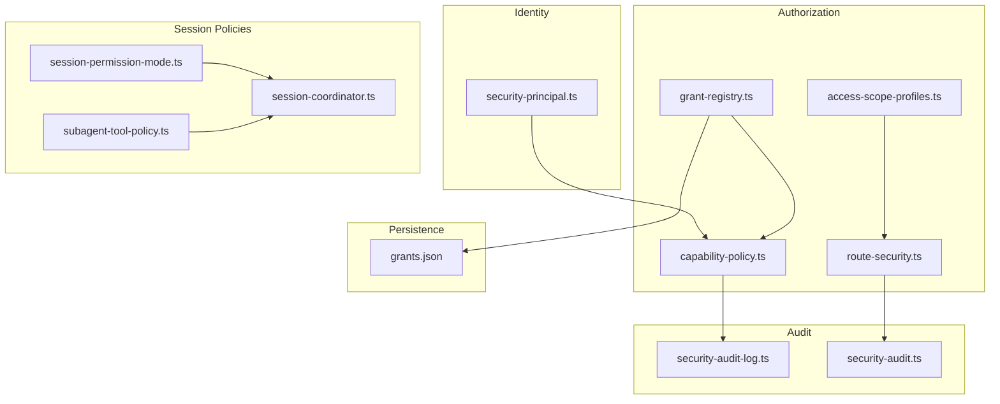
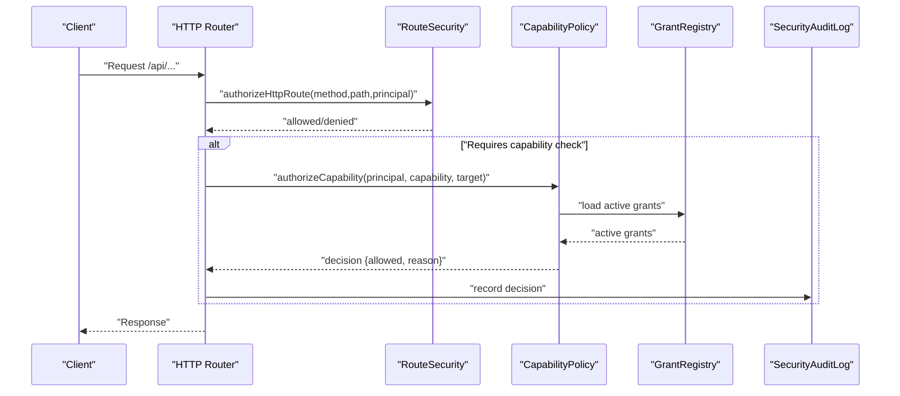
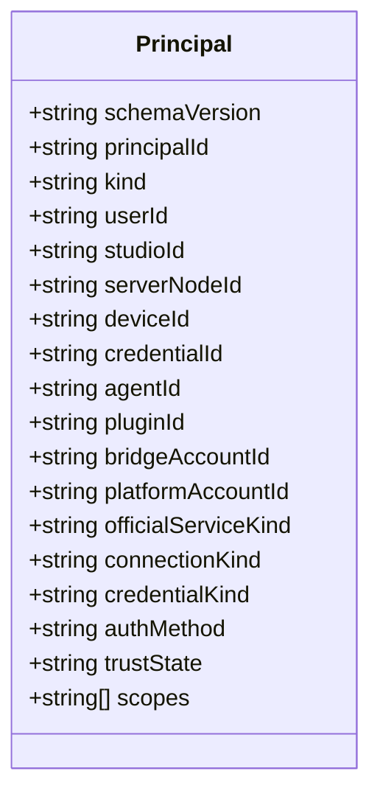
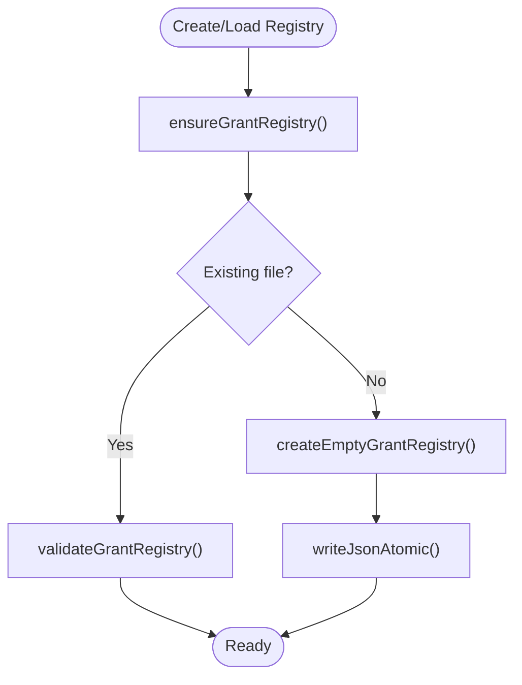
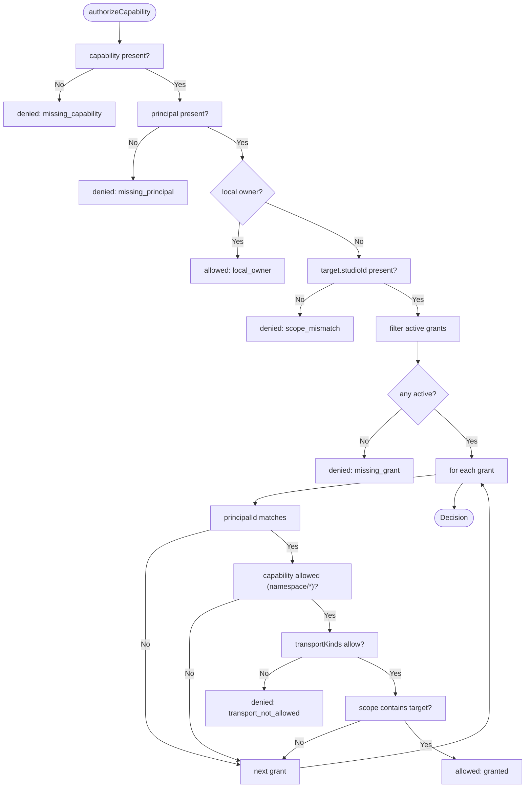
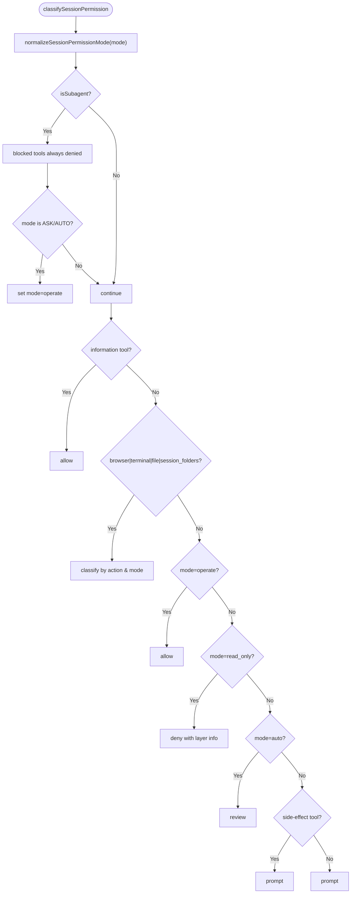
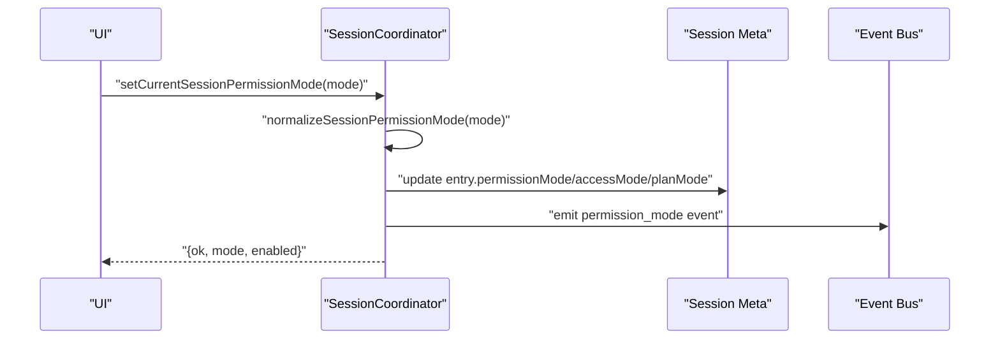
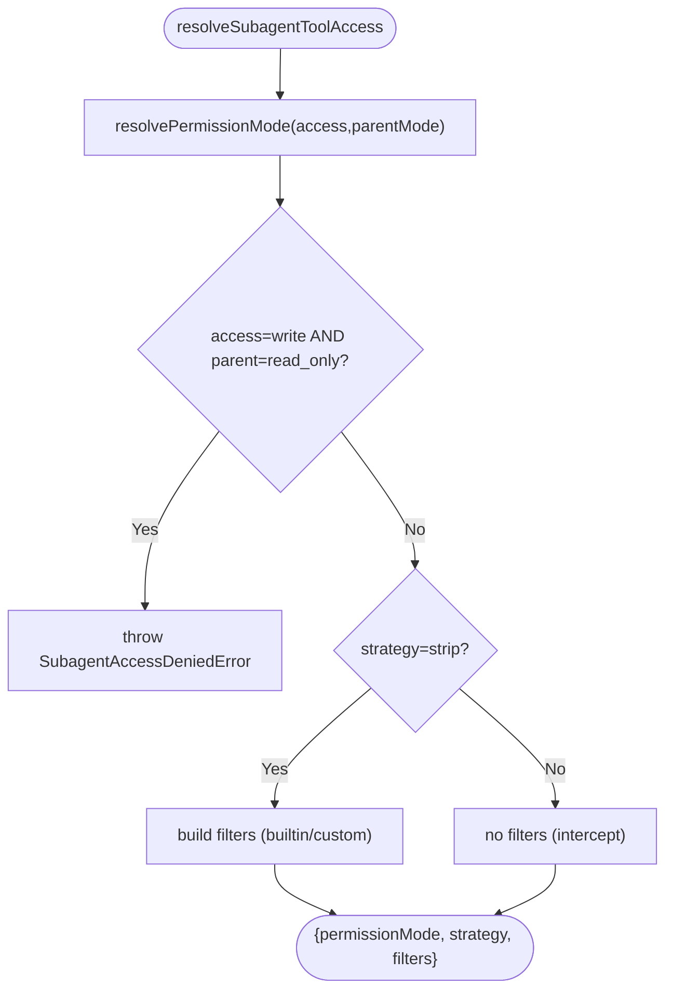
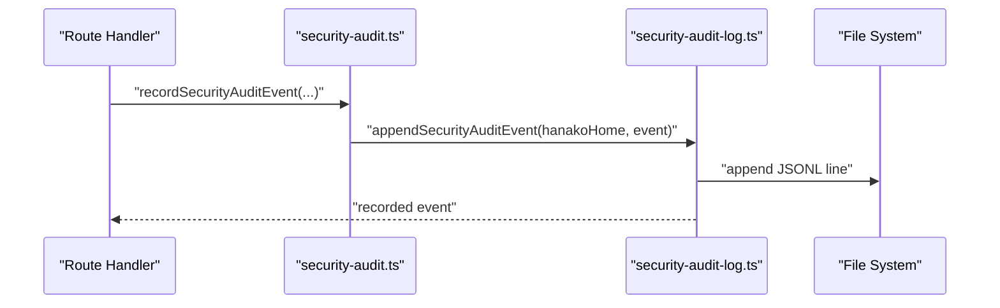
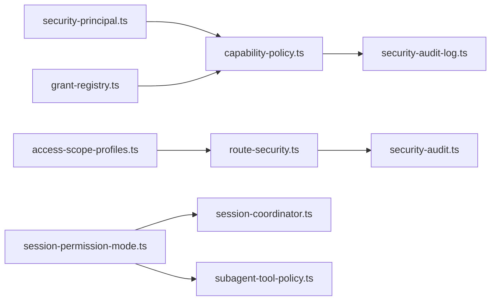

# Permission Management

<cite>
**Referenced Files in This Document**
- [grant-registry.ts](file://core/grant-registry.ts)
- [capability-policy.ts](file://core/capability-policy.ts)
- [security-principal.ts](file://core/security-principal.ts)
- [session-permission-mode.ts](file://core/session-permission-mode.ts)
- [session-coordinator.ts](file://core/session-coordinator.ts)
- [subagent-tool-policy.ts](file://lib/tools/subagent-tool-policy.ts)
- [access-scope-profiles.ts](file://shared/access-scope-profiles.ts)
- [route-security.ts](file://server/http/route-security.ts)
- [security-audit-log.ts](file://core/security-audit-log.ts)
- [security-audit.ts](file://server/http/security-audit.ts)
- [grants.json](file://security/grants.json)
</cite>

## Table of Contents
1. [Introduction](#introduction)
2. [Project Structure](#project-structure)
3. [Core Components](#core-components)
4. [Architecture Overview](#architecture-overview)
5. [Detailed Component Analysis](#detailed-component-analysis)
6. [Dependency Analysis](#dependency-analysis)
7. [Performance Considerations](#performance-considerations)
8. [Troubleshooting Guide](#troubleshooting-guide)
9. [Conclusion](#conclusion)
10. [Appendices](#appendices)

## Introduction
This document explains the permission management system with a focus on granular access control, policy-based permissions, and session context integration. It covers:
- Policy-based authorization using principals, grants, capabilities, and scopes
- Session-level permission modes (auto, ask, operate, read-only) and their enforcement
- GrantRegistry for managing permissions across agents and sessions
- Role-like scope profiles and HTTP route authorization
- Subagent permission inheritance and escalation prevention
- Audit trails for security decisions
- Best practices for secure permission hierarchies

## Project Structure
The permission system spans core modules for identity, authorization, session policies, and persistence, plus server-side HTTP authorization and audit logging.



**Diagram sources**
- [security-principal.ts](file://core/security-principal.ts)
- [grant-registry.ts](file://core/grant-registry.ts)
- [capability-policy.ts](file://core/capability-policy.ts)
- [access-scope-profiles.ts](file://shared/access-scope-profiles.ts)
- [route-security.ts](file://server/http/route-security.ts)
- [session-permission-mode.ts](file://core/session-permission-mode.ts)
- [session-coordinator.ts](file://core/session-coordinator.ts)
- [subagent-tool-policy.ts](file://lib/tools/subagent-tool-policy.ts)
- [security-audit-log.ts](file://core/security-audit-log.ts)
- [security-audit.ts](file://server/http/security-audit.ts)
- [grants.json](file://security/grants.json)

**Section sources**
- [grant-registry.ts](file://core/grant-registry.ts)
- [capability-policy.ts](file://core/capability-policy.ts)
- [security-principal.ts](file://core/security-principal.ts)
- [session-permission-mode.ts](file://core/session-permission-mode.ts)
- [session-coordinator.ts](file://core/session-coordinator.ts)
- [subagent-tool-policy.ts](file://lib/tools/subagent-tool-policy.ts)
- [access-scope-profiles.ts](file://shared/access-scope-profiles.ts)
- [route-security.ts](file://server/http/route-security.ts)
- [security-audit-log.ts](file://core/security-audit-log.ts)
- [security-audit.ts](file://server/http/security-audit.ts)
- [grants.json](file://security/grants.json)

## Core Components
- Principal normalization and scope checks provide a consistent identity model used by both capability-based and scope-based authorization.
- GrantRegistry persists and validates grants that bind a principal to capabilities and scoped targets.
- CapabilityPolicy evaluates whether a principal can perform a capability against a target using active grants and constraints.
- SessionPermissionMode defines and enforces per-session tool access levels (auto, ask, operate, read-only).
- SessionCoordinator applies permission modes to sessions and exposes APIs to change them.
- SubagentToolPolicy resolves inherited or explicit permission modes for subagents and prevents escalation.
- AccessScopeProfiles and RouteSecurity implement role-like scopes and HTTP route authorization.
- SecurityAuditLog records decisions and changes with sanitized fields.

**Section sources**
- [security-principal.ts](file://core/security-principal.ts)
- [grant-registry.ts](file://core/grant-registry.ts)
- [capability-policy.ts](file://core/capability-policy.ts)
- [session-permission-mode.ts](file://core/session-permission-mode.ts)
- [session-coordinator.ts](file://core/session-coordinator.ts)
- [subagent-tool-policy.ts](file://lib/tools/subagent-tool-policy.ts)
- [access-scope-profiles.ts](file://shared/access-scope-profiles.ts)
- [route-security.ts](file://server/http/route-security.ts)
- [security-audit-log.ts](file://core/security-audit-log.ts)

## Architecture Overview
The system combines two complementary models:
- Capability-based authorization: principals + grants + capabilities + scoped targets
- Scope-based authorization: roles/profiles mapped to scopes for HTTP routes



**Diagram sources**
- [route-security.ts](file://server/http/route-security.ts)
- [capability-policy.ts](file://core/capability-policy.ts)
- [grant-registry.ts](file://core/grant-registry.ts)
- [security-audit-log.ts](file://core/security-audit-log.ts)

## Detailed Component Analysis

### Principal Model
- Normalizes identity attributes (kind, userId, deviceId, connectionKind, credentialKind, trustState) and derives stable principalId.
- Provides helpers to check local ownership and scope membership with namespace support.



**Diagram sources**
- [security-principal.ts](file://core/security-principal.ts)

**Section sources**
- [security-principal.ts](file://core/security-principal.ts)

### GrantRegistry
- Persists grants in a JSON file under the security directory.
- Validates schema version, required fields, unique IDs, and constraints.
- Supports creating, revoking, and querying active grants; auto-expiration updates status to expired.



**Diagram sources**
- [grant-registry.ts](file://core/grant-registry.ts)
- [grants.json](file://security/grants.json)

**Section sources**
- [grant-registry.ts](file://core/grant-registry.ts)
- [grants.json](file://security/grants.json)

### CapabilityPolicy
- Evaluates whether a principal can perform a capability against a target.
- Local owner bypasses grant checks.
- Requires non-empty studioId in target; otherwise denies due to scope mismatch.
- Filters active grants by principalId, capability match (including namespace and wildcard), transport constraints, and exact scope containment.



**Diagram sources**
- [capability-policy.ts](file://core/capability-policy.ts)

**Section sources**
- [capability-policy.ts](file://core/capability-policy.ts)

### Session Permission Modes
- Modes: auto, ask, operate, read-only. Defaults to ask.
- Classifies tool calls based on mode and tool category (informational vs side-effect).
- Special handling for browser, terminal, file, and session folders actions.
- In subagent context, ASK/AUTO collapse to operate to avoid deadlocks; fixed blocklist prevents recursion and privileged operations.



**Diagram sources**
- [session-permission-mode.ts](file://core/session-permission-mode.ts)

**Section sources**
- [session-permission-mode.ts](file://core/session-permission-mode.ts)

### Session Coordinator Integration
- Applies permission modes to current or specific sessions and emits events.
- Maintains legacy compatibility via accessMode and planMode mappings.
- Exposes APIs to set pending or current session permission mode.



**Diagram sources**
- [session-coordinator.ts](file://core/session-coordinator.ts)
- [session-permission-mode.ts](file://core/session-permission-mode.ts)

**Section sources**
- [session-coordinator.ts](file://core/session-coordinator.ts)
- [session-permission-mode.ts](file://core/session-permission-mode.ts)

### Subagent Permission Inheritance and Escalation Prevention
- Resolves effective permission mode from explicit access parameter or inherited parent mode.
- Enforces attenuation: write access denied when parent is read-only; error returned instead of silent downgrade.
- Two strategies: intercept (default) and strip; both ensure subagent cannot exceed parent privileges.



**Diagram sources**
- [subagent-tool-policy.ts](file://lib/tools/subagent-tool-policy.ts)
- [session-permission-mode.ts](file://core/session-permission-mode.ts)

**Section sources**
- [subagent-tool-policy.ts](file://lib/tools/subagent-tool-policy.ts)
- [session-permission-mode.ts](file://core/session-permission-mode.ts)

### Role-Based Access Control via Scopes
- Defines scope profiles (mobile, desktop) and helper functions to check presence of scopes including namespace wildcards.
- HTTP route authorization maps endpoints to required scopes or special categories (public, local_only, authenticated, studio_owner, plugin_route).

```mermaid
classDiagram
class AccessScopeProfiles {
+string[] scopesForAccessProfile(profile)
+boolean hasStudioOwnerScope(scopes)
+boolean scopeSetAllows(scopes, required)
}
class RouteSecurity {
+authorizeHttpRoute({method,path,principal})
+classifyHttpRoute({method,path})
+isPublicHttpRoute({method,path})
+isLocalOwnerPrincipal(principal)
+isStudioOwnerPrincipal(principal)
}
AccessScopeProfiles <.. RouteSecurity : "used by"
```

**Diagram sources**
- [access-scope-profiles.ts](file://shared/access-scope-profiles.ts)
- [route-security.ts](file://server/http/route-security.ts)

**Section sources**
- [access-scope-profiles.ts](file://shared/access-scope-profiles.ts)
- [route-security.ts](file://server/http/route-security.ts)

### Audit Trails
- SecurityAuditLog normalizes and appends structured events to a JSONL file, masking secret-like fields.
- Server-side helper integrates with request context to record decisions and outcomes.



**Diagram sources**
- [security-audit.ts](file://server/http/security-audit.ts)
- [security-audit-log.ts](file://core/security-audit-log.ts)

**Section sources**
- [security-audit-log.ts](file://core/security-audit-log.ts)
- [security-audit.ts](file://server/http/security-audit.ts)

## Dependency Analysis
- CapabilityPolicy depends on Principal normalization and GrantRegistry for active grants.
- RouteSecurity uses AccessScopeProfiles for scope checks and principal helpers for local/studio-owner detection.
- SessionCoordinator composes SessionPermissionMode utilities and emits events for UI/state synchronization.
- SubagentToolPolicy relies on SessionPermissionMode to enforce inheritance and attenuation.
- Audit components are invoked after authorization decisions and permission changes.



**Diagram sources**
- [security-principal.ts](file://core/security-principal.ts)
- [grant-registry.ts](file://core/grant-registry.ts)
- [capability-policy.ts](file://core/capability-policy.ts)
- [access-scope-profiles.ts](file://shared/access-scope-profiles.ts)
- [route-security.ts](file://server/http/route-security.ts)
- [session-permission-mode.ts](file://core/session-permission-mode.ts)
- [session-coordinator.ts](file://core/session-coordinator.ts)
- [subagent-tool-policy.ts](file://lib/tools/subagent-tool-policy.ts)
- [security-audit-log.ts](file://core/security-audit-log.ts)
- [security-audit.ts](file://server/http/security-audit.ts)

**Section sources**
- [capability-policy.ts](file://core/capability-policy.ts)
- [grant-registry.ts](file://core/grant-registry.ts)
- [security-principal.ts](file://core/security-principal.ts)
- [access-scope-profiles.ts](file://shared/access-scope-profiles.ts)
- [route-security.ts](file://server/http/route-security.ts)
- [session-permission-mode.ts](file://core/session-permission-mode.ts)
- [session-coordinator.ts](file://core/session-coordinator.ts)
- [subagent-tool-policy.ts](file://lib/tools/subagent-tool-policy.ts)
- [security-audit-log.ts](file://core/security-audit-log.ts)
- [security-audit.ts](file://server/http/security-audit.ts)

## Performance Considerations
- Grant filtering is linear over active grants; keep grants minimal and targeted to reduce evaluation time.
- Capability matching supports namespace and wildcard checks; prefer precise capabilities to minimize false positives.
- Session permission classification is O(1) per tool call; avoid frequent mode switches in hot paths.
- Audit logging appends to a single file; consider log rotation and asynchronous batching if high throughput is expected.

## Troubleshooting Guide
- Missing capability or principal: Ensure requests include valid principal and capability identifiers.
- Scope mismatch: Verify target includes a valid studioId and matches grant scope.
- Transport not allowed: Check grant constraints.transportKinds against connectionKind.
- Insufficient capability: Confirm grant includes the required capability or a matching namespace/wildcard.
- Read-only mode blocks: For side-effect tools, switch session out of read-only or use appropriate mode.
- Subagent escalation denied: If parent session is read-only, do not request write access; adjust parent mode or use read access.

**Section sources**
- [capability-policy.ts](file://core/capability-policy.ts)
- [session-permission-mode.ts](file://core/session-permission-mode.ts)
- [subagent-tool-policy.ts](file://lib/tools/subagent-tool-policy.ts)

## Conclusion
The permission system provides robust, layered controls combining capability-based authorization with session-scoped tool policies and role-like scopes for HTTP routes. GrantRegistry ensures persistent, validated grants; SessionPermissionMode enforces safe defaults and interactive prompts; SubagentToolPolicy guarantees no privilege escalation. Audit logging offers traceability for all critical decisions. Following best practices—least privilege, explicit scoping, and clear inheritance rules—ensures secure and maintainable permission hierarchies.

## Appendices

### Practical Examples

- Defining permission policies
  - Create a grant binding a principal to specific capabilities and a scoped target (studioId, sessionId, etc.). Use constraints to limit transport kinds and expiration.
  - Reference: [grant-registry.ts](file://core/grant-registry.ts)

- Implementing role-based access control
  - Assign scope profiles (mobile/desktop) to principals and map HTTP routes to required scopes. Use studio.owner for admin-like operations.
  - References: [access-scope-profiles.ts](file://shared/access-scope-profiles.ts), [route-security.ts](file://server/http/route-security.ts)

- Handling permission inheritance
  - For subagents, specify access:"read" or access:"write"; omit to inherit parent mode collapsed to read-only or operate. Write is denied if parent is read-only.
  - References: [subagent-tool-policy.ts](file://lib/tools/subagent-tool-policy.ts), [session-permission-mode.ts](file://core/session-permission-mode.ts)

- Session permission modes and security implications
  - read-only: blocks side-effect tools; suitable for planning/review.
  - ask: prompts before side-effect actions; balances safety and flexibility.
  - auto: reviews side-effect actions automatically; useful for automation pipelines.
  - operate: allows all tools without prompts; highest risk.
  - References: [session-permission-mode.ts](file://core/session-permission-mode.ts), [session-coordinator.ts](file://core/session-coordinator.ts)

- Preventing permission escalation
  - Enforce attenuation in subagent creation; never allow child to exceed parent privileges.
  - Reference: [subagent-tool-policy.ts](file://lib/tools/subagent-tool-policy.ts)

- Audit trails for permission changes
  - Record authorization decisions and permission mode changes with actor, target, result, and sanitized metadata.
  - References: [security-audit-log.ts](file://core/security-audit-log.ts), [security-audit.ts](file://server/http/security-audit.ts)

- Best practices for secure permission hierarchies
  - Prefer narrow scopes and explicit capabilities; avoid broad wildcards.
  - Limit transport kinds and expiration windows in grants.
  - Default to ask/auto for interactive flows; reserve operate for trusted contexts.
  - Keep subagents read-only unless explicitly necessary and parent permits write.
  - Regularly review grants and revoke unused ones; monitor audit logs for anomalies.