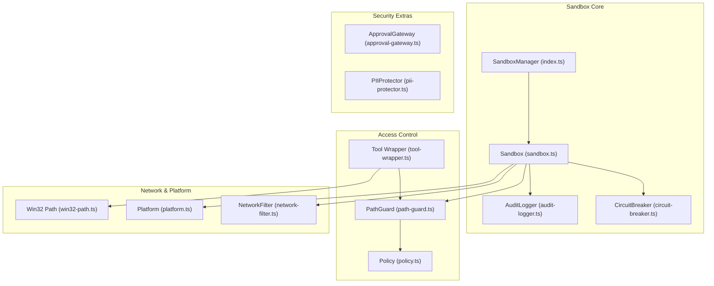
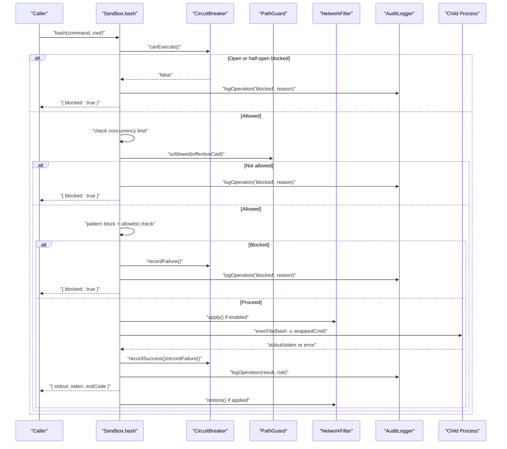
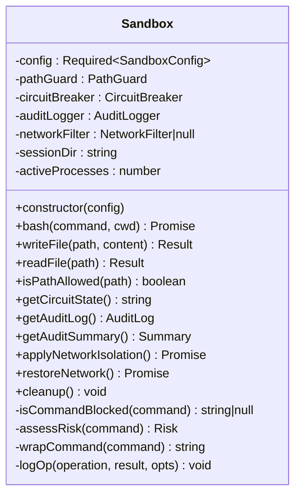
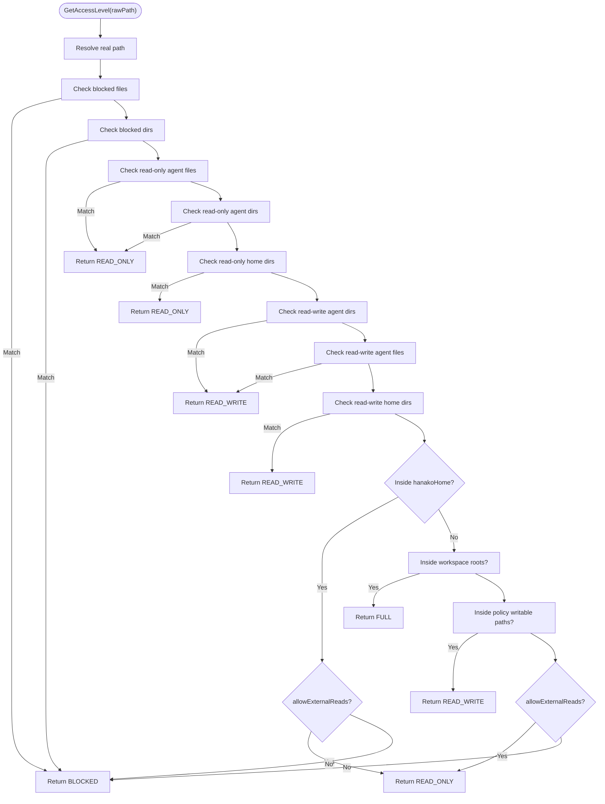
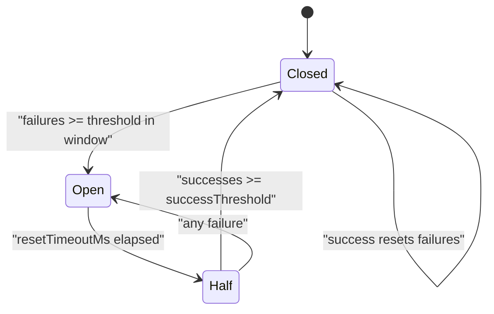
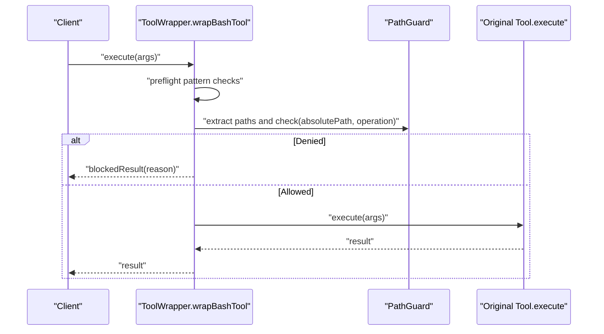
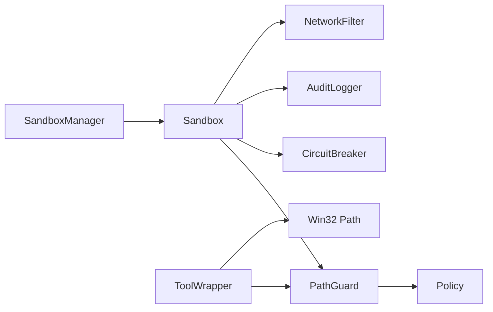

# Sandboxing System

<cite>
**Referenced Files in This Document**
- [sandbox.ts](file://core/sandbox/sandbox.ts)
- [index.ts](file://core/sandbox/index.ts)
- [path-guard.ts](file://core/sandbox/path-guard.ts)
- [circuit-breaker.ts](file://core/sandbox/circuit-breaker.ts)
- [audit-logger.ts](file://core/sandbox/audit-logger.ts)
- [network-filter.ts](file://core/sandbox/network-filter.ts)
- [policy.ts](file://core/sandbox/policy.ts)
- [tool-wrapper.ts](file://core/sandbox/tool-wrapper.ts)
- [platform.ts](file://core/sandbox/platform.ts)
- [win32-path.ts](file://core/sandbox/win32-path.ts)
- [approval-gateway.ts](file://core/sandbox/approval-gateway.ts)
- [pii-protector.ts](file://core/sandbox/pii-protector.ts)
- [sandbox.test.ts](file://tests/sandbox.test.ts)
</cite>

## Table of Contents
1. [Introduction](#introduction)
2. [Project Structure](#project-structure)
3. [Core Components](#core-components)
4. [Architecture Overview](#architecture-overview)
5. [Detailed Component Analysis](#detailed-component-analysis)
6. [Dependency Analysis](#dependency-analysis)
7. [Performance Considerations](#performance-considerations)
8. [Troubleshooting Guide](#troubleshooting-guide)
9. [Conclusion](#conclusion)
10. [Appendices](#appendices)

## Introduction
This document explains the sandboxing system that provides isolated execution environments for agent operations. It focuses on a dual-layer security model:
- Application-level path guards and policy enforcement
- OS-level process isolation with resource limits, timeouts, and optional network filtering

The Sandbox class enforces command execution restrictions, file access controls, concurrency limits, and failure protection via a circuit breaker. The system also includes audit logging, PII redaction, approval workflows, and platform-specific helpers to ensure consistent behavior across operating systems.

## Project Structure
The sandbox subsystem is organized into focused modules:
- Core runtime: Sandbox, SandboxManager, CircuitBreaker, AuditLogger
- Access control: PathGuard, Policy definitions, Tool wrappers
- Network and platform: NetworkFilter, Platform detection, Windows path normalization
- Security extras: ApprovalGateway, PIIProtector
- Tests: Integration tests validating core behaviors

**Diagram sources**
- [sandbox.ts:61-94](file://core/sandbox/sandbox.ts#L61-L94)
- [index.ts:19-60](file://core/sandbox/index.ts#L19-L60)
- [circuit-breaker.ts:30-62](file://core/sandbox/circuit-breaker.ts#L30-L62)
- [audit-logger.ts:30-73](file://core/sandbox/audit-logger.ts#L30-L73)
- [path-guard.ts:37-60](file://core/sandbox/path-guard.ts#L37-L60)
- [policy.ts:76-138](file://core/sandbox/policy.ts#L76-L138)
- [tool-wrapper.ts:325-354](file://core/sandbox/tool-wrapper.ts#L325-L354)
- [network-filter.ts:23-33](file://core/sandbox/network-filter.ts#L23-L33)
- [platform.ts:7-12](file://core/sandbox/platform.ts#L7-L12)
- [win32-path.ts:46-83](file://core/sandbox/win32-path.ts#L46-L83)
- [approval-gateway.ts:48-100](file://core/sandbox/approval-gateway.ts#L48-L100)
- [pii-protector.ts:50-68](file://core/sandbox/pii-protector.ts#L50-L68)

**Section sources**
- [sandbox.ts:1-12](file://core/sandbox/sandbox.ts#L1-L12)
- [index.ts:1-10](file://core/sandbox/index.ts#L1-L10)

## Core Components
- Sandbox: Orchestrates execution with path checks, pattern blocking, allowlists, concurrency limits, timeouts, resource wrapping, and audit logging.
- SandboxManager: Factory and lifecycle manager for per-session sandboxes with eviction and global audit aggregation.
- PathGuard: Enforces read/write/delete permissions based on policy-defined zones and resolved real paths.
- CircuitBreaker: Halts execution after repeated failures and allows recovery through half-open probing.
- AuditLogger: Records all operations with risk levels and summaries for review.
- NetworkFilter: Applies host-based network restrictions by manipulating /etc/hosts.
- Policy: Central source of ACL constants and derived sandbox policies.
- Tool Wrapper: Pre-execution checks for tools and bash commands, integrating PathGuard and managed config write rules.
- Platform: Detects available OS-level sandbox tooling.
- Win32 Path: Normalizes shell paths to native Windows absolute paths for accurate checks.
- ApprovalGateway: Optional human-in-the-loop approvals for risky operations.
- PIIProtector: Redacts sensitive data from outputs.

**Section sources**
- [sandbox.ts:61-94](file://core/sandbox/sandbox.ts#L61-L94)
- [index.ts:19-60](file://core/sandbox/index.ts#L19-L60)
- [path-guard.ts:37-60](file://core/sandbox/path-guard.ts#L37-L60)
- [circuit-breaker.ts:30-62](file://core/sandbox/circuit-breaker.ts#L30-L62)
- [audit-logger.ts:30-73](file://core/sandbox/audit-logger.ts#L30-L73)
- [network-filter.ts:23-33](file://core/sandbox/network-filter.ts#L23-L33)
- [policy.ts:76-138](file://core/sandbox/policy.ts#L76-L138)
- [tool-wrapper.ts:325-354](file://core/sandbox/tool-wrapper.ts#L325-L354)
- [platform.ts:7-12](file://core/sandbox/platform.ts#L7-L12)
- [win32-path.ts:46-83](file://core/sandbox/win32-path.ts#L46-L83)
- [approval-gateway.ts:48-100](file://core/sandbox/approval-gateway.ts#L48-L100)
- [pii-protector.ts:50-68](file://core/sandbox/pii-protector.ts#L50-L68)

## Architecture Overview
The sandbox applies layered defenses before executing any operation:
- Command preflight: Pattern blocking and allowlist checks
- Path scoping: Working directory and target path validation
- Concurrency gating: Limit active processes
- Resource wrapping: Apply ulimit constraints
- Execution: Run under bash with timeout and buffer limits
- Post-execution: Record success/failure, update circuit breaker, and audit log

**Diagram sources**
- [sandbox.ts:101-191](file://core/sandbox/sandbox.ts#L101-L191)
- [circuit-breaker.ts:44-62](file://core/sandbox/circuit-breaker.ts#L44-L62)
- [path-guard.ts:186-199](file://core/sandbox/path-guard.ts#L186-L199)
- [network-filter.ts:38-59](file://core/sandbox/network-filter.ts#L38-L59)
- [audit-logger.ts:46-73](file://core/sandbox/audit-logger.ts#L46-L73)

## Detailed Component Analysis

### Sandbox Class
Responsibilities:
- Enforce command allowlists and dangerous pattern blocks
- Restrict working directories using PathGuard
- Limit concurrent processes
- Wrap commands with resource limits (ulimit)
- Execute via child_process with timeout and buffer caps
- Integrate circuit breaker and audit logging
- Provide optional network isolation

Key configuration options:
- sessionId, allowedDir, timeoutMs, maxBuffer, maxProcesses, networkIsolation, allowedCommands, extraBlockedPatterns

Behavior highlights:
- Early rejection when circuit breaker is open
- Reject out-of-scope working directories
- Block dangerous patterns and disallowed commands
- Track active processes and decrement in finally
- Slice output sizes to prevent memory growth
- Assess risk level for audit entries

**Diagram sources**
- [sandbox.ts:61-94](file://core/sandbox/sandbox.ts#L61-L94)
- [sandbox.ts:101-191](file://core/sandbox/sandbox.ts#L101-L191)
- [sandbox.ts:196-230](file://core/sandbox/sandbox.ts#L196-L230)
- [sandbox.ts:235-258](file://core/sandbox/sandbox.ts#L235-L258)
- [sandbox.ts:263-289](file://core/sandbox/sandbox.ts#L263-L289)
- [sandbox.ts:293-331](file://core/sandbox/sandbox.ts#L293-L331)

**Section sources**
- [sandbox.ts:25-42](file://core/sandbox/sandbox.ts#L25-L42)
- [sandbox.ts:61-94](file://core/sandbox/sandbox.ts#L61-L94)
- [sandbox.ts:101-191](file://core/sandbox/sandbox.ts#L101-L191)
- [sandbox.ts:196-230](file://core/sandbox/sandbox.ts#L196-L230)
- [sandbox.ts:235-258](file://core/sandbox/sandbox.ts#L235-L258)
- [sandbox.ts:263-289](file://core/sandbox/sandbox.ts#L263-L289)
- [sandbox.ts:293-331](file://core/sandbox/sandbox.ts#L293-L331)

### PathGuard and Policy
PathGuard resolves real paths (following symlinks) and determines access levels:
- BLOCKED, READ_ONLY, READ_WRITE, FULL
- Operations require minimum levels: read, write, delete

Policy centralizes ACL constants and derives writable/readable/deny lists for OS-level sandboxes.

**Diagram sources**
- [path-guard.ts:102-178](file://core/sandbox/path-guard.ts#L102-L178)
- [policy.ts:14-48](file://core/sandbox/policy.ts#L14-L48)
- [policy.ts:76-138](file://core/sandbox/policy.ts#L76-L138)

**Section sources**
- [path-guard.ts:37-60](file://core/sandbox/path-guard.ts#L37-L60)
- [path-guard.ts:102-178](file://core/sandbox/path-guard.ts#L102-L178)
- [path-guard.ts:186-199](file://core/sandbox/path-guard.ts#L186-L199)
- [policy.ts:76-138](file://core/sandbox/policy.ts#L76-L138)

### Circuit Breaker
States:
- Closed: normal operation; counts failures within a time window
- Open: blocks execution until resetTimeoutMs elapses
- Half: allows limited test requests; transitions back to closed after successThreshold successes

Usage in Sandbox:
- Blocks early when open
- Records success/failure around execution
- Resets failure count on success

**Diagram sources**
- [circuit-breaker.ts:30-62](file://core/sandbox/circuit-breaker.ts#L30-L62)
- [circuit-breaker.ts:67-100](file://core/sandbox/circuit-breaker.ts#L67-L100)

**Section sources**
- [circuit-breaker.ts:12-28](file://core/sandbox/circuit-breaker.ts#L12-L28)
- [circuit-breaker.ts:44-62](file://core/sandbox/circuit-breaker.ts#L44-L62)
- [circuit-breaker.ts:67-100](file://core/sandbox/circuit-breaker.ts#L67-L100)

### Audit Logger
Records structured entries with timestamps, session IDs, operation types, results, reasons, durations, and risk levels. Provides summaries and filtered views for high-risk events.

**Section sources**
- [audit-logger.ts:5-21](file://core/sandbox/audit-logger.ts#L5-L21)
- [audit-logger.ts:46-73](file://core/sandbox/audit-logger.ts#L46-L73)
- [audit-logger.ts:106-132](file://core/sandbox/audit-logger.ts#L106-L132)

### Network Filter
Applies host-based restrictions by appending entries to /etc/hosts and restoring them afterward. Supports custom mappings and private IP blocking flags.

**Section sources**
- [network-filter.ts:9-16](file://core/sandbox/network-filter.ts#L9-L16)
- [network-filter.ts:38-59](file://core/sandbox/network-filter.ts#L38-L59)
- [network-filter.ts:64-70](file://core/sandbox/network-filter.ts#L64-L70)

### Tool Wrapper
Wraps path-based tools and bash commands to enforce PathGuard checks and managed config write rules. On Windows, uses normalized shell paths for accurate checks. Returns user-friendly blocked messages instead of exceptions.

**Diagram sources**
- [tool-wrapper.ts:359-416](file://core/sandbox/tool-wrapper.ts#L359-L416)
- [tool-wrapper.ts:325-354](file://core/sandbox/tool-wrapper.ts#L325-L354)
- [win32-path.ts:46-83](file://core/sandbox/win32-path.ts#L46-L83)

**Section sources**
- [tool-wrapper.ts:325-354](file://core/sandbox/tool-wrapper.ts#L325-L354)
- [tool-wrapper.ts:359-416](file://core/sandbox/tool-wrapper.ts#L359-L416)
- [win32-path.ts:46-83](file://core/sandbox/win32-path.ts#L46-L83)

### Platform Detection
Detects available OS-level sandbox tooling (seatbelt on macOS, bwrap on Linux). Availability checks verify presence of required binaries.

**Section sources**
- [platform.ts:7-12](file://core/sandbox/platform.ts#L7-L12)
- [platform.ts:14-28](file://core/sandbox/platform.ts#L14-L28)

### Approval Gateway and PII Protector
- ApprovalGateway: Evaluates risk and can auto-approve low-risk operations or request human approval for higher risks.
- PIIProtector: Redacts sensitive information like emails, phone numbers, API keys, and IPs from text.

**Section sources**
- [approval-gateway.ts:48-100](file://core/sandbox/approval-gateway.ts#L48-L100)
- [pii-protector.ts:50-68](file://core/sandbox/pii-protector.ts#L50-L68)

## Dependency Analysis
High-level dependencies:
- Sandbox depends on PathGuard, CircuitBreaker, AuditLogger, and optionally NetworkFilter
- SandboxManager manages multiple Sandbox instances and evicts oldest when at capacity
- ToolWrapper integrates PathGuard and Windows path normalization
- Policy defines ACL constants consumed by PathGuard and OS sandbox derivation

**Diagram sources**
- [sandbox.ts:61-94](file://core/sandbox/sandbox.ts#L61-L94)
- [index.ts:19-60](file://core/sandbox/index.ts#L19-L60)
- [tool-wrapper.ts:325-354](file://core/sandbox/tool-wrapper.ts#L325-L354)
- [path-guard.ts:37-60](file://core/sandbox/path-guard.ts#L37-L60)
- [policy.ts:76-138](file://core/sandbox/policy.ts#L76-L138)

**Section sources**
- [sandbox.ts:61-94](file://core/sandbox/sandbox.ts#L61-L94)
- [index.ts:19-60](file://core/sandbox/index.ts#L19-L60)
- [tool-wrapper.ts:325-354](file://core/sandbox/tool-wrapper.ts#L325-L354)
- [path-guard.ts:37-60](file://core/sandbox/path-guard.ts#L37-L60)
- [policy.ts:76-138](file://core/sandbox/policy.ts#L76-L138)

## Performance Considerations
- Concurrency limits: Prevent resource exhaustion by capping active processes per sandbox.
- Timeouts and buffers: Avoid long-running or memory-heavy executions by enforcing timeoutMs and maxBuffer.
- Output slicing: Truncate stdout/stderr to bounded sizes to reduce memory pressure.
- Circuit breaker: Rapidly fail fast during cascading errors to protect system stability.
- Path resolution overhead: Realpath resolution occurs per access; consider caching where appropriate if performance becomes critical.

[No sources needed since this section provides general guidance]

## Troubleshooting Guide
Common issues and resolutions:
- Circuit breaker open: Indicates repeated failures; review recent operations and adjust thresholds or fix underlying causes.
- Too many concurrent processes: Increase maxProcesses or optimize workloads to reduce contention.
- Working directory outside scope: Ensure effectiveCwd is within allowedDir or configure additional allowed directories.
- Command blocked by pattern or allowlist: Adjust allowedCommands or remove overly restrictive patterns.
- Timeout errors: Increase timeoutMs for longer tasks or refactor slow operations.
- Network isolation side effects: If enabling networkIsolation, verify hosts file changes and restore network state after use.

Operational tips:
- Use getAuditSummary() to identify high-risk operations and trends.
- Inspect getCircuitState() to monitor health.
- For Windows, ensure shell path normalization is used to avoid false positives.

**Section sources**
- [sandbox.ts:101-191](file://core/sandbox/sandbox.ts#L101-L191)
- [sandbox.ts:242-258](file://core/sandbox/sandbox.ts#L242-L258)
- [sandbox.ts:263-289](file://core/sandbox/sandbox.ts#L263-L289)
- [sandbox.test.ts:148-156](file://tests/sandbox.test.ts#L148-L156)

## Conclusion
The sandboxing system combines application-level path guards and policy-driven access control with OS-level process isolation, resource limits, and optional network filtering. It provides robust protections against dangerous commands, unauthorized file access, and resource abuse while maintaining operational visibility through audit logs and risk assessments. By tuning parameters such as allowed directories, command allowlists, timeouts, and concurrency limits, teams can balance security with functionality for diverse use cases.

[No sources needed since this section summarizes without analyzing specific files]

## Appendices

### Practical Configuration Examples
- Configure a sandbox with strict command allowlist and short timeout:
  - Set allowedCommands to a minimal set (e.g., echo, cat)
  - Reduce timeoutMs for interactive tasks
  - Enable networkIsolation only when necessary
- Set up allowed directories:
  - Provide allowedDir scoped to a session workspace
  - Use SandboxManager to derive per-session directories automatically
- Implement command allowlists:
  - Define allowedCommands explicitly
  - Add extraBlockedPatterns for known dangerous sequences
- Apply network isolation:
  - Enable networkIsolation and call applyNetworkIsolation before execution
  - Always call restoreNetwork after use to revert /etc/hosts changes

**Section sources**
- [sandbox.ts:25-42](file://core/sandbox/sandbox.ts#L25-L42)
- [sandbox.ts:101-191](file://core/sandbox/sandbox.ts#L101-L191)
- [index.ts:35-60](file://core/sandbox/index.ts#L35-L60)
- [network-filter.ts:38-59](file://core/sandbox/network-filter.ts#L38-L59)

### Security Implications and Guidance
- Strict allowlists minimize attack surface but may restrict legitimate operations; maintain a curated list and review regularly.
- Dangerous pattern blocking prevents common exploits; tune patterns to reduce false positives without weakening security.
- Path scoping prevents lateral movement; ensure allowedDir covers only necessary workspace areas.
- Circuit breaker protects against cascading failures; monitor its state and investigate root causes promptly.
- Network isolation reduces exfiltration risk; use sparingly and restore state after execution.
- Audit logs enable post-incident analysis; export and retain logs according to compliance requirements.

**Section sources**
- [sandbox.ts:293-331](file://core/sandbox/sandbox.ts#L293-L331)
- [audit-logger.ts:106-132](file://core/sandbox/audit-logger.ts#L106-L132)
- [network-filter.ts:38-59](file://core/sandbox/network-filter.ts#L38-L59)