# Security Framework

<cite>
**Referenced Files in This Document**
- [core/sandbox/index.ts](file://core/sandbox/index.ts)
- [core/sandbox/sandbox.ts](file://core/sandbox/sandbox.ts)
- [core/sandbox/policy.ts](file://core/sandbox/policy.ts)
- [core/sandbox/path-guard.ts](file://core/sandbox/path-guard.ts)
- [core/sandbox/network-filter.ts](file://core/sandbox/network-filter.ts)
- [core/sandbox/audit-logger.ts](file://core/sandbox/audit-logger.ts)
- [core/sandbox/circuit-breaker.ts](file://core/sandbox/circuit-breaker.ts)
- [core/sandbox/tool-wrapper.ts](file://core/sandbox/tool-wrapper.ts)
- [core/sandbox/approval-gateway.ts](file://core/sandbox/approval-gateway.ts)
- [core/security-audit-log.ts](file://core/security-audit-log.ts)
- [core/pii-guard.ts](file://core/pii-guard.ts)
- [server/http/route-security.ts](file://server/http/route-security.ts)
- [server/http/capability-guard.ts](file://server/http/capability-guard.ts)
- [core/execution-boundary.ts](file://core/execution-boundary.ts)
</cite>

## Table of Contents
1. Introduction
2. Project Structure
3. Core Components
4. Architecture Overview
5. Detailed Component Analysis
6. Dependency Analysis
7. Performance Considerations
8. Troubleshooting Guide
9. Conclusion
10. Appendices

## Introduction
This document explains the security framework focused on sandboxing and access control. It describes a dual-layer model that combines application-level path guards with OS-level isolation, a permission-based access control system, policy configuration, audit logging, PII protection, file system sandboxing, command execution restrictions, and network request filtering. It also provides best practices, compliance considerations, monitoring approaches, guidance for developing security policies, and incident response procedures.

## Project Structure
The security framework is implemented primarily under core/sandbox and integrates with server HTTP authorization and global audit logging:
- Sandbox runtime and lifecycle management
- Path-based access control and policy derivation
- Command execution guardrails and circuit breaker
- Network filtering via hosts manipulation
- Audit logging and risk assessment
- PII detection and redaction
- HTTP route authorization and capability checks
- Execution boundary metadata for legacy compatibility

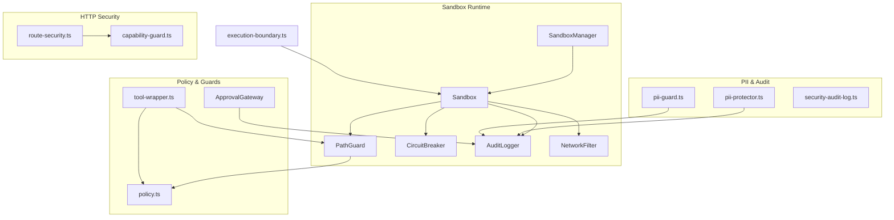

**Diagram sources**
- [core/sandbox/index.ts:1-102](file://core/sandbox/index.ts#L1-L102)
- [core/sandbox/sandbox.ts:1-336](file://core/sandbox/sandbox.ts#L1-L336)
- [core/sandbox/policy.ts:1-139](file://core/sandbox/policy.ts#L1-L139)
- [core/sandbox/path-guard.ts:1-201](file://core/sandbox/path-guard.ts#L1-L201)
- [core/sandbox/network-filter.ts:1-78](file://core/sandbox/network-filter.ts#L1-L78)
- [core/sandbox/audit-logger.ts:1-137](file://core/sandbox/audit-logger.ts#L1-L137)
- [core/sandbox/circuit-breaker.ts:1-125](file://core/sandbox/circuit-breaker.ts#L1-L125)
- [core/sandbox/tool-wrapper.ts:1-417](file://core/sandbox/tool-wrapper.ts#L1-L417)
- [core/sandbox/approval-gateway.ts:1-159](file://core/sandbox/approval-gateway.ts#L1-L159)
- [core/security-audit-log.ts:1-104](file://core/security-audit-log.ts#L1-L104)
- [core/pii-guard.ts:1-37](file://core/pii-guard.ts#L1-L37)
- [server/http/route-security.ts:1-574](file://server/http/route-security.ts#L1-L574)
- [server/http/capability-guard.ts:1-46](file://server/http/capability-guard.ts#L1-L46)
- [core/execution-boundary.ts:1-69](file://core/execution-boundary.ts#L1-L69)

**Section sources**
- [core/sandbox/index.ts:1-102](file://core/sandbox/index.ts#L1-L102)
- [core/sandbox/sandbox.ts:1-336](file://core/sandbox/sandbox.ts#L1-L336)
- [core/sandbox/policy.ts:1-139](file://core/sandbox/policy.ts#L1-L139)
- [core/sandbox/path-guard.ts:1-201](file://core/sandbox/path-guard.ts#L1-L201)
- [core/sandbox/network-filter.ts:1-78](file://core/sandbox/network-filter.ts#L1-L78)
- [core/sandbox/audit-logger.ts:1-137](file://core/sandbox/audit-logger.ts#L1-L137)
- [core/sandbox/circuit-breaker.ts:1-125](file://core/sandbox/circuit-breaker.ts#L1-L125)
- [core/sandbox/tool-wrapper.ts:1-417](file://core/sandbox/tool-wrapper.ts#L1-L417)
- [core/sandbox/approval-gateway.ts:1-159](file://core/sandbox/approval-gateway.ts#L1-L159)
- [core/security-audit-log.ts:1-104](file://core/security-audit-log.ts#L1-L104)
- [core/pii-guard.ts:1-37](file://core/pii-guard.ts#L1-L37)
- [server/http/route-security.ts:1-574](file://server/http/route-security.ts#L1-L574)
- [server/http/capability-guard.ts:1-46](file://server/http/capability-guard.ts#L1-L46)
- [core/execution-boundary.ts:1-69](file://core/execution-boundary.ts#L1-L69)

## Core Components
- SandboxManager: Creates and manages per-session Sandboxes, enforces concurrency limits, and aggregates global audit summaries.
- Sandbox: Enforces process isolation, working directory scoping, command allowlists, pattern blocking, resource wrapping, and optional network isolation.
- PathGuard: Application-level path ACL with levels (blocked, read-only, read-write, full), symlink resolution, and operation requirements.
- Policy: Centralized constants and derived policy for writable/readable/deny paths based on agent/workspace/hanakoHome.
- CircuitBreaker: Prevents cascading failures by opening after threshold failures within a time window.
- AuditLogger: Records operations with timestamps, risk levels, and summaries; exported for analysis.
- NetworkFilter: Best-effort outbound network restriction via /etc/hosts manipulation.
- Tool Wrapper: Pre-flight checks and path extraction from shell commands to enforce PathGuard before execution.
- Approval Gateway: Risk-based approval workflow with auto-approval rules and manual decision support.
- PII Protection: Pattern-based detection and redaction for sensitive data in logs and outputs.
- HTTP Authorization: Route classification and scope enforcement for API endpoints.
- Execution Boundary: Metadata describing legacy sandbox and filesystem/network policies.

**Section sources**
- [core/sandbox/index.ts:1-102](file://core/sandbox/index.ts#L1-L102)
- [core/sandbox/sandbox.ts:1-336](file://core/sandbox/sandbox.ts#L1-L336)
- [core/sandbox/path-guard.ts:1-201](file://core/sandbox/path-guard.ts#L1-L201)
- [core/sandbox/policy.ts:1-139](file://core/sandbox/policy.ts#L1-L139)
- [core/sandbox/circuit-breaker.ts:1-125](file://core/sandbox/circuit-breaker.ts#L1-L125)
- [core/sandbox/audit-logger.ts:1-137](file://core/sandbox/audit-logger.ts#L1-L137)
- [core/sandbox/network-filter.ts:1-78](file://core/sandbox/network-filter.ts#L1-L78)
- [core/sandbox/tool-wrapper.ts:1-417](file://core/sandbox/tool-wrapper.ts#L1-L417)
- [core/sandbox/approval-gateway.ts:1-159](file://core/sandbox/approval-gateway.ts#L1-L159)
- [core/pii-guard.ts:1-37](file://core/pii-guard.ts#L1-L37)
- [server/http/route-security.ts:1-574](file://server/http/route-security.ts#L1-L574)
- [server/http/capability-guard.ts:1-46](file://server/http/capability-guard.ts#L1-L46)
- [core/execution-boundary.ts:1-69](file://core/execution-boundary.ts#L1-L69)

## Architecture Overview
The dual-layer security model applies:
- Layer 1 (Application-level): PathGuard + tool wrappers + approval gateway + PII redaction + audit logging.
- Layer 2 (OS-level): Process isolation via child_process with ulimit constraints, optional network isolation via hosts manipulation, and session-scoped temp directories.

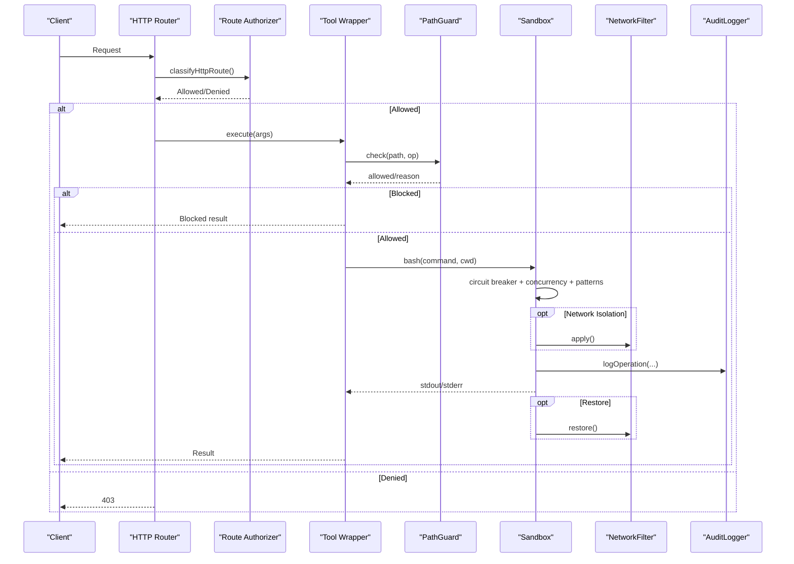

**Diagram sources**
- [server/http/route-security.ts:1-574](file://server/http/route-security.ts#L1-L574)
- [core/sandbox/tool-wrapper.ts:1-417](file://core/sandbox/tool-wrapper.ts#L1-L417)
- [core/sandbox/path-guard.ts:1-201](file://core/sandbox/path-guard.ts#L1-L201)
- [core/sandbox/sandbox.ts:1-336](file://core/sandbox/sandbox.ts#L1-L336)
- [core/sandbox/network-filter.ts:1-78](file://core/sandbox/network-filter.ts#L1-L78)
- [core/sandbox/audit-logger.ts:1-137](file://core/sandbox/audit-logger.ts#L1-L137)

## Detailed Component Analysis

### SandboxManager and Sandbox Lifecycle
- Manages multiple Sandboxes keyed by sessionId with eviction when maxSandboxes reached.
- Each Sandbox encapsulates PathGuard, CircuitBreaker, AuditLogger, and optional NetworkFilter.
- Provides cleanup and summary APIs.

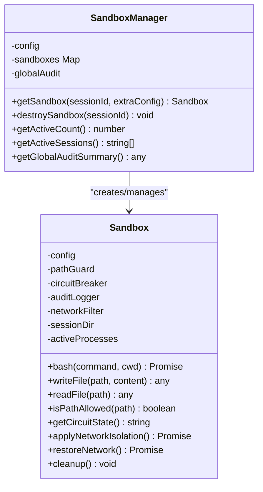

**Diagram sources**
- [core/sandbox/index.ts:1-102](file://core/sandbox/index.ts#L1-L102)
- [core/sandbox/sandbox.ts:1-336](file://core/sandbox/sandbox.ts#L1-L336)

**Section sources**
- [core/sandbox/index.ts:1-102](file://core/sandbox/index.ts#L1-L102)
- [core/sandbox/sandbox.ts:1-336](file://core/sandbox/sandbox.ts#L1-L336)

### Dual-Layer Security Model
- Application-level: PathGuard resolves real paths and evaluates access levels against policy constants.
- OS-level: Child process execution with ulimit constraints, timeouts, buffer limits, and optional network isolation.

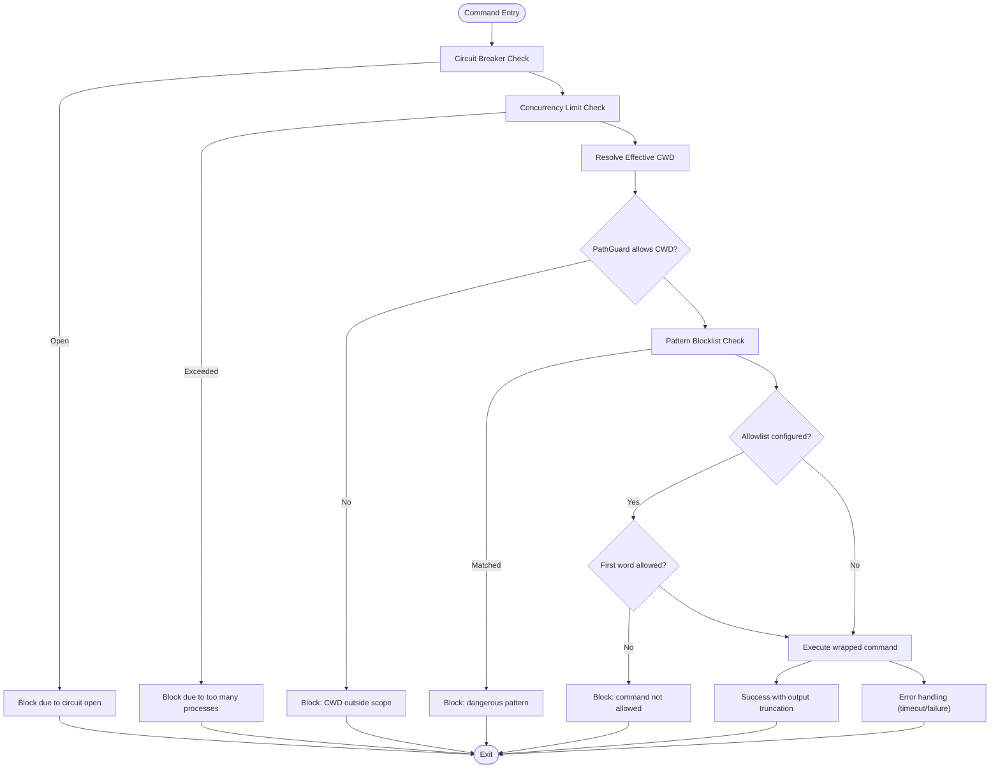

**Diagram sources**
- [core/sandbox/sandbox.ts:1-336](file://core/sandbox/sandbox.ts#L1-L336)
- [core/sandbox/circuit-breaker.ts:1-125](file://core/sandbox/circuit-breaker.ts#L1-L125)
- [core/sandbox/path-guard.ts:1-201](file://core/sandbox/path-guard.ts#L1-L201)

**Section sources**
- [core/sandbox/sandbox.ts:1-336](file://core/sandbox/sandbox.ts#L1-L336)
- [core/sandbox/circuit-breaker.ts:1-125](file://core/sandbox/circuit-breaker.ts#L1-L125)
- [core/sandbox/path-guard.ts:1-201](file://core/sandbox/path-guard.ts#L1-L201)

### Permission-Based Access Control and Policy Configuration
- Policy centralizes blocked files/dirs, read-only and read-write scopes for agent and home directories, and workspace roots.
- PathGuard uses these constants to determine access level and operation allowance.
- deriveSandboxPolicy computes writablePaths, readablePaths, denyReadPaths, protectedPaths based on mode and inputs.

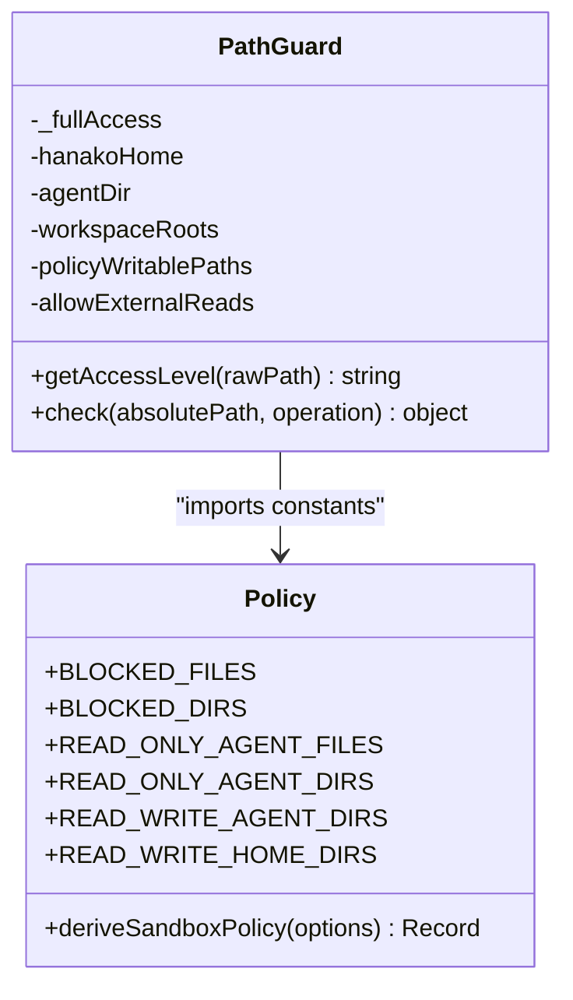

**Diagram sources**
- [core/sandbox/policy.ts:1-139](file://core/sandbox/policy.ts#L1-L139)
- [core/sandbox/path-guard.ts:1-201](file://core/sandbox/path-guard.ts#L1-L201)

**Section sources**
- [core/sandbox/policy.ts:1-139](file://core/sandbox/policy.ts#L1-L139)
- [core/sandbox/path-guard.ts:1-201](file://core/sandbox/path-guard.ts#L1-L201)

### File System Sandboxing
- PathGuard resolves symlinks and determines access levels across hanakoHome, agentDir, and workspace roots.
- Operation requirements map read/write/delete to minimum access levels.
- External read grants can override read denials for specific granted paths.

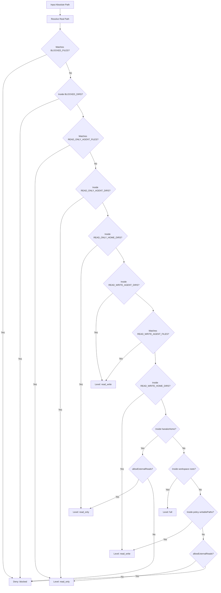

**Diagram sources**
- [core/sandbox/path-guard.ts:1-201](file://core/sandbox/path-guard.ts#L1-L201)
- [core/sandbox/policy.ts:1-139](file://core/sandbox/policy.ts#L1-L139)

**Section sources**
- [core/sandbox/path-guard.ts:1-201](file://core/sandbox/path-guard.ts#L1-L201)
- [core/sandbox/policy.ts:1-139](file://core/sandbox/policy.ts#L1-L139)

### Command Execution Restrictions
- Preflight checks block privileged or destructive commands on Unix and Windows.
- Shell parsing extracts paths from redirections and operands for targeted checks.
- Managed config write checks integrate with external policy hooks.

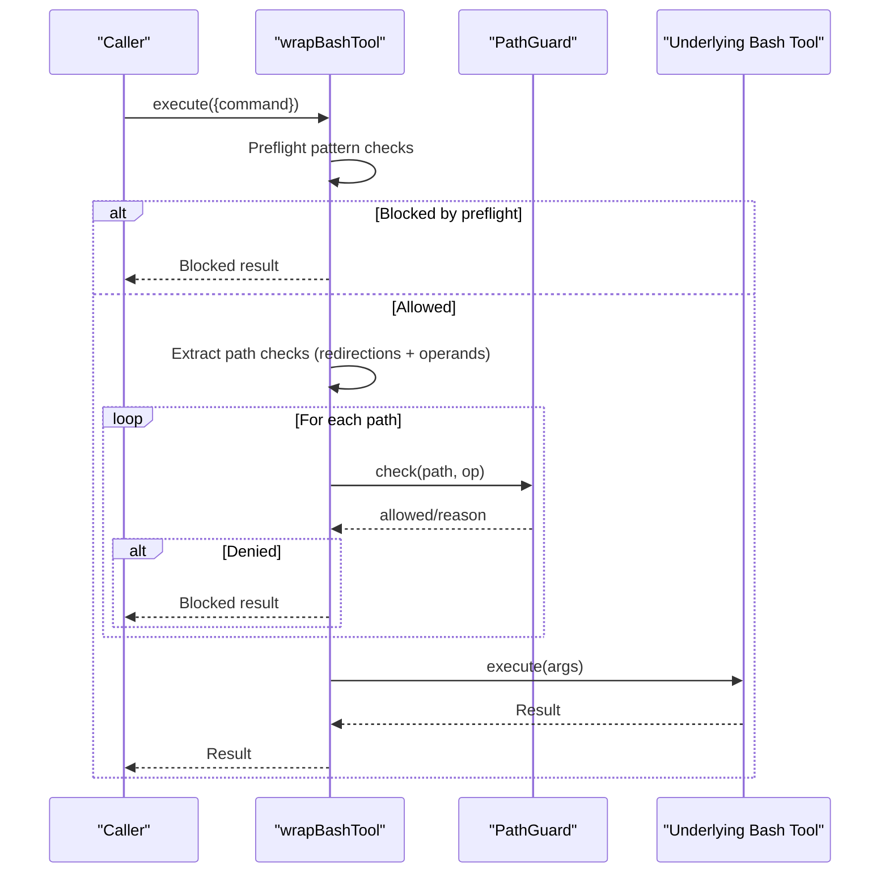

**Diagram sources**
- [core/sandbox/tool-wrapper.ts:1-417](file://core/sandbox/tool-wrapper.ts#L1-L417)
- [core/sandbox/path-guard.ts:1-201](file://core/sandbox/path-guard.ts#L1-L201)

**Section sources**
- [core/sandbox/tool-wrapper.ts:1-417](file://core/sandbox/tool-wrapper.ts#L1-L417)
- [core/sandbox/path-guard.ts:1-201](file://core/sandbox/path-guard.ts#L1-L201)

### Network Request Filtering
- Applies /etc/hosts entries to block default targets and add custom mappings.
- Restores original hosts on completion.

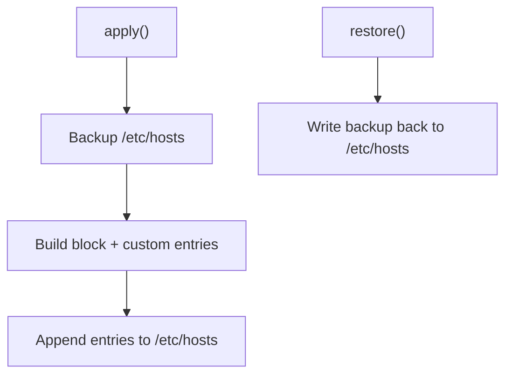

**Diagram sources**
- [core/sandbox/network-filter.ts:1-78](file://core/sandbox/network-filter.ts#L1-L78)

**Section sources**
- [core/sandbox/network-filter.ts:1-78](file://core/sandbox/network-filter.ts#L1-L78)

### Audit Logging and Risk Assessment
- AuditLogger records operations with timestamps, results, reasons, durations, and risk levels.
- Global and per-sandbox summaries are available.
- Server-side security audit log persists events with sanitized secrets.

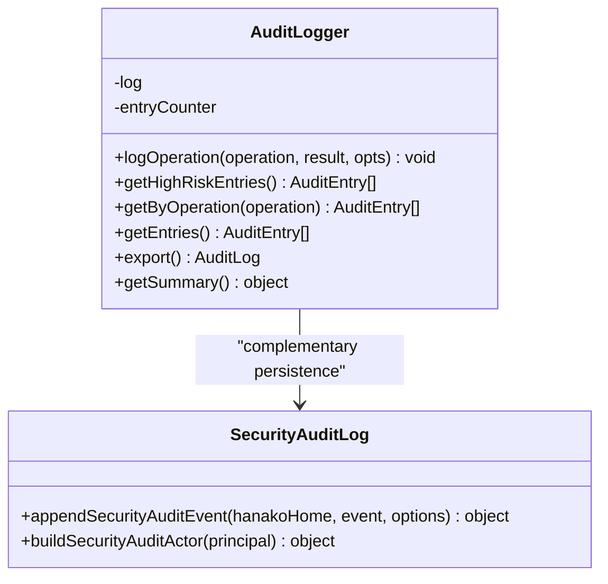

**Diagram sources**
- [core/sandbox/audit-logger.ts:1-137](file://core/sandbox/audit-logger.ts#L1-L137)
- [core/security-audit-log.ts:1-104](file://core/security-audit-log.ts#L1-L104)

**Section sources**
- [core/sandbox/audit-logger.ts:1-137](file://core/sandbox/audit-logger.ts#L1-L137)
- [core/security-audit-log.ts:1-104](file://core/security-audit-log.ts#L1-L104)

### PII Protection
- Pattern-based detection and redaction for emails, phone numbers, IDs, API keys, IPs, and more.
- Supports selective enabling of rule labels and message batch redaction.

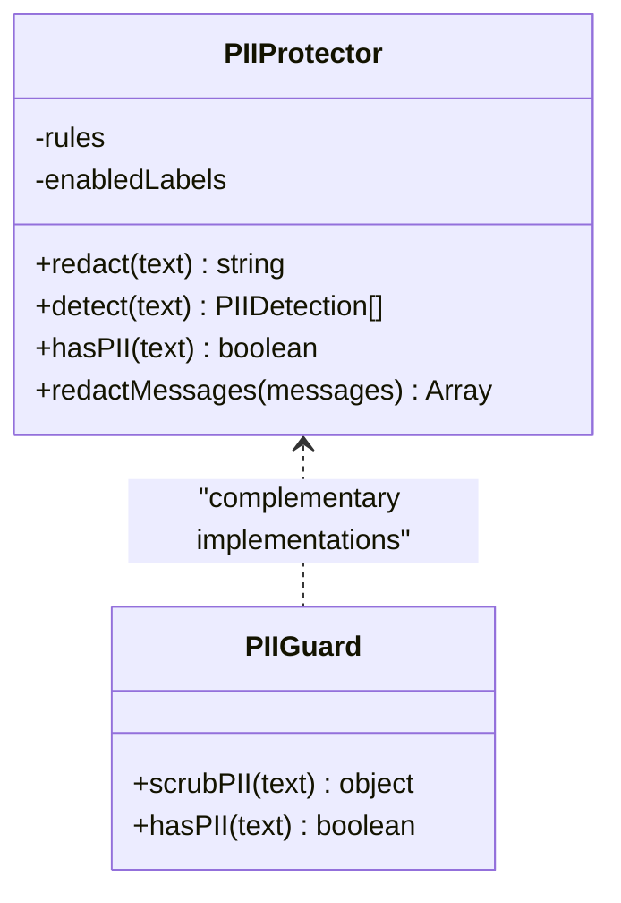

**Diagram sources**
- [core/sandbox/pii-protector.ts:1-101](file://core/sandbox/pii-protector.ts#L1-L101)
- [core/pii-guard.ts:1-37](file://core/pii-guard.ts#L1-L37)

**Section sources**
- [core/sandbox/pii-protector.ts:1-101](file://core/sandbox/pii-protector.ts#L1-L101)
- [core/pii-guard.ts:1-37](file://core/pii-guard.ts#L1-L37)

### Approval Workflow
- Risk-based approval rules with auto-approval for low-risk operations.
- Manual decisions integrated via promise-based requests and event bus notifications.

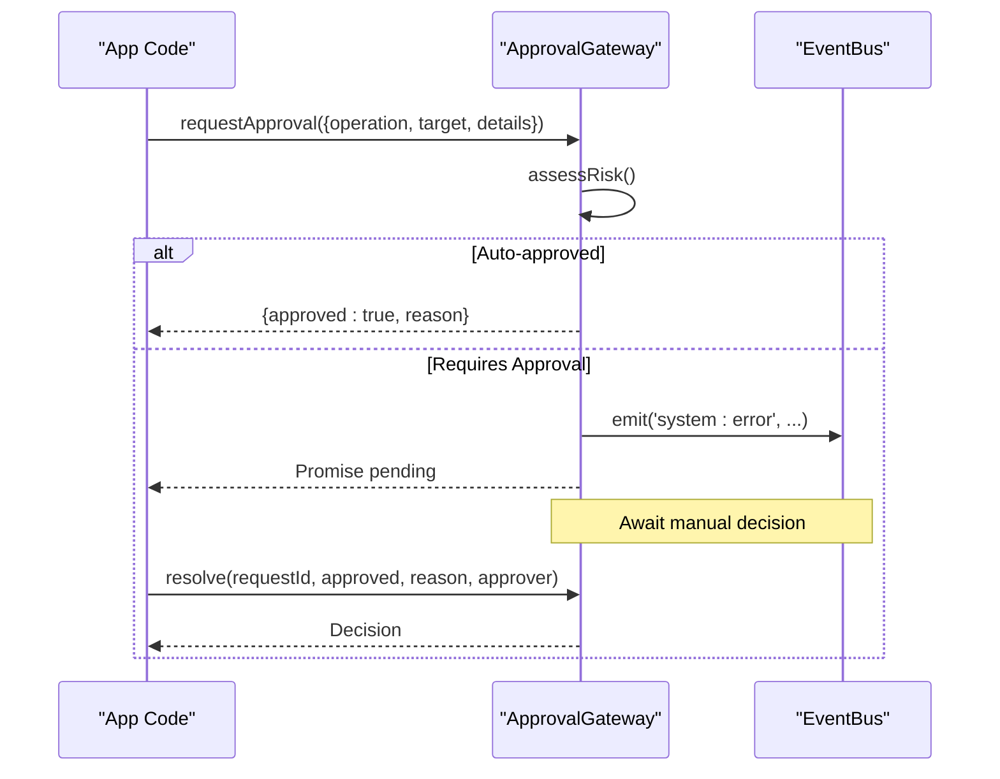

**Diagram sources**
- [core/sandbox/approval-gateway.ts:1-159](file://core/sandbox/approval-gateway.ts#L1-L159)

**Section sources**
- [core/sandbox/approval-gateway.ts:1-159](file://core/sandbox/approval-gateway.ts#L1-L159)

### HTTP Authorization and Capability Checks
- Route classification defines public, authenticated, local-only, plugin-specific, and studio-owner routes.
- Scope checks enforce fine-grained permissions for settings, files, chat, providers, and resources.
- Capability guard helpers simplify principal scope checks and secret mutation protection.

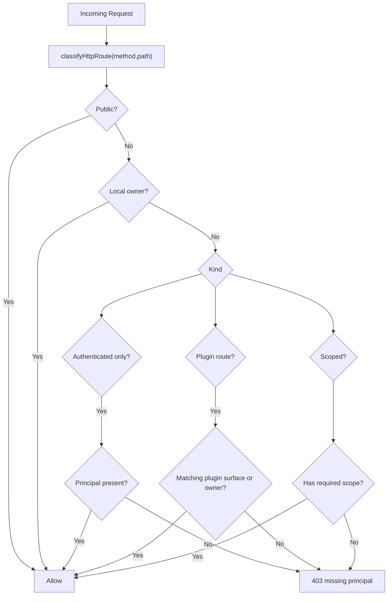

**Diagram sources**
- [server/http/route-security.ts:1-574](file://server/http/route-security.ts#L1-L574)
- [server/http/capability-guard.ts:1-46](file://server/http/capability-guard.ts#L1-L46)

**Section sources**
- [server/http/route-security.ts:1-574](file://server/http/route-security.ts#L1-L574)
- [server/http/capability-guard.ts:1-46](file://server/http/capability-guard.ts#L1-L46)

### Execution Boundary Metadata
- Provides immutable metadata describing legacy sandbox and filesystem/network policies for compatibility.

**Section sources**
- [core/execution-boundary.ts:1-69](file://core/execution-boundary.ts#L1-L69)

## Dependency Analysis
Key dependencies and relationships:
- Sandbox depends on PathGuard, CircuitBreaker, AuditLogger, and optionally NetworkFilter.
- Tool wrapper depends on PathGuard and policy constants.
- Approval gateway emits events and integrates with audit logging.
- HTTP authorization is independent but complements sandbox controls at the API layer.

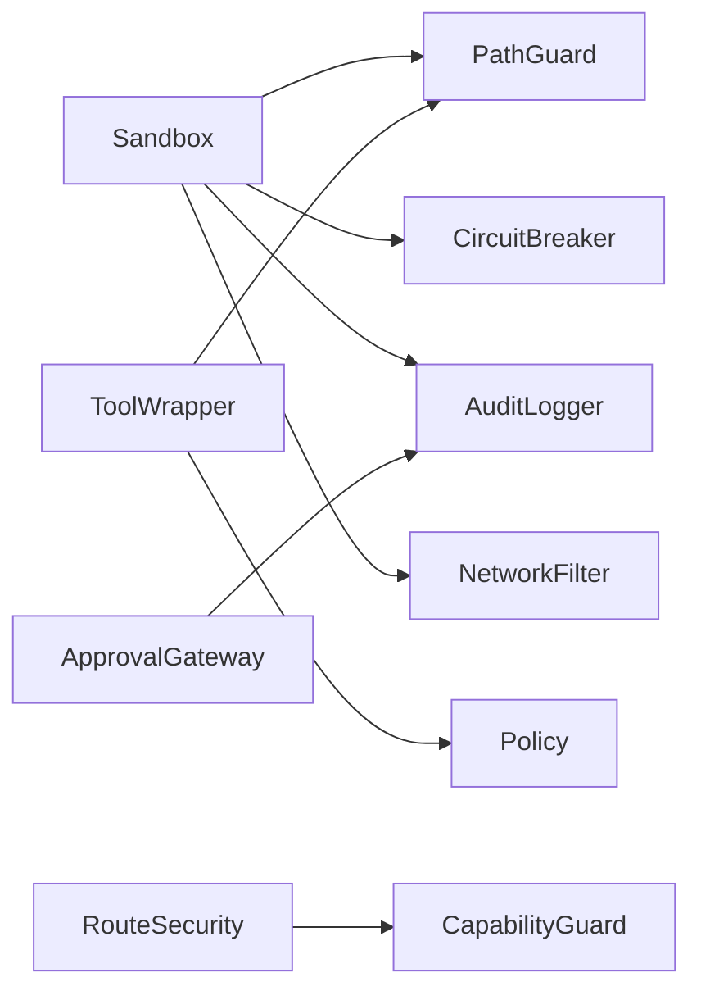

**Diagram sources**
- [core/sandbox/sandbox.ts:1-336](file://core/sandbox/sandbox.ts#L1-L336)
- [core/sandbox/path-guard.ts:1-201](file://core/sandbox/path-guard.ts#L1-L201)
- [core/sandbox/circuit-breaker.ts:1-125](file://core/sandbox/circuit-breaker.ts#L1-L125)
- [core/sandbox/audit-logger.ts:1-137](file://core/sandbox/audit-logger.ts#L1-L137)
- [core/sandbox/network-filter.ts:1-78](file://core/sandbox/network-filter.ts#L1-L78)
- [core/sandbox/tool-wrapper.ts:1-417](file://core/sandbox/tool-wrapper.ts#L1-L417)
- [core/sandbox/policy.ts:1-139](file://core/sandbox/policy.ts#L1-L139)
- [core/sandbox/approval-gateway.ts:1-159](file://core/sandbox/approval-gateway.ts#L1-L159)
- [server/http/route-security.ts:1-574](file://server/http/route-security.ts#L1-L574)
- [server/http/capability-guard.ts:1-46](file://server/http/capability-guard.ts#L1-L46)

**Section sources**
- [core/sandbox/sandbox.ts:1-336](file://core/sandbox/sandbox.ts#L1-L336)
- [core/sandbox/path-guard.ts:1-201](file://core/sandbox/path-guard.ts#L1-L201)
- [core/sandbox/circuit-breaker.ts:1-125](file://core/sandbox/circuit-breaker.ts#L1-L125)
- [core/sandbox/audit-logger.ts:1-137](file://core/sandbox/audit-logger.ts#L1-L137)
- [core/sandbox/network-filter.ts:1-78](file://core/sandbox/network-filter.ts#L1-L78)
- [core/sandbox/tool-wrapper.ts:1-417](file://core/sandbox/tool-wrapper.ts#L1-L417)
- [core/sandbox/policy.ts:1-139](file://core/sandbox/policy.ts#L1-L139)
- [core/sandbox/approval-gateway.ts:1-159](file://core/sandbox/approval-gateway.ts#L1-L159)
- [server/http/route-security.ts:1-574](file://server/http/route-security.ts#L1-L574)
- [server/http/capability-guard.ts:1-46](file://server/http/capability-guard.ts#L1-L46)

## Performance Considerations
- Prefer minimal regex usage in hot paths; consider caching resolved real paths where appropriate.
- Tune CircuitBreaker thresholds and windows to balance resilience and throughput.
- Limit max concurrent processes and buffer sizes to prevent resource exhaustion.
- Use network isolation judiciously; applying hosts changes has system-wide effects and should be scoped tightly.
- Truncate large outputs early to reduce memory pressure.

[No sources needed since this section provides general guidance]

## Troubleshooting Guide
Common issues and diagnostics:
- Circuit breaker open: Review recent failures and adjust thresholds if necessary.
- Path denied: Verify workspace roots and policy writablePaths; ensure external read grants cover intended paths.
- Command blocked: Inspect preflight patterns and allowlists; update policy constants carefully.
- Network errors: Confirm hosts restoration and allowed host mappings.
- Audit gaps: Ensure appendSecurityAuditEvent is invoked for critical actions and secrets are masked.

**Section sources**
- [core/sandbox/circuit-breaker.ts:1-125](file://core/sandbox/circuit-breaker.ts#L1-L125)
- [core/sandbox/path-guard.ts:1-201](file://core/sandbox/path-guard.ts#L1-L201)
- [core/sandbox/tool-wrapper.ts:1-417](file://core/sandbox/tool-wrapper.ts#L1-L417)
- [core/sandbox/network-filter.ts:1-78](file://core/sandbox/network-filter.ts#L1-L78)
- [core/security-audit-log.ts:1-104](file://core/security-audit-log.ts#L1-L104)

## Conclusion
The framework implements a robust dual-layer security model combining application-level path guards with OS-level isolation. It provides comprehensive access control, command execution safeguards, network filtering, audit logging, and PII protection. With clear policy configuration and approval workflows, it supports secure development and deployment while maintaining operational flexibility.

[No sources needed since this section summarizes without analyzing specific files]

## Appendices

### Practical Examples

- Defining security policies:
  - Configure writablePaths, readablePaths, denyReadPaths, and protectedPaths via deriveSandboxPolicy using agentDir, hanakoHome, workspace, and mode.
  - Adjust PathGuard behavior by toggling allowExternalReads and workspace roots.

- Audit logging:
  - Use AuditLogger.logOperation for sandbox operations and appendSecurityAuditEvent for server-side persistent logs.
  - Export summaries for dashboards and alerts.

- PII protection:
  - Integrate PIIProtector.redact or PIIGuard.scrubPII around outputs and logs.
  - Enable only required rule labels to minimize false positives.

- File system sandboxing:
  - Wrap tools with wrapPathTool/wrapBashTool to enforce PathGuard checks before execution.
  - Validate effective CWD and target paths through PathGuard.check.

- Command execution restrictions:
  - Maintain allowlists and preflight patterns; extend PREFLIGHT_PATTERNS for platform-specific risks.
  - Use CircuitBreaker to mitigate repeated failures.

- Network request filtering:
  - Apply NetworkFilter.apply before network-bound operations and restore afterward.
  - Use allowedHosts and customMappings to restrict outbound traffic.

- Compliance considerations:
  - Ensure audit trails capture actor, decision, and secret fields masked.
  - Align policy with least privilege and data minimization principles.

- Monitoring approaches:
  - Aggregate high-risk audit entries and track failure rates.
  - Alert on circuit breaker trips and blocked operations exceeding thresholds.

- Security policy development:
  - Start with standard mode; gradually expand writablePaths as needed.
  - Regularly review blocked patterns and allowlists against threat models.

- Incident response procedures:
  - Investigate audit logs for affected sessions and principals.
  - Revoke external read grants and tighten PathGuard rules.
  - Reset CircuitBreaker after root cause remediation.

[No sources needed since this section provides general guidance]