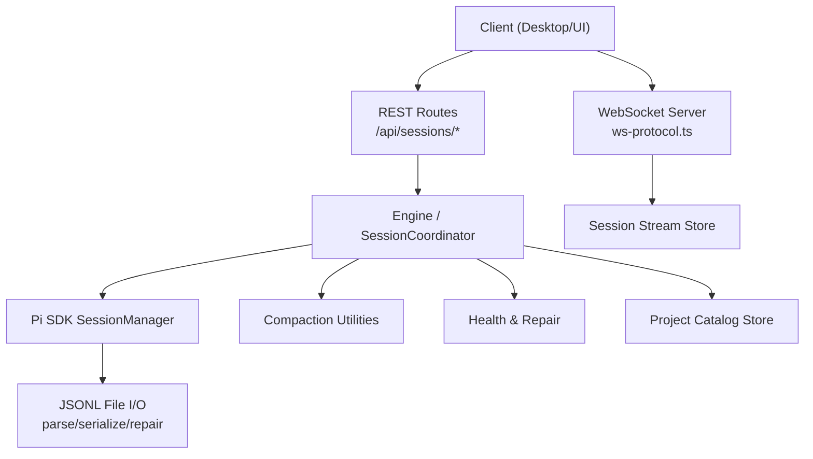
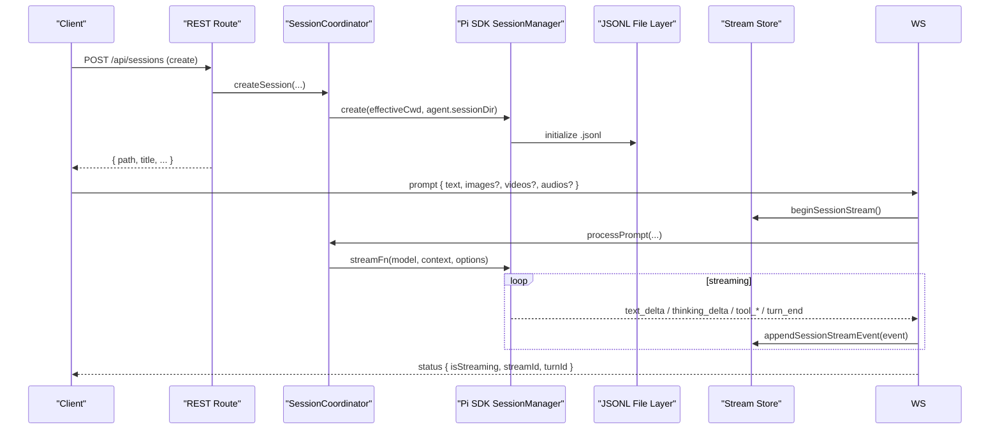
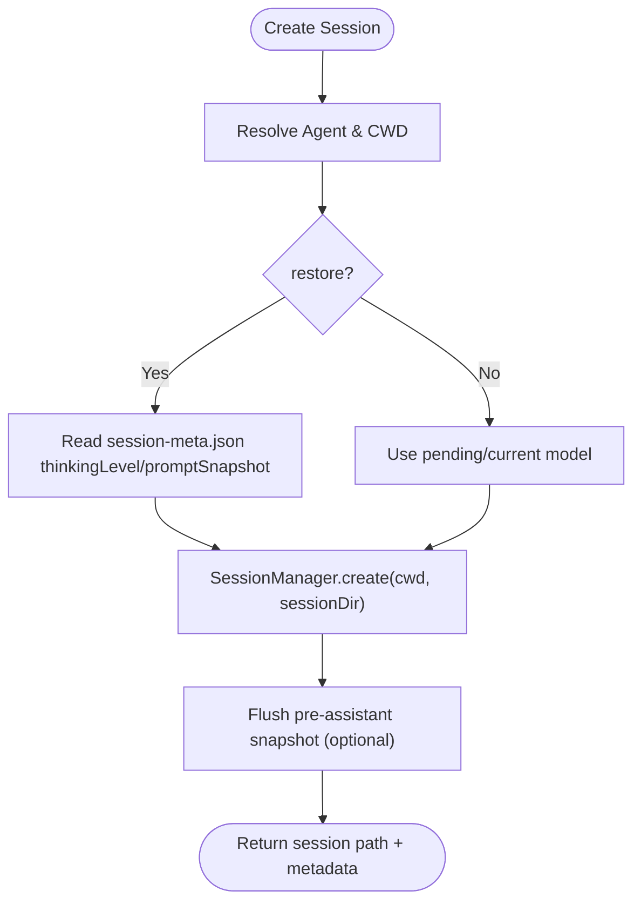
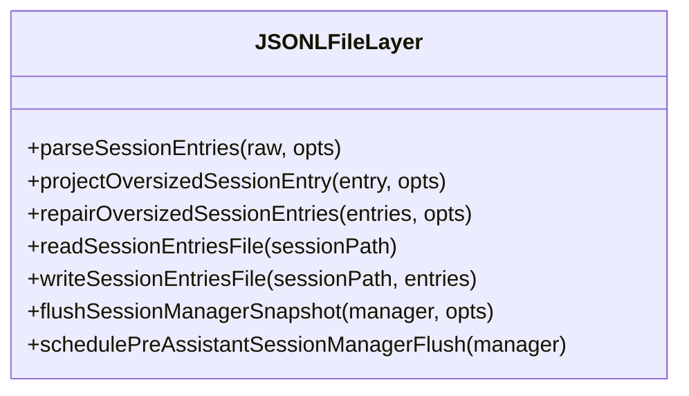
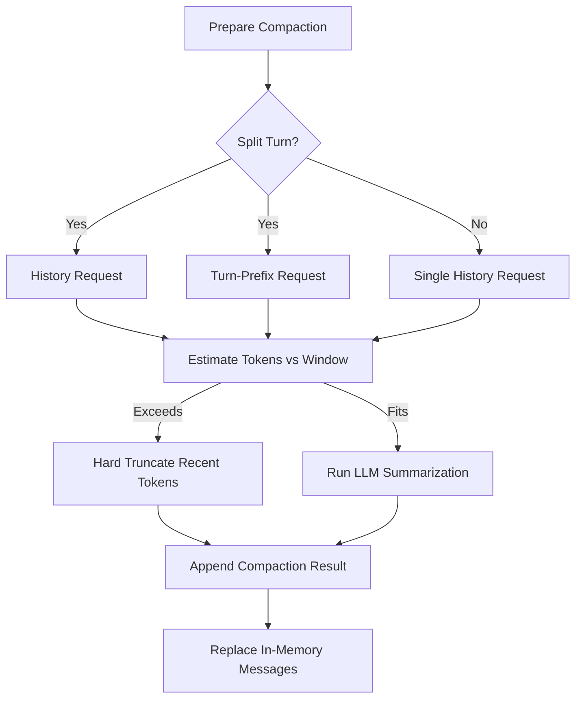
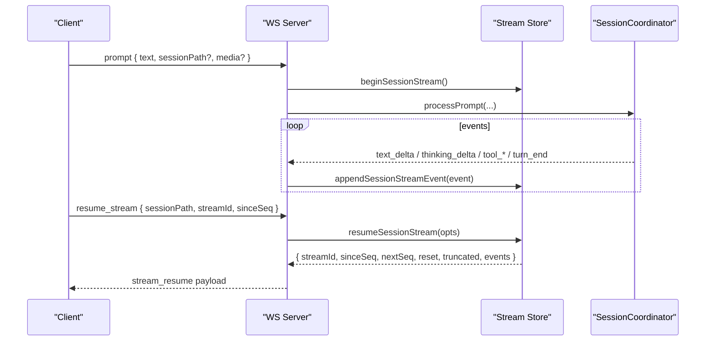
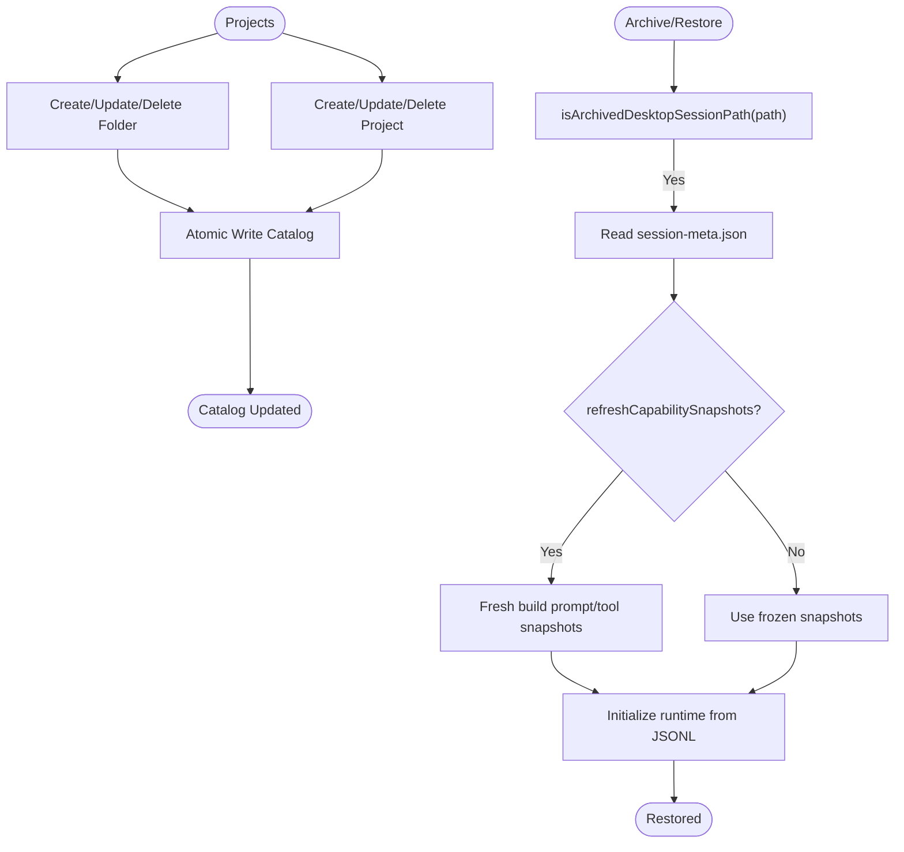
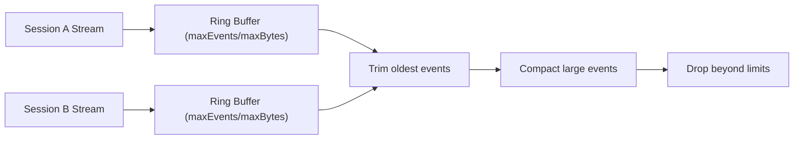
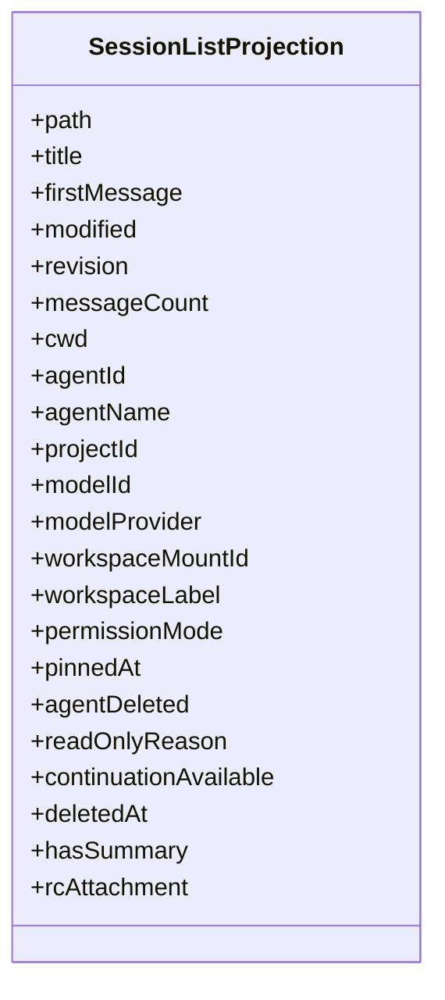
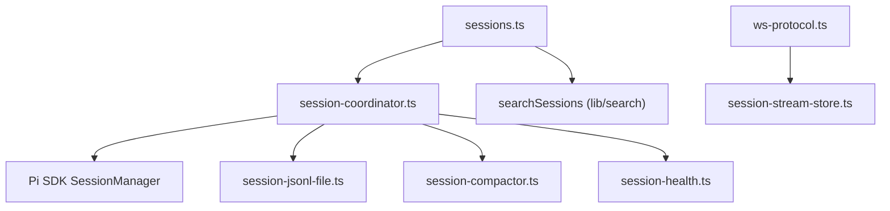

# Session Management

<cite>
**Referenced Files in This Document**
- [session-manager.ts](file://core/session-manager.ts)
- [session-store.ts](file://core/session-store.ts)
- [session-coordinator.ts](file://core/session-coordinator.ts)
- [session-jsonl-file.ts](file://core/session-jsonl-file.ts)
- [session-jsonl.ts](file://lib/session-jsonl.ts)
- [session-compactor.ts](file://core/session-compactor.ts)
- [session-health.ts](file://core/session-health.ts)
- [sessions.ts](file://server/routes/sessions.ts)
- [ws-protocol.ts](file://server/ws-protocol.ts)
- [ws.ts](file://server/ws.ts)
- [session-stream-store.ts](file://server/session-stream-store.ts)
- [session-project-catalog-store.ts](file://core/session-project-catalog-store.ts)
</cite>

## Table of Contents
1. Introduction
2. Project Structure
3. Core Components
4. Architecture Overview
5. Detailed Component Analysis
6. Dependency Analysis
7. Performance Considerations
8. Troubleshooting Guide
9. Conclusion

## Introduction
This document explains session management with a focus on conversation lifecycle and message persistence. It covers how sessions are created, managed, and stored using JSONL format; how messages stream over WebSocket; how context is built and compacted; and how projects, archiving, and restoration work. It also addresses concurrency, memory optimization, performance, metadata, search capabilities, and integration points for the desktop UI.

## Project Structure
Session management spans several layers:
- REST API routes expose session operations (list, search, pin, authorized folders, messages).
- WebSocket protocol defines streaming events and resume semantics.
- Session coordination orchestrates creation, switching, compaction, health checks, and resource teardown.
- JSONL file utilities parse/serialize entries, repair oversized lines, and flush early snapshots.
- Compaction builds summaries and hard-truncates when necessary.
- Health utilities detect unhealthy sessions and repair orphan tool results.
- Projects catalog organizes sessions into folders/projects.

**Diagram sources**
- [sessions.ts](file://server/routes/sessions.ts)
- [ws-protocol.ts](file://server/ws-protocol.ts)
- [session-coordinator.ts](file://core/session-coordinator.ts)
- [session-jsonl-file.ts](file://core/session-jsonl-file.ts)
- [session-compactor.ts](file://core/session-compactor.ts)
- [session-health.ts](file://core/session-health.ts)
- [session-project-catalog-store.ts](file://core/session-project-catalog-store.ts)
- [session-stream-store.ts](file://server/session-stream-store.ts)

**Section sources**
- [sessions.ts](file://server/routes/sessions.ts)
- [ws-protocol.ts](file://server/ws-protocol.ts)
- [session-coordinator.ts](file://core/session-coordinator.ts)
- [session-jsonl-file.ts](file://core/session-jsonl-file.ts)
- [session-compactor.ts](file://core/session-compactor.ts)
- [session-health.ts](file://core/session-health.ts)
- [session-project-catalog-store.ts](file://core/session-project-catalog-store.ts)
- [session-stream-store.ts](file://server/session-stream-store.ts)

## Core Components
- SessionCoordinator: Orchestrates session lifecycle (create, switch, close), compaction triggers, health evaluation, and resource teardown. Integrates with Pi SDK SessionManager and manages caches, titles, meta payloads, and permission modes.
- JSONL File Layer: Parses and serializes session entries, repairs oversized lines, and flushes early snapshots to ensure sidebar/archive/restart can read files before assistant messages arrive.
- Compaction: Builds structured summaries while preserving cache keys; falls back to hard truncation if requests exceed model window.
- Health & Repair: Scans trailing assistant messages to detect error loops; repairs orphan toolResult entries that would cause provider errors.
- Streaming Store: Maintains per-turn event ring buffers with seq-based resume and size limits.
- Projects Catalog: Stores project/folder organization for sessions.

**Section sources**
- [session-coordinator.ts](file://core/session-coordinator.ts)
- [session-jsonl-file.ts](file://core/session-jsonl-file.ts)
- [session-compactor.ts](file://core/session-compactor.ts)
- [session-health.ts](file://core/session-health.ts)
- [session-stream-store.ts](file://server/session-stream-store.ts)
- [session-project-catalog-store.ts](file://core/session-project-catalog-store.ts)

## Architecture Overview
The system combines REST and WebSocket interfaces with a robust JSONL-backed session store and advanced compaction and health mechanisms.

**Diagram sources**
- [sessions.ts](file://server/routes/sessions.ts)
- [session-coordinator.ts](file://core/session-coordinator.ts)
- [session-jsonl-file.ts](file://core/session-jsonl-file.ts)
- [ws-protocol.ts](file://server/ws-protocol.ts)
- [session-stream-store.ts](file://server/session-stream-store.ts)

## Detailed Component Analysis

### Session Lifecycle and Creation
- REST endpoints handle listing, searching, pinning, and fetching messages.
- Create flow initializes a new session via Pi SDK SessionManager, ensuring workspace defaults and optional restore behavior.
- The coordinator resolves effective model, thinking level, and capability snapshots; it may refresh snapshots on demand.

**Diagram sources**
- [session-coordinator.ts](file://core/session-coordinator.ts)
- [session-jsonl-file.ts](file://core/session-jsonl-file.ts)

**Section sources**
- [sessions.ts](file://server/routes/sessions.ts)
- [session-coordinator.ts](file://core/session-coordinator.ts)
- [session-jsonl-file.ts](file://core/session-jsonl-file.ts)

### Message Persistence in JSONL
- Entries are line-delimited JSON objects with a session header followed by message/tool/compaction entries.
- Oversized lines are projected (truncated strings, limited arrays/keys) to keep each line under a configurable byte limit.
- Early flush ensures the file exists before assistant messages arrive, enabling sidebar, archive, and restart flows.

**Diagram sources**
- [session-jsonl-file.ts](file://core/session-jsonl-file.ts)

**Section sources**
- [session-jsonl-file.ts](file://core/session-jsonl-file.ts)
- [session-jsonl.ts](file://lib/session-jsonl.ts)

### Context Building and Compaction Strategies
- Context includes long-term memory summary, previous session summary, and recent messages.
- Cache-preserving compaction constructs one or two LLM requests (history and/or turn-prefix) to produce a structured summary while preserving cache keys.
- If the compaction request itself exceeds the model window, hard truncation keeps only recent tokens and records a summary note.

**Diagram sources**
- [session-compactor.ts](file://core/session-compactor.ts)

**Section sources**
- [session-compactor.ts](file://core/session-compactor.ts)
- [session-coordinator.ts](file://core/session-coordinator.ts)

### Streaming Over WebSocket
- Protocol defines client/server messages including prompt, abort, resume_stream, and server deltas (text, thinking, mood, tools, turn_end, status).
- Stream resume supports replaying missed events with sinceSeq and nextSeq, handling resets and truncation.
- Per-session stream store maintains a ring buffer with size caps and compacts large events.

**Diagram sources**
- [ws-protocol.ts](file://server/ws-protocol.ts)
- [session-stream-store.ts](file://server/session-stream-store.ts)
- [session-coordinator.ts](file://core/session-coordinator.ts)

**Section sources**
- [ws-protocol.ts](file://server/ws-protocol.ts)
- [session-stream-store.ts](file://server/session-stream-store.ts)

### Session Projects, Archiving, and Restoration
- Projects: Folder/project catalog persists ordering and membership; auto IDs supported; safe atomic writes.
- Archiving: Archived desktop sessions reside under an archived directory and are readable/restorable but not directly runnable.
- Restoration: On restore, coordinator reads session-meta, optionally refreshes capability snapshots, and reinitializes runtime state.

**Diagram sources**
- [session-project-catalog-store.ts](file://core/session-project-catalog-store.ts)
- [message-utils.ts](file://core/message-utils.ts)
- [session-coordinator.ts](file://core/session-coordinator.ts)

**Section sources**
- [session-project-catalog-store.ts](file://core/session-project-catalog-store.ts)
- [message-utils.ts](file://core/message-utils.ts)
- [session-coordinator.ts](file://core/session-coordinator.ts)

### Concurrent Session Handling and Memory Optimization
- Concurrency: Each session has its own stream state and file; coordinator tracks active sessions and hibernated metadata; cleanup routines abort tasks and release resources on lifecycle transitions.
- Memory: Stream store enforces max events/bytes and compacts large events; compaction reduces in-memory context; JSONL guard projects oversized fields; health checks avoid repeatedly failing sessions.

**Diagram sources**
- [session-stream-store.ts](file://server/session-stream-store.ts)
- [session-coordinator.ts](file://core/session-coordinator.ts)

**Section sources**
- [session-stream-store.ts](file://server/session-stream-store.ts)
- [session-coordinator.ts](file://core/session-coordinator.ts)

### Metadata, Search, and Desktop Integration
- Metadata: Sessions include path, title, firstMessage, modified timestamp, revision signature, messageCount, workspace mount info, permission mode, pinnedAt, continuation flags, and summary availability.
- Search: Title/content search returns matches with snippet and score; tokenizer unavailability yields 503.
- Desktop Integration: Sidebar uses revision signatures to reconcile offline writes; RC attachments map to desktop sessions; archived sessions are handled separately.

**Diagram sources**
- [sessions.ts](file://server/routes/sessions.ts)

**Section sources**
- [sessions.ts](file://server/routes/sessions.ts)

## Dependency Analysis
- REST routes depend on engine/session coordinator for business logic and on search utilities for queries.
- Coordinator depends on Pi SDK SessionManager, compaction utilities, health/repair, and JSONL file helpers.
- JSONL layer provides parsing, projection, and write primitives used across components.
- Stream store is consumed by WebSocket handlers to maintain per-turn replay state.

**Diagram sources**
- [sessions.ts](file://server/routes/sessions.ts)
- [session-coordinator.ts](file://core/session-coordinator.ts)
- [session-jsonl-file.ts](file://core/session-jsonl-file.ts)
- [session-compactor.ts](file://core/session-compactor.ts)
- [session-health.ts](file://core/session-health.ts)
- [ws-protocol.ts](file://server/ws-protocol.ts)
- [session-stream-store.ts](file://server/session-stream-store.ts)

**Section sources**
- [sessions.ts](file://server/routes/sessions.ts)
- [session-coordinator.ts](file://core/session-coordinator.ts)
- [session-jsonl-file.ts](file://core/session-jsonl-file.ts)
- [session-compactor.ts](file://core/session-compactor.ts)
- [session-health.ts](file://core/session-health.ts)
- [ws-protocol.ts](file://server/ws-protocol.ts)
- [session-stream-store.ts](file://server/session-stream-store.ts)

## Performance Considerations
- JSONL Guard: Limits string lengths, array items, and object keys; marks omitted regions to prevent oversized lines.
- Compaction Budgeting: Estimates total tokens including system prompt and buffer; chooses hard truncation when needed.
- Stream Store Caps: Enforces maximum events and bytes per turn; compacts large events; drops oldest when exceeded.
- Tail Reads: For history retrieval, large files are read from the tail to reduce IO overhead.
- Revision Signatures: Lightweight stat-based signatures allow clients to detect changes without full content fetches.

[No sources needed since this section provides general guidance]

## Troubleshooting Guide
- Unhealthy Sessions: If many recent assistant messages have stopReason="error", consider skipping automatic restore or triggering aggressive compaction.
- Orphan Tool Results: During restore, orphan toolResult entries are detected and removed to prevent provider 400 errors.
- Oversized Lines: If JSONL lines exceed limits, they are projected automatically; backups are kept alongside the session for recovery.
- Resume Failures: Ensure streamId and sinceSeq are consistent; if streamId changed, client must reset local state and replay from nextSeq.

**Section sources**
- [session-health.ts](file://core/session-health.ts)
- [session-jsonl-file.ts](file://core/session-jsonl-file.ts)
- [ws-protocol.ts](file://server/ws-protocol.ts)

## Conclusion
Session management in this codebase centers on durable JSONL storage, robust compaction strategies, resilient streaming with resume semantics, and comprehensive metadata and search. The design balances performance and correctness through guards, budgets, and targeted repairs, while providing clear integration points for REST and WebSocket clients and the desktop UI.