# Tools Registry

<cite>
**Referenced Files in This Document**
- [core/tool-registry.ts](file://core/tool-registry.ts)
- [core/tools/index.ts](file://core/tools/index.ts)
- [core/tools/tool-session.ts](file://core/tools/tool-session.ts)
- [core/tools/tool-result.ts](file://core/tools/tool-result.ts)
- [core/tool-availability.ts](file://core/tool-availability.ts)
- [shared/tool-categories.ts](file://shared/tool-categories.ts)
- [core/tools/path-guard.ts](file://core/tools/path-guard.ts)
- [core/tools/file.ts](file://core/tools/file.ts)
- [core/tools/bash.ts](file://core/tools/bash.ts)
- [core/tools/grep-tool.ts](file://core/tools/grep-tool.ts)
- [core/tools/browser.ts](file://core/tools/browser.ts)
- [core/tools/automation.ts](file://core/tools/automation.ts)
- [core/tools/web-search.ts](file://core/tools/web-search.ts)
</cite>

## Table of Contents
1. Introduction
2. Project Structure
3. Core Components
4. Architecture Overview
5. Detailed Component Analysis
6. Dependency Analysis
7. Performance Considerations
8. Troubleshooting Guide
9. Conclusion

## Introduction
This document explains the tools registry and how function extension and automation are implemented within the agent context. It covers tool registration, discovery, execution, parameter validation, result formatting, session management, error handling, resource cleanup, availability checking, dependency resolution, performance monitoring, and guidance for building custom tools. Practical examples include file operations, bash execution, grep search, browser automation, web search, and automation scheduling.

## Project Structure
The tools system is organized around a central registry, standardized result/session helpers, availability computation, and category-based policy enforcement. Built-in tools live under core/tools and expose either:
- A factory returning a map of named functions (e.g., createFileTools), or
- A register function that binds a ToolSpec and handler to the registry (e.g., registerWebSearchTool).

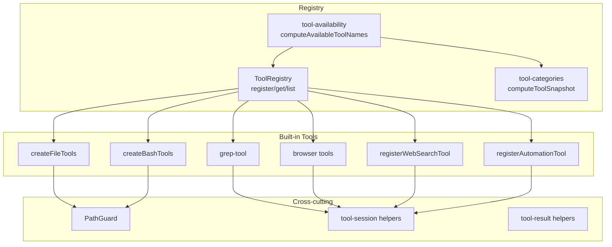

**Diagram sources**
- [core/tool-registry.ts:22-70](file://core/tool-registry.ts#L22-L70)
- [core/tools/index.ts:1-32](file://core/tools/index.ts#L1-L32)
- [core/tool-availability.ts:36-56](file://core/tool-availability.ts#L36-L56)
- [shared/tool-categories.ts:160-169](file://shared/tool-categories.ts#L160-L169)
- [core/tools/path-guard.ts:65-176](file://core/tools/path-guard.ts#L65-L176)
- [core/tools/file.ts:30-95](file://core/tools/file.ts#L30-L95)
- [core/tools/bash.ts:45-108](file://core/tools/bash.ts#L45-L108)
- [core/tools/grep-tool.ts:136-184](file://core/tools/grep-tool.ts#L136-L184)
- [core/tools/browser.ts:398-411](file://core/tools/browser.ts#L398-L411)
- [core/tools/automation.ts:38-132](file://core/tools/automation.ts#L38-L132)
- [core/tools/web-search.ts:189-220](file://core/tools/web-search.ts#L189-L220)

**Section sources**
- [core/tool-registry.ts:1-89](file://core/tool-registry.ts#L1-L89)
- [core/tools/index.ts:1-32](file://core/tools/index.ts#L1-L32)
- [core/tool-availability.ts:1-57](file://core/tool-availability.ts#L1-L57)
- [shared/tool-categories.ts:1-170](file://shared/tool-categories.ts#L1-L170)

## Core Components
- ToolRegistry: Central store mapping tool names to specs and handlers; supports listing, merging, and removal.
- ToolSpec and Handler contract: Defines function signature and JSON schema-like parameters used by the agent.
- Availability and categories: Computes which tools are available per agent configuration and runtime conditions.
- PathGuard: Enforces filesystem access levels for safe tool execution.
- Session and result helpers: Provide consistent session context and output format across tools.

Key responsibilities:
- Registration: Tools declare their spec and handler via registry.register or factory functions.
- Discovery: getSpecs/list returns tool metadata for the agent model.
- Execution: Handlers receive validated arguments and return structured results.
- Policy: Categories and availability determine whether a tool is exposed at runtime.

**Section sources**
- [core/tool-registry.ts:1-89](file://core/tool-registry.ts#L1-L89)
- [core/tools/tool-result.ts:1-17](file://core/tools/tool-result.ts#L1-L17)
- [core/tools/tool-session.ts:1-21](file://core/tools/tool-session.ts#L1-L21)
- [core/tool-availability.ts:1-57](file://core/tool-availability.ts#L1-L57)
- [shared/tool-categories.ts:1-170](file://shared/tool-categories.ts#L1-L170)

## Architecture Overview
The following diagram shows how tools are registered, discovered, and executed with availability checks and security guards.

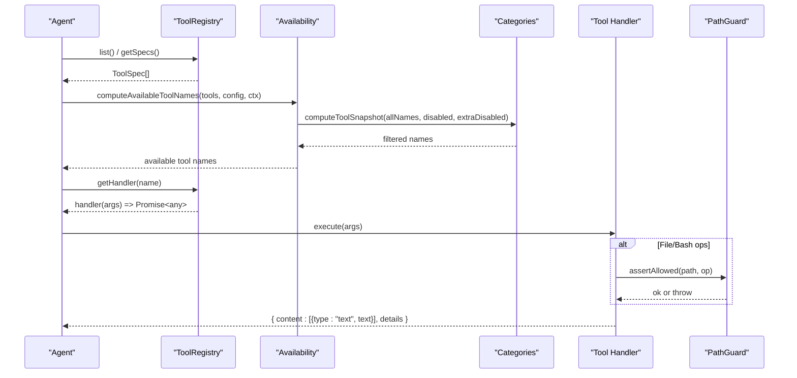

**Diagram sources**
- [core/tool-registry.ts:22-70](file://core/tool-registry.ts#L22-L70)
- [core/tool-availability.ts:36-56](file://core/tool-availability.ts#L36-L56)
- [shared/tool-categories.ts:160-169](file://shared/tool-categories.ts#L160-L169)
- [core/tools/path-guard.ts:171-176](file://core/tools/path-guard.ts#L171-L176)
- [core/tools/tool-result.ts:4-16](file://core/tools/tool-result.ts#L4-L16)

## Detailed Component Analysis

### Tool Registry Contract
- Registration APIs:
  - register(name, spec, handler)
  - registerEntry(name, entry)
- Discovery APIs:
  - list(), getSpecs(), has(name), size()
- Access APIs:
  - get(name), getHandler(name)
- Lifecycle:
  - remove(name), clear(), merge(other)

Parameter validation:
- ToolSpec defines name, description, and parameters object with properties and required fields. The helper createToolSpec derives required from params marked optional.

Execution:
- Handlers receive args and return a Promise or value. Consumers should normalize results using toolOk/toolError helpers.

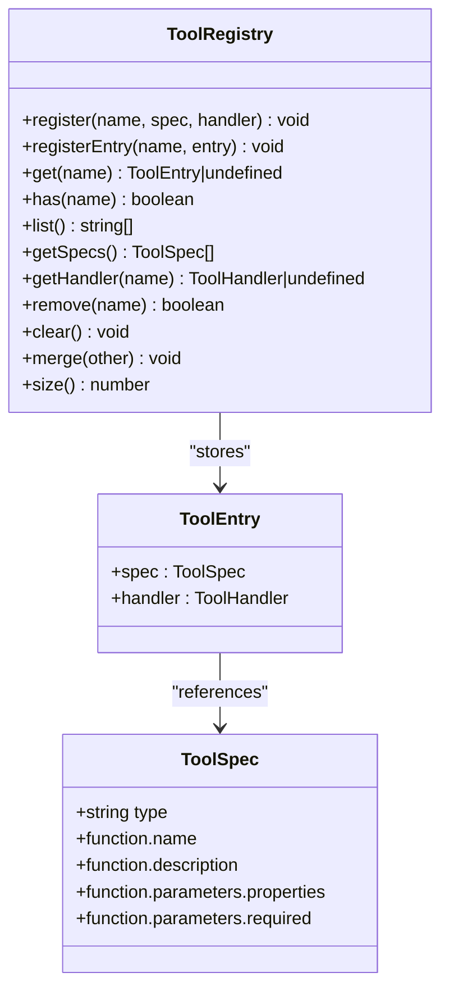

**Diagram sources**
- [core/tool-registry.ts:1-89](file://core/tool-registry.ts#L1-L89)

**Section sources**
- [core/tool-registry.ts:1-89](file://core/tool-registry.ts#L1-L89)

### Built-in Tools

#### File Operations (read/write/stat/list)
- Factory: createFileTools(guard?)
- Functions: file_read, file_write, file_stat, file_list
- Security: Uses PathGuard.assertAllowed before any FS operation.
- Errors: Returns success:false with error message on failure.

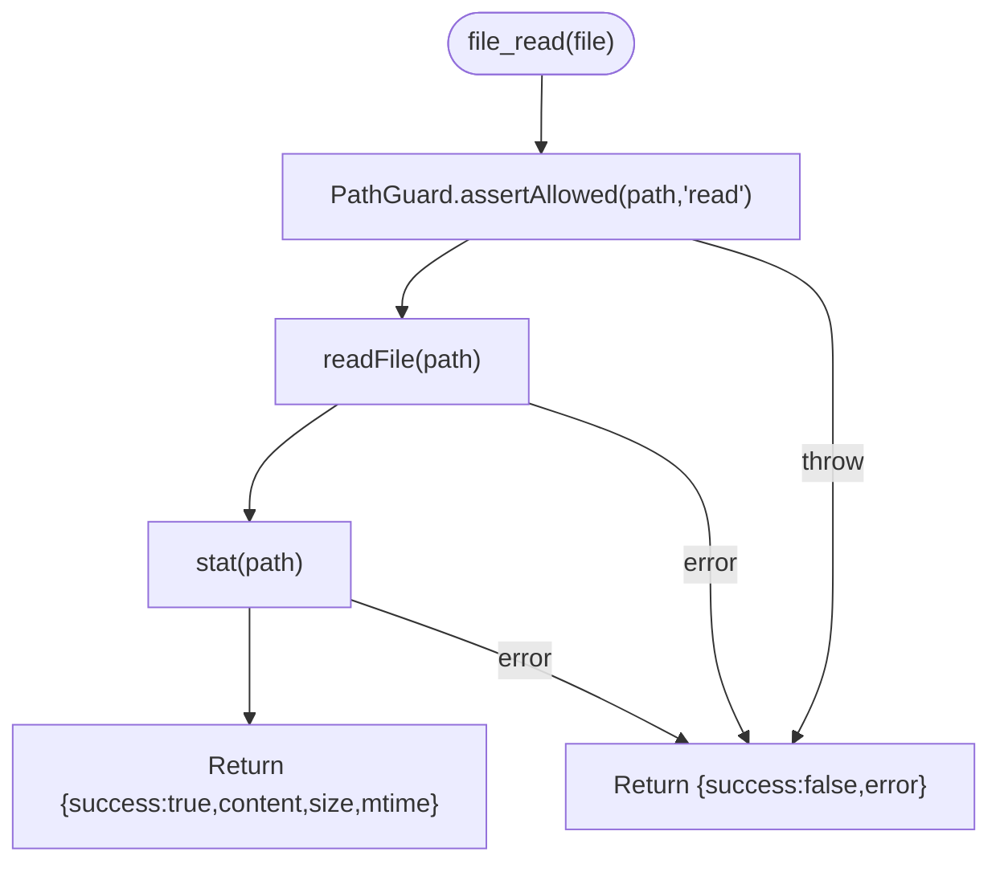

**Diagram sources**
- [core/tools/file.ts:30-95](file://core/tools/file.ts#L30-L95)
- [core/tools/path-guard.ts:171-176](file://core/tools/path-guard.ts#L171-L176)

**Section sources**
- [core/tools/file.ts:1-96](file://core/tools/file.ts#L1-L96)
- [core/tools/path-guard.ts:65-176](file://core/tools/path-guard.ts#L65-L176)

#### Bash Execution
- Factory: createBashTools(guard?)
- Function: bash({ command, cwd? })
- Safety: Blocks dangerous patterns, enforces working directory guard, sets timeouts and buffer limits, prefers Git Bash on Windows.
- Output: Normalized stdout/stderr with truncation and exit code.

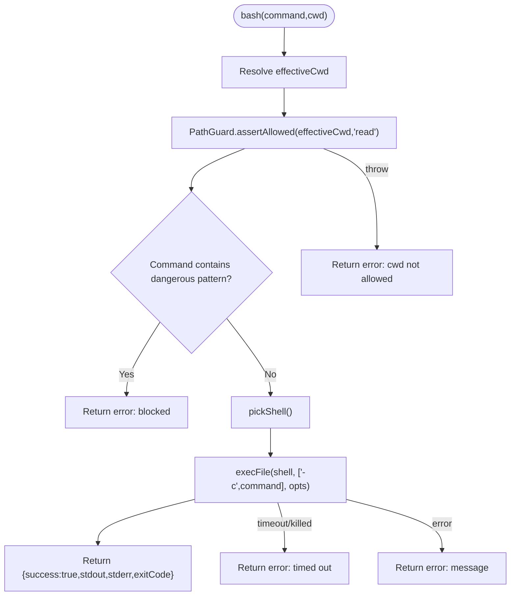

**Diagram sources**
- [core/tools/bash.ts:45-108](file://core/tools/bash.ts#L45-L108)
- [core/tools/path-guard.ts:171-176](file://core/tools/path-guard.ts#L171-L176)

**Section sources**
- [core/tools/bash.ts:1-109](file://core/tools/bash.ts#L1-L109)
- [core/tools/path-guard.ts:65-176](file://core/tools/path-guard.ts#L65-L176)

#### Grep Search
- Entry: grepTool(args) and exported execute(args) for registry integration.
- Features: Recursive search, regex/literal modes, ignoreCase, limit, glob filtering, max file size, total output cap, skip common dirs.
- Output: Text lines with file:line:content and notices when limits hit.

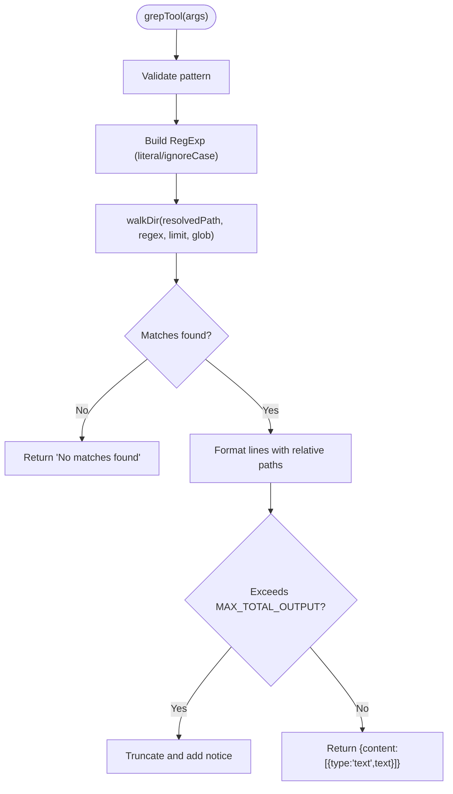

**Diagram sources**
- [core/tools/grep-tool.ts:136-184](file://core/tools/grep-tool.ts#L136-L184)

**Section sources**
- [core/tools/grep-tool.ts:1-194](file://core/tools/grep-tool.ts#L1-L194)

#### Browser Automation
- Modes: Electron webview (IPC) preferred; Playwright fallback for CLI/server.
- Lifecycle: browser_new, browser_close, browser_navigate, browser_screenshot, browser_click, browser_type, browser_press_key, browser_get_text, browser_get_html, browser_wait.
- Session: Instances stored by id; defaultId used if none provided.
- Cleanup: browserClose ensures context/page/browser teardown or IPC close.

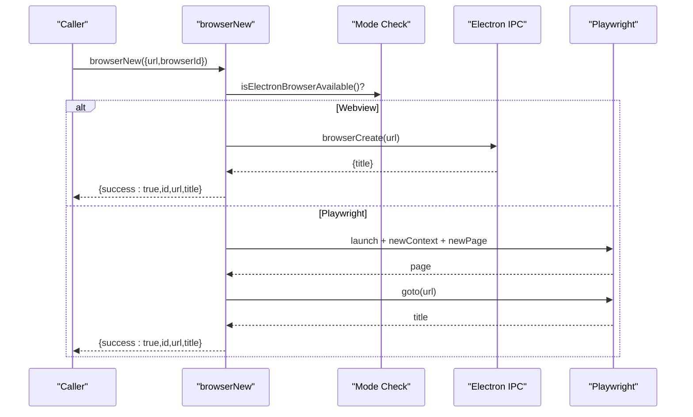

**Diagram sources**
- [core/tools/browser.ts:71-136](file://core/tools/browser.ts#L71-L136)

**Section sources**
- [core/tools/browser.ts:1-414](file://core/tools/browser.ts#L1-L414)

#### Web Search
- Registration: registerWebSearchTool(registry, configPath?)
- Providers: Tavily, Serper, Brave, AnySearch free; auto-fallback chain based on configured API keys.
- Parameters: query (required), maxResults (optional).
- Output: Formatted markdown-style list with provider attribution.

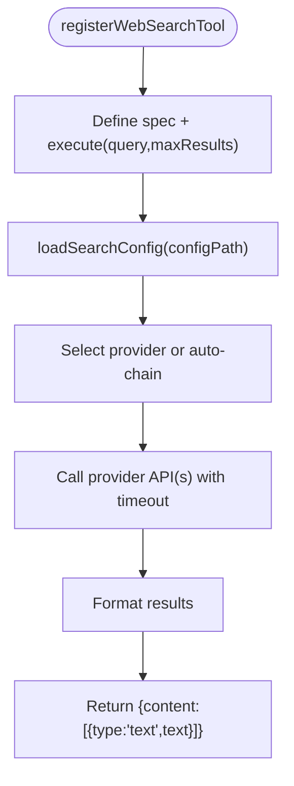

**Diagram sources**
- [core/tools/web-search.ts:189-220](file://core/tools/web-search.ts#L189-L220)

**Section sources**
- [core/tools/web-search.ts:1-221](file://core/tools/web-search.ts#L1-L221)

#### Automation Scheduler
- Registration: registerAutomationTool(registry)
- Actions: list, create, delete, enable, disable, run
- Persistence: data/automations.json
- Output: Text summary with optional details payload.

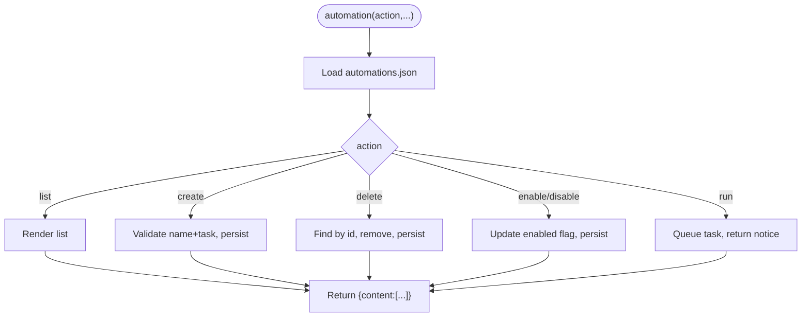

**Diagram sources**
- [core/tools/automation.ts:38-132](file://core/tools/automation.ts#L38-L132)

**Section sources**
- [core/tools/automation.ts:1-133](file://core/tools/automation.ts#L1-L133)

### Tool Interface Contract
- ToolSpec:
  - type: "function"
  - function.name: string
  - function.description: string
  - function.parameters: object with properties and required array
- ToolHandler:
  - Signature: (args: any) => Promise<any> | any
- Result format:
  - Use toolOk(text, details) or toolError(text, details) to produce { content:[{type:"text",text}], details }.

Best practices:
- Always validate required parameters early and return user-friendly errors.
- Keep outputs concise; use details for structured payloads.
- For long-running tasks, return immediate acknowledgment and schedule follow-up.

**Section sources**
- [core/tool-registry.ts:1-89](file://core/tool-registry.ts#L1-L89)
- [core/tools/tool-result.ts:1-17](file://core/tools/tool-result.ts#L1-L17)

### Parameter Validation and Error Handling
- Validation:
  - Use ToolSpec.required to guide caller-side validation.
  - Implement defensive checks inside handlers (e.g., empty query, missing path).
- Error handling:
  - Wrap I/O and network calls in try/catch.
  - Return { success:false, error } for typed failures where applicable (e.g., file/bash).
  - Normalize all responses to the standard content/details shape for consistency.

Examples:
- File tools return explicit success/error objects.
- Bash tool blocks dangerous commands and reports timeouts.
- Grep tool caps output and provides notices when limits are reached.

**Section sources**
- [core/tools/file.ts:30-95](file://core/tools/file.ts#L30-L95)
- [core/tools/bash.ts:45-108](file://core/tools/bash.ts#L45-L108)
- [core/tools/grep-tool.ts:136-184](file://core/tools/grep-tool.ts#L136-L184)
- [core/tools/tool-result.ts:1-17](file://core/tools/tool-result.ts#L1-L17)

### Tool Session Management
- Helpers:
  - getToolSessionPath(ctx): resolves session path from ctx.sessionPath or falls back to process.cwd().
  - getToolSessionCwd(ctx): resolves session cwd similarly.
- Usage:
  - Pass a minimal ctx with sessionPath/cwd to tool handlers to scope operations.

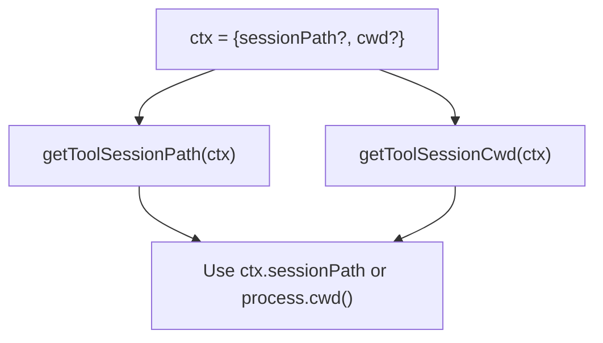

**Diagram sources**
- [core/tools/tool-session.ts:1-21](file://core/tools/tool-session.ts#L1-L21)

**Section sources**
- [core/tools/tool-session.ts:1-21](file://core/tools/tool-session.ts#L1-L21)

### Resource Cleanup
- Browser instances:
  - Maintain an internal Map keyed by id.
  - browserClose closes contexts/pages or invokes IPC close and removes entries.
- Bash processes:
  - Timeouts enforced via exec options; killed processes return explicit errors.
- Filesystem:
  - No persistent handles; operations are short-lived.

Recommendations:
- Always call browser_close after automation flows.
- Ensure cwd is valid and accessible before spawning child processes.

**Section sources**
- [core/tools/browser.ts:138-155](file://core/tools/browser.ts#L138-L155)
- [core/tools/bash.ts:69-106](file://core/tools/bash.ts#L69-L106)

### Tool Availability Checking and Category Policy
- Categories:
  - CORE, STANDARD, OPTIONAL, GLOBAL define visibility and toggling behavior.
  - DEFAULT_DISABLED_TOOL_NAMES controls opt-in defaults for some OPTIONAL tools.
- Availability:
  - computeRuntimeDisabledToolNames evaluates per-tool isEnabledForAgentConfig.
  - computeAvailableToolNames merges disabled lists and computes final snapshot.
  - filterToolObjectsByAvailability filters tool objects by computed names.

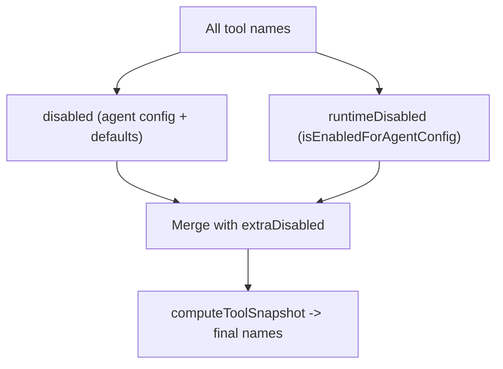

**Diagram sources**
- [core/tool-availability.ts:19-56](file://core/tool-availability.ts#L19-L56)
- [shared/tool-categories.ts:160-169](file://shared/tool-categories.ts#L160-L169)

**Section sources**
- [core/tool-availability.ts:1-57](file://core/tool-availability.ts#L1-L57)
- [shared/tool-categories.ts:1-170](file://shared/tool-categories.ts#L1-L170)

### Dependency Resolution and Integration Patterns
- Registration patterns:
  - Factory-based: createFileTools, createBashTools return maps of functions to be merged into the registry.
  - Register-based: registerWebSearchTool, registerAutomationTool bind ToolSpec and handler directly.
- Cross-cutting dependencies:
  - PathGuard for filesystem safety.
  - Tool session helpers for scoping.
  - Standard result constructors for consistent output.

Integration steps:
1. Define ToolSpec with clear parameters and descriptions.
2. Implement handler with validation and error handling.
3. Register via registry.register or factory export.
4. Ensure tool is categorized in shared/tool-categories.ts if built-in.
5. Expose via core/tools/index.ts for discoverability.

**Section sources**
- [core/tools/index.ts:1-32](file://core/tools/index.ts#L1-L32)
- [core/tools/file.ts:30-95](file://core/tools/file.ts#L30-L95)
- [core/tools/bash.ts:45-108](file://core/tools/bash.ts#L45-L108)
- [core/tools/web-search.ts:189-220](file://core/tools/web-search.ts#L189-L220)
- [core/tools/automation.ts:38-132](file://core/tools/automation.ts#L38-L132)
- [shared/tool-categories.ts:1-170](file://shared/tool-categories.ts#L1-L170)

## Dependency Analysis
The following diagram highlights key dependencies among registry, availability, categories, and tool implementations.

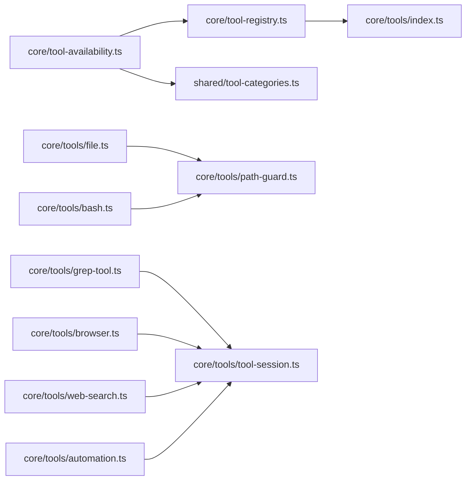

**Diagram sources**
- [core/tool-registry.ts:22-70](file://core/tool-registry.ts#L22-L70)
- [core/tools/index.ts:1-32](file://core/tools/index.ts#L1-L32)
- [core/tool-availability.ts:36-56](file://core/tool-availability.ts#L36-L56)
- [shared/tool-categories.ts:160-169](file://shared/tool-categories.ts#L160-L169)
- [core/tools/file.ts:30-95](file://core/tools/file.ts#L30-L95)
- [core/tools/bash.ts:45-108](file://core/tools/bash.ts#L45-L108)
- [core/tools/grep-tool.ts:136-184](file://core/tools/grep-tool.ts#L136-L184)
- [core/tools/browser.ts:398-411](file://core/tools/browser.ts#L398-L411)
- [core/tools/automation.ts:38-132](file://core/tools/automation.ts#L38-L132)
- [core/tools/tool-session.ts:1-21](file://core/tools/tool-session.ts#L1-L21)

**Section sources**
- [core/tool-registry.ts:22-70](file://core/tool-registry.ts#L22-L70)
- [core/tools/index.ts:1-32](file://core/tools/index.ts#L1-L32)
- [core/tool-availability.ts:36-56](file://core/tool-availability.ts#L36-L56)
- [shared/tool-categories.ts:160-169](file://shared/tool-categories.ts#L160-L169)

## Performance Considerations
- Bash execution:
  - Enforce timeouts and buffer limits to prevent runaway processes.
  - Prefer shell selection that avoids encoding issues on Windows.
- Grep search:
  - Limit per-file size and total output; skip heavy directories.
  - Use regex flags efficiently and reset lastIndex between lines.
- Browser automation:
  - Reuse instances where possible; close promptly to free resources.
  - Headless mode reduces overhead in server environments.
- Web search:
  - Clamp maxResults per provider; apply timeouts to avoid slow providers.
  - Auto-fallback chain minimizes latency by trying fastest available provider first.
- General:
  - Avoid large payloads; prefer summaries and pagination hints.
  - Cache stable metadata (e.g., tool specs) to reduce recomputation.

[No sources needed since this section provides general guidance]

## Troubleshooting Guide
Common issues and resolutions:
- Invalid parameter types:
  - Symptom: Error indicating mismatched types (e.g., expected array but got string).
  - Cause: Caller passed incorrect argument structure.
  - Fix: Ensure parameters match ToolSpec properties and required arrays; wrap array inputs correctly.
- Blocked commands:
  - Symptom: Bash execution fails with “blocked by security policy”.
  - Cause: Command matches dangerous patterns.
  - Fix: Rewrite command to avoid disallowed patterns.
- Working directory not allowed:
  - Symptom: Bash fails due to cwd guard.
  - Cause: cwd outside allowed paths.
  - Fix: Provide a valid cwd within workspaceRoots or writablePaths.
- Browser not open:
  - Symptom: Browser actions fail because no instance exists.
  - Fix: Call browser_new first; ensure proper cleanup with browser_close.
- Output truncated:
  - Symptom: Grep or browser HTML truncated with notices.
  - Cause: Size limits enforced.
  - Fix: Narrow search scope or adjust limits; paginate results.

**Section sources**
- [core/tools/bash.ts:62-106](file://core/tools/bash.ts#L62-L106)
- [core/tools/grep-tool.ts:170-184](file://core/tools/grep-tool.ts#L170-L184)
- [core/tools/browser.ts:138-155](file://core/tools/browser.ts#L138-L155)

## Conclusion
The tools registry provides a robust foundation for extending agent capabilities through well-defined contracts, strong security policies, and consistent result formatting. By adhering to the interface, leveraging availability and category controls, and following best practices for validation and cleanup, developers can integrate powerful automation features such as file operations, shell execution, search, browser automation, and scheduled workflows.

[No sources needed since this section summarizes without analyzing specific files]