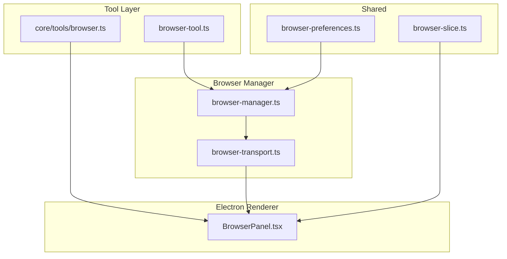
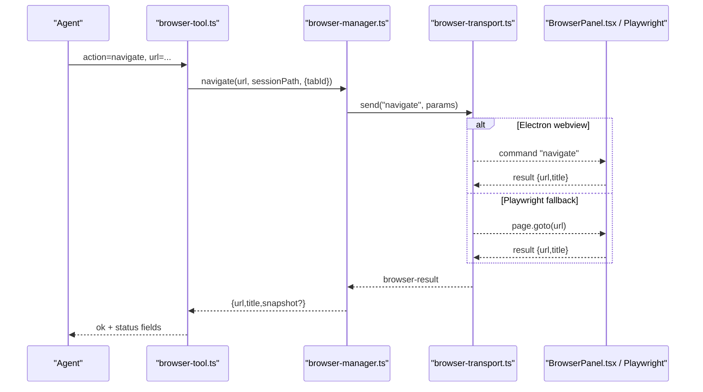
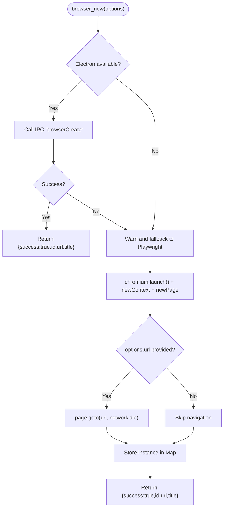
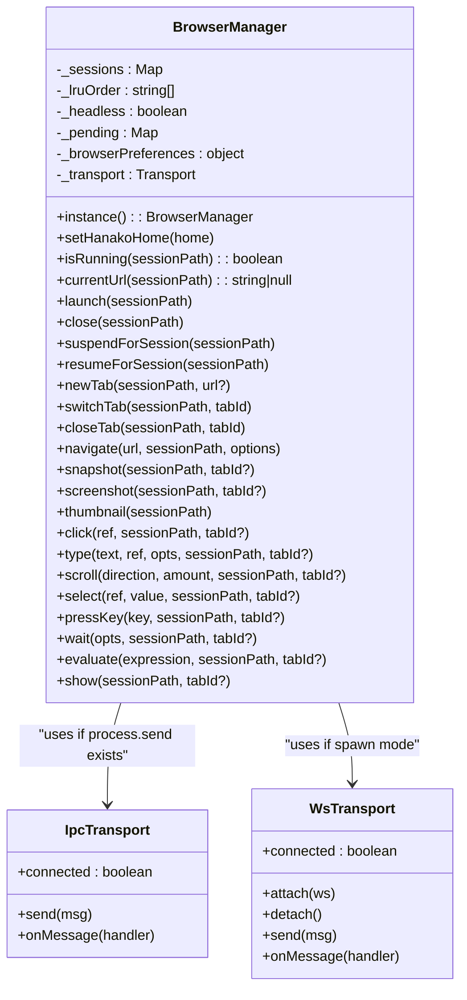
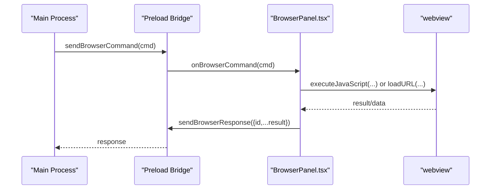
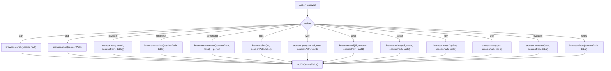
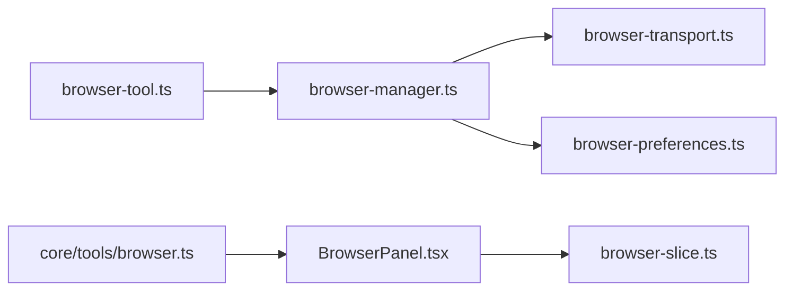

# Browser Control & Navigation

<cite>
**Referenced Files in This Document**
- [browser.ts](file://core/tools/browser.ts)
- [browser-types.ts](file://core/tools/browser-types.ts)
- [browser-manager.ts](file://lib/browser/browser-manager.ts)
- [browser-transport.ts](file://lib/browser/browser-transport.ts)
- [browser-tool.ts](file://lib/tools/browser-tool.ts)
- [BrowserPanel.tsx](file://desktop/src/components/BrowserPanel.tsx)
- [browser-slice.ts](file://desktop/src/react/stores/browser-slice.ts)
- [browser-preferences.ts](file://shared/browser-preferences.ts)
</cite>

## Table of Contents
1. Introduction
2. Project Structure
3. Core Components
4. Architecture Overview
5. Detailed Component Analysis
6. Dependency Analysis
7. Performance Considerations
8. Troubleshooting Guide
9. Conclusion

## Introduction
This document explains the browser control and navigation capabilities, focusing on a dual-mode architecture that supports:
- Electron webview mode (visible, interactive browser inside the app)
- Playwright headless mode (CLI/server fallback)

It covers lifecycle management (creation, navigation, cleanup), navigation strategies (URL handling, waits, error recovery), multi-tab browsing, session management, context isolation, viewport configuration, proxy settings, anti-detection considerations, selector-based interactions, element manipulation, and DOM extraction patterns.

## Project Structure
The browser subsystem spans several layers:
- Tooling layer exposes high-level actions to agents and orchestrators
- Browser manager coordinates sessions, tabs, transport, and persistence
- Transport abstracts IPC vs WebSocket communication
- Electron renderer hosts a webview for user-visible browsing
- Shared preferences define behavior like cookie acceptance and agent open behavior

**Diagram sources**
- [browser-tool.ts:1-343](file://lib/tools/browser-tool.ts#L1-L343)
- [browser-manager.ts:1-974](file://lib/browser/browser-manager.ts#L1-L974)
- [browser-transport.ts:1-92](file://lib/browser/browser-transport.ts#L1-L92)
- [BrowserPanel.tsx:1-262](file://desktop/src/components/BrowserPanel.tsx#L1-L262)
- [browser-preferences.ts:1-41](file://shared/browser-preferences.ts#L1-L41)
- [browser-slice.ts:1-45](file://desktop/src/react/stores/browser-slice.ts#L1-L45)

**Section sources**
- [browser-tool.ts:1-343](file://lib/tools/browser-tool.ts#L1-L343)
- [browser-manager.ts:1-974](file://lib/browser/browser-manager.ts#L1-L974)
- [browser-transport.ts:1-92](file://lib/browser/browser-transport.ts#L1-L92)
- [BrowserPanel.tsx:1-262](file://desktop/src/components/BrowserPanel.tsx#L1-L262)
- [browser-preferences.ts:1-41](file://shared/browser-preferences.ts#L1-L41)
- [browser-slice.ts:1-45](file://desktop/src/react/stores/browser-slice.ts#L1-L45)

## Core Components
- Browser tool (agent-facing): Provides actions such as start, stop, navigate, snapshot, screenshot, click, type, scroll, select, key, wait, evaluate, show. It integrates with BrowserManager and persists screenshots into session files.
- Dual-mode API wrapper: Offers a simple API that auto-selects Electron webview or Playwright based on environment.
- Browser manager: Orchestrates per-session browser instances, tab state, LRU eviction, cold persistence, and transport commands.
- Transport abstraction: Encapsulates IPC (fork) and WebSocket (spawn) messaging between server and browser host.
- Electron webview panel: Renders a visible webview and executes commands via JS injection.
- Preferences: Cookie acceptance and agent open behavior (current_tab vs new_tab).

Key responsibilities:
- Lifecycle: launch/close/suspend/resume with LRU and cold save
- Navigation: navigate, newTab, switchTab, closeTab
- Perception: snapshot (textual AXTree), screenshot (image), thumbnail
- Interaction: click/type/scroll/select/key/wait/evaluate/show
- Session scoping: each chat session has its own browser instance and tabs

**Section sources**
- [browser-tool.ts:1-343](file://lib/tools/browser-tool.ts#L1-L343)
- [browser.ts:1-414](file://core/tools/browser.ts#L1-L414)
- [browser-manager.ts:1-974](file://lib/browser/browser-manager.ts#L1-L974)
- [browser-transport.ts:1-92](file://lib/browser/browser-transport.ts#L1-L92)
- [BrowserPanel.tsx:1-262](file://desktop/src/components/BrowserPanel.tsx#L1-L262)
- [browser-preferences.ts:1-41](file://shared/browser-preferences.ts#L1-L41)

## Architecture Overview
The system uses a layered design:
- Agent calls the browser tool, which delegates to BrowserManager
- BrowserManager sends commands over a transport (IPC or WS) to the browser host
- In Electron, the host is a webview managed by BrowserPanel; in CLI/server, it can fall back to Playwright via the dual-mode API

**Diagram sources**
- [browser-tool.ts:180-214](file://lib/tools/browser-tool.ts#L180-L214)
- [browser-manager.ts:783-799](file://lib/browser/browser-manager.ts#L783-L799)
- [browser-transport.ts:1-92](file://lib/browser/browser-transport.ts#L1-L92)
- [BrowserPanel.tsx:73-104](file://desktop/src/components/BrowserPanel.tsx#L73-L104)

## Detailed Component Analysis

### Dual-mode Browser API (Electron webview vs Playwright)
- Mode detection: checks for Electron runtime availability
- Creation: launches either an Electron webview via IPC or Playwright Chromium
- Navigation: uses IPC or Playwright goto with networkidle wait
- Screenshot: captures from webview or Playwright page
- Interactions: click/type/pressKey/getText/getHtml/waitForSelector
- Cleanup: closes webview via IPC or Playwright context/browser

**Diagram sources**
- [browser.ts:71-136](file://core/tools/browser.ts#L71-L136)
- [browser.ts:159-184](file://core/tools/browser.ts#L159-L184)
- [browser.ts:188-228](file://core/tools/browser.ts#L188-L228)
- [browser.ts:232-254](file://core/tools/browser.ts#L232-L254)
- [browser.ts:258-288](file://core/tools/browser.ts#L258-L288)
- [browser.ts:292-313](file://core/tools/browser.ts#L292-L313)
- [browser.ts:317-339](file://core/tools/browser.ts#L317-L339)
- [browser.ts:343-365](file://core/tools/browser.ts#L343-L365)
- [browser.ts:369-390](file://core/tools/browser.ts#L369-L390)

**Section sources**
- [browser.ts:1-414](file://core/tools/browser.ts#L1-L414)
- [browser-types.ts:1-49](file://core/tools/browser-types.ts#L1-L49)

### Browser Manager (sessions, tabs, LRU, cold persistence)
- Per-session state: Map keyed by session path with running/url/tabs/headless
- LRU: tracks usage order; evicts least recently used when hitting MAX_INSTANCES
- Cold persistence: saves/restores workspace (tabs, activeTabId, url) across restarts
- Transport: unified interface for IPC and WebSocket
- Commands: launch/close/suspend/resume/newTab/switchTab/closeTab/navigate/snapshot/screenshot/thumbnail/click/type/scroll/select/key/wait/evaluate/show
- Error handling: marks sessions unhealthy on fatal errors; provides unavailable reasons

**Diagram sources**
- [browser-manager.ts:141-974](file://lib/browser/browser-manager.ts#L141-L974)
- [browser-transport.ts:1-92](file://lib/browser/browser-transport.ts#L1-L92)

**Section sources**
- [browser-manager.ts:1-974](file://lib/browser/browser-manager.ts#L1-L974)
- [browser-transport.ts:1-92](file://lib/browser/browser-transport.ts#L1-L92)

### Electron Webview Panel (renderer-side execution)
- Receives commands from main process via preload bridge
- Executes commands on the webview: navigate, goBack/goForward/reload, screenshot, click/type/pressKey, getText/getHtml, waitForSelector
- Returns responses back through the bridge

**Diagram sources**
- [BrowserPanel.tsx:57-203](file://desktop/src/components/BrowserPanel.tsx#L57-L203)

**Section sources**
- [BrowserPanel.tsx:1-262](file://desktop/src/components/BrowserPanel.tsx#L1-L262)

### Browser Tool (agent-facing actions)
- Exposes a single tool with multiple actions
- Integrates with BrowserManager for all operations
- Captures status fields (running, url, thumbnail) and attaches them to results
- Persists screenshots into session files and returns media items when supported

**Diagram sources**
- [browser-tool.ts:152-343](file://lib/tools/browser-tool.ts#L152-L343)
- [browser-manager.ts:783-974](file://lib/browser/browser-manager.ts#L783-L974)

**Section sources**
- [browser-tool.ts:1-343](file://lib/tools/browser-tool.ts#L1-L343)

### Preferences and Behavior
- acceptCookies: controls whether cookies are accepted by the browser host
- agentOpenBehavior: determines how agent-initiated navigations open (current_tab vs new_tab)
- Defaults and normalization ensure safe values even with invalid inputs

**Section sources**
- [browser-preferences.ts:1-41](file://shared/browser-preferences.ts#L1-L41)
- [browser-manager.ts:461-478](file://lib/browser/browser-manager.ts#L461-L478)

## Dependency Analysis
- The browser tool depends on BrowserManager for all operations and on session file utilities for screenshot persistence.
- BrowserManager depends on a transport abstraction to communicate with the browser host.
- Electron webview panel depends on the preload bridge for IPC.
- Shared preferences influence BrowserManager behavior.

**Diagram sources**
- [browser-tool.ts:1-343](file://lib/tools/browser-tool.ts#L1-L343)
- [browser-manager.ts:1-974](file://lib/browser/browser-manager.ts#L1-L974)
- [browser-transport.ts:1-92](file://lib/browser/browser-transport.ts#L1-L92)
- [browser-preferences.ts:1-41](file://shared/browser-preferences.ts#L1-L41)
- [browser.ts:1-414](file://core/tools/browser.ts#L1-L414)
- [BrowserPanel.tsx:1-262](file://desktop/src/components/BrowserPanel.tsx#L1-L262)
- [browser-slice.ts:1-45](file://desktop/src/react/stores/browser-slice.ts#L1-L45)

**Section sources**
- [browser-tool.ts:1-343](file://lib/tools/browser-tool.ts#L1-L343)
- [browser-manager.ts:1-974](file://lib/browser/browser-manager.ts#L1-L974)
- [browser-transport.ts:1-92](file://lib/browser/browser-transport.ts#L1-L92)
- [browser-preferences.ts:1-41](file://shared/browser-preferences.ts#L1-L41)
- [browser.ts:1-414](file://core/tools/browser.ts#L1-L414)
- [BrowserPanel.tsx:1-262](file://desktop/src/components/BrowserPanel.tsx#L1-L262)
- [browser-slice.ts:1-45](file://desktop/src/react/stores/browser-slice.ts#L1-L45)

## Performance Considerations
- Concurrency limit: BrowserManager enforces a maximum number of concurrent browser instances and evicts the least recently used when exceeded.
- LRU tracking: Frequent access updates recency; idle sessions can be suspended to free resources.
- Cold persistence: Saves workspace state to disk so sessions can resume without re-launching.
- Network waits: Navigation defaults to waiting until network is idle to reduce flakiness.
- Screenshot size: Full-page screenshots may be large; prefer viewport-sized images where possible.

[No sources needed since this section provides general guidance]

## Troubleshooting Guide
Common issues and remedies:
- Browser not open: Ensure you call the creation/start action before navigation or interaction.
- Navigation timeout: Increase timeout or check URL validity; verify network connectivity.
- Selector not found: Use snapshot first to obtain stable refs; selectors may change after navigation.
- Session unavailable: Fatal host errors mark sessions unhealthy; restart the session or destroy the view and relaunch.
- Headless vs visible: In Electron, use webview mode for visibility; in CLI/server, Playwright runs headless.

Operational tips:
- Always refresh snapshots after actions that mutate the DOM.
- Prefer using refs from the latest snapshot for click/type/select.
- For long-running tasks, consider suspending non-active sessions to conserve resources.

**Section sources**
- [browser-manager.ts:240-271](file://lib/browser/browser-manager.ts#L240-L271)
- [browser-manager.ts:513-569](file://lib/browser/browser-manager.ts#L513-L569)
- [browser.ts:159-184](file://core/tools/browser.ts#L159-L184)
- [BrowserPanel.tsx:170-188](file://desktop/src/components/BrowserPanel.tsx#L170-L188)

## Conclusion
The browser subsystem provides a robust, dual-mode solution for both interactive and automated browsing. With session-scoped instances, tab management, LRU resource control, and cold persistence, it balances usability and efficiency. The agent-facing tool offers a comprehensive set of actions for navigation, perception, and interaction, while the Electron webview enables real-time visibility and debugging.

[No sources needed since this section summarizes without analyzing specific files]