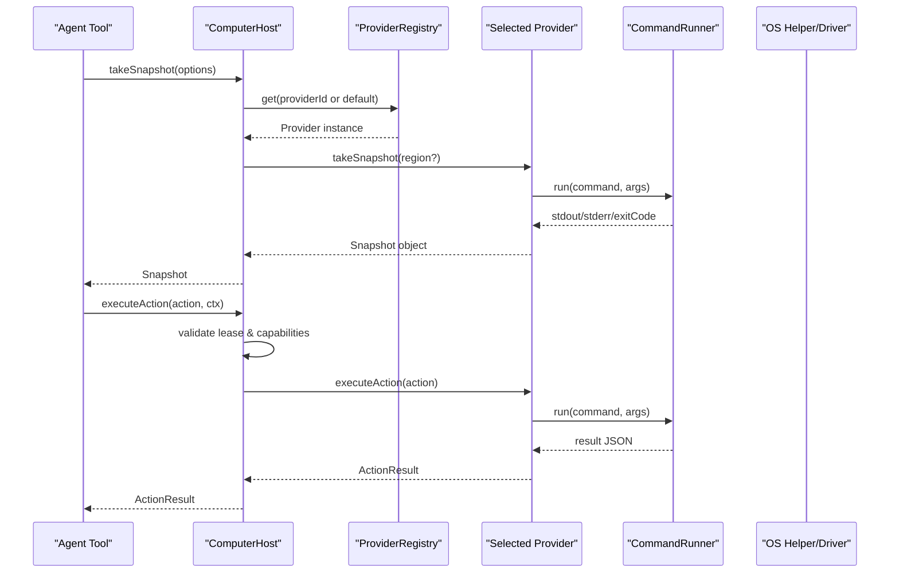
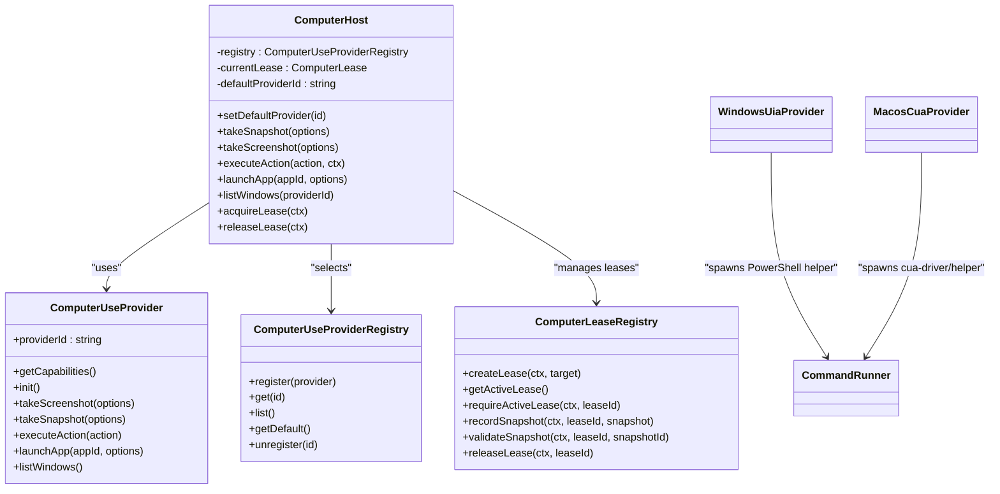

# Computer Use Automation

<cite>
**Referenced Files in This Document**
- [provider-contract.ts](file://core/computer-use/provider-contract.ts)
- [computer-host.ts](file://core/computer-use/computer-host.ts)
- [platform-support.ts](file://core/computer-use/platform-support.ts)
- [settings.ts](file://core/computer-use/settings.ts)
- [errors.ts](file://core/computer-use/errors.ts)
- [lease-registry.ts](file://core/computer-use/lease-registry.ts)
- [model-policy.ts](file://core/computer-use/model-policy.ts)
- [command-runner.ts](file://core/computer-use/providers/command-runner.ts)
- [windows-uia-provider.ts](file://core/computer-use/providers/windows-uia-provider.ts)
- [macos-cua-provider.ts](file://core/computer-use/providers/macos-cua-provider.ts)
- [computer-use-tools.ts](file://core/tools/computer-use-tools.ts)
</cite>

## Table of Contents
1. [Introduction](#introduction)
2. [Project Structure](#project-structure)
3. [Core Components](#core-components)
4. [Architecture Overview](#architecture-overview)
5. [Detailed Component Analysis](#detailed-component-analysis)
6. [Dependency Analysis](#dependency-analysis)
7. [Performance Considerations](#performance-considerations)
8. [Troubleshooting Guide](#troubleshooting-guide)
9. [Conclusion](#conclusion)
10. [Appendices](#appendices)

## Introduction
This document explains the computer use automation capabilities implemented in the repository. It covers cross-platform desktop automation through platform-specific providers for Windows UIA and macOS CUA, screen coordinate-based interactions (mouse movements, clicks, keyboard input simulation), window management, application launching, and process control. It also includes practical examples for automating workflows across applications, form filling, and system task orchestration, along with platform compatibility requirements, permission models, security considerations, error handling, retry mechanisms, and robust scripting patterns.

## Project Structure
The computer use subsystem is organized around a provider contract, a host that manages leases and actions, platform support utilities, settings, and two concrete providers:
- Provider contract defines the common interface and data types used by all providers.
- Host coordinates provider selection, lease management, capability validation, and action execution.
- Platform support determines whether computer use is enabled and which provider to select per OS.
- Settings normalize configuration including provider selection and app approvals.
- Providers implement platform-specific automation via external helpers or drivers.
- Tools expose agent-facing functions for taking snapshots, executing actions, screenshots, and releasing leases.

```mermaid
graph TB
subgraph "Core"
Contract["Provider Contract<br/>Types & Interfaces"]
Host["ComputerHost<br/>Lease & Action Orchestration"]
Registry["ProviderRegistry<br/>Default Selection"]
LeaseReg["LeaseRegistry<br/>Lease & Snapshot Store"]
ModelPolicy["Model Policy<br/>Vision Model Check"]
PlatformSupport["Platform Support<br/>Enabled & Provider Selection"]
Settings["Settings Normalization<br/>App Approvals"]
Errors["Error Types & Helpers"]
end
subgraph "Providers"
WinUIA["Windows UIA Provider<br/>PowerShell Helper"]
MacCUA["macOS CUA Provider<br/>cua-driver / hana-computer-use-helper"]
CmdRunner["Command Runner<br/>spawn/run wrapper"]
end
subgraph "Tools"
Tools["Agent Tools<br/>Snapshot, Action, Screenshot, Release"]
end
Contract --> Host
Registry --> Host
LeaseReg --> Host
ModelPolicy --> Host
PlatformSupport --> Host
Settings --> Host
Errors --> Host
Errors --> WinUIA
Errors --> MacCUA
CmdRunner --> WinUIA
CmdRunner --> MacCUA
Host --> WinUIA
Host --> MacCUA
Tools --> Host
```

**Diagram sources**
- [provider-contract.ts](file://core/computer-use/provider-contract.ts)
- [computer-host.ts](file://core/computer-use/computer-host.ts)
- [provider-registry.ts](file://core/computer-use/provider-registry.ts)
- [lease-registry.ts](file://core/computer-use/lease-registry.ts)
- [model-policy.ts](file://core/computer-use/model-policy.ts)
- [platform-support.ts](file://core/computer-use/platform-support.ts)
- [settings.ts](file://core/computer-use/settings.ts)
- [errors.ts](file://core/computer-use/errors.ts)
- [windows-uia-provider.ts](file://core/computer-use/providers/windows-uia-provider.ts)
- [macos-cua-provider.ts](file://core/computer-use/providers/macos-cua-provider.ts)
- [command-runner.ts](file://core/computer-use/providers/command-runner.ts)
- [computer-use-tools.ts](file://core/tools/computer-use-tools.ts)

**Section sources**
- [provider-contract.ts](file://core/computer-use/provider-contract.ts)
- [computer-host.ts](file://core/computer-use/computer-host.ts)
- [platform-support.ts](file://core/computer-use/platform-support.ts)
- [settings.ts](file://core/computer-use/settings.ts)
- [errors.ts](file://core/computer-use/errors.ts)
- [lease-registry.ts](file://core/computer-use/lease-registry.ts)
- [model-policy.ts](file://core/computer-use/model-policy.ts)
- [command-runner.ts](file://core/computer-use/providers/command-runner.ts)
- [windows-uia-provider.ts](file://core/computer-use/providers/windows-uia-provider.ts)
- [macos-cua-provider.ts](file://core/computer-use/providers/macos-cua-provider.ts)
- [computer-use-tools.ts](file://core/tools/computer-use-tools.ts)

## Core Components
- Provider Contract: Defines shared interfaces for capabilities, snapshots, elements, actions, results, and windows.
- ComputerHost: Orchestrates provider selection, snapshot/screenshot capture, action execution with lease checks, capability validation, and optional app launch/window listing.
- Provider Registry: Provides default provider selection priority and registration utilities.
- Lease Registry: Manages lease lifecycle, active lease lookup, snapshot recording, and snapshot staleness validation.
- Platform Support: Determines if computer use is supported on the current platform and selects the appropriate provider by platform.
- Settings: Normalizes configuration, including provider_by_platform mapping, approval lists, and flags like allow_windows_input_injection.
- Error Utilities: Centralized error codes and helper to serialize errors consistently.
- Command Runner: Cross-platform child process runner with timeout and spawn abstraction used by providers.

Key responsibilities:
- Capability gating ensures actions are only executed if the selected provider supports them.
- Lease enforcement prevents concurrent control conflicts between sessions/agents.
- Snapshot validation prevents stale element references.
- Platform-aware defaults ensure correct provider usage on Windows vs macOS.

**Section sources**
- [provider-contract.ts](file://core/computer-use/provider-contract.ts)
- [computer-host.ts](file://core/computer-use/computer-host.ts)
- [provider-registry.ts](file://core/computer-use/provider-registry.ts)
- [lease-registry.ts](file://core/computer-use/lease-registry.ts)
- [platform-support.ts](file://core/computer-use/platform-support.ts)
- [settings.ts](file://core/computer-use/settings.ts)
- [errors.ts](file://core/computer-use/errors.ts)
- [command-runner.ts](file://core/computer-use/providers/command-runner.ts)

## Architecture Overview
The architecture follows a layered design:
- Agent tools call into the host for high-level operations.
- The host validates permissions, capabilities, and leases before delegating to the selected provider.
- Providers encapsulate platform-specific logic and communicate with native helpers/drivers.
- A command runner abstracts process spawning and I/O for reliability and timeouts.



**Diagram sources**
- [computer-host.ts](file://core/computer-use/computer-host.ts)
- [provider-registry.ts](file://core/computer-use/provider-registry.ts)
- [command-runner.ts](file://core/computer-use/providers/command-runner.ts)
- [windows-uia-provider.ts](file://core/computer-use/providers/windows-uia-provider.ts)
- [macos-cua-provider.ts](file://core/computer-use/providers/macos-cua-provider.ts)

## Detailed Component Analysis

### Provider Contract
Defines the canonical API surface and data structures:
- Capabilities describe what a provider can do (background control, element actions, point click, drag, text input, keyboard input, screenshot, list windows, launch app).
- Actions include click_element, double_click, click_point, type_text, press_key, scroll, drag, launch_app, take_snapshot, take_screenshot.
- Snapshots contain screen dimensions, interactive elements with bounds, and optional screenshot image data.
- Results indicate success/failure, new snapshots, errors, and additional data.

Practical implications:
- Consumers should always call take_snapshot before element-bound actions to obtain fresh element metadata.
- Point-based actions may require foreground focus depending on provider capabilities.

**Section sources**
- [provider-contract.ts](file://core/computer-use/provider-contract.ts)

### ComputerHost
Responsibilities:
- Selects the provider (default or explicit).
- Enforces lease ownership for actions; allows anonymous snapshots for preview.
- Validates actions against provider capabilities.
- Updates last snapshot in lease when actions change screen state.
- Exposes convenience methods for launchApp and listWindows where supported.

Error handling:
- Throws typed errors for missing provider, no lease, lease mismatch, unsupported actions, and unsupported features.

Best practices:
- Always acquire a lease before performing actions.
- Reuse snapshots for multiple actions within a single turn; refresh after significant UI changes.

**Section sources**
- [computer-host.ts](file://core/computer-use/computer-host.ts)

### Provider Registry
- Maintains registered providers and provides a default selection strategy prioritizing known providers.
- Useful for bootstrapping without explicit provider IDs.

**Section sources**
- [provider-registry.ts](file://core/computer-use/provider-registry.ts)

### Lease Registry
- Tracks leases by sessionPath and agentId, ensuring exclusive control.
- Records snapshots and enforces staleness checks to prevent outdated element references.
- Supports release and stopping states for graceful shutdown.

Operational guidance:
- Record a snapshot immediately after any action that changes UI.
- Validate snapshots before using element IDs in subsequent actions.

**Section sources**
- [lease-registry.ts](file://core/computer-use/lease-registry.ts)

### Platform Support and Settings
- Platform support disables computer use on unsupported platforms and returns normalized settings with enabled=false.
- Settings normalization merges defaults, deduplicates approvals, and ensures provider_by_platform maps are valid.
- App approval mechanism controls which apps are permitted for automation per provider.

Security considerations:
- Restrict input injection on Windows via allow_windows_input_injection flag.
- Maintain an approved app list to limit scope of automation.

**Section sources**
- [platform-support.ts](file://core/computer-use/platform-support.ts)
- [settings.ts](file://core/computer-use/settings.ts)

### Model Policy
- Ensures the model supports direct image input for vision-based automation.
- Throws a specific error if the model lacks image input capability.

**Section sources**
- [model-policy.ts](file://core/computer-use/model-policy.ts)

### Windows UIA Provider
Highlights:
- Uses PowerShell to invoke a bundled helper script for UIA operations.
- Writes request JSON to a file and reads result JSON from another file to handle large payloads safely.
- Validates foreground-only actions and requires numeric parameters for point-based inputs.
- Enforces snapshot freshness for element-bound actions.
- Returns normalized snapshots with display metrics, focused element, and element metadata.

Capabilities:
- Background control is partial; some actions require foreground focus.
- Element actions and semantic text input are supported; pixel-based actions are not advertised.

Error diagnostics:
- Rich diagnostics include stdout/stderr previews, result size, truncation hints, and file read errors.

**Section sources**
- [windows-uia-provider.ts](file://core/computer-use/providers/windows-uia-provider.ts)
- [command-runner.ts](file://core/computer-use/providers/command-runner.ts)
- [errors.ts](file://core/computer-use/errors.ts)

### macOS CUA Provider
Highlights:
- Communicates with cua-driver or a bundled hana-computer-use-helper via CLI commands over a Unix socket.
- Optionally auto-starts a managed daemon and configures native cursor style and motion.
- Normalizes apps and windows payloads, selecting best-fit windows for launching or leasing.
- Parses structured responses and markdown trees to build element lists.
- Disables pixel-based actions for clean background control.

Capabilities:
- Full background control with pid-scoped keyboard input.
- Semantic text input and element actions supported; pixel actions disabled by default.

Permissions:
- Checks accessibility and screen recording permissions; prompts user when requested.

**Section sources**
- [macos-cua-provider.ts](file://core/computer-use/providers/macos-cua-provider.ts)
- [command-runner.ts](file://core/computer-use/providers/command-runner.ts)
- [errors.ts](file://core/computer-use/errors.ts)

### Agent Tools
Expose simple tool names for agents:
- computer_take_snapshot: Capture current screen structure and elements.
- computer_execute_action: Execute actions such as clicking, typing, pressing keys, scrolling, dragging, launching apps, or capturing screenshots.
- computer_screenshot: Return base64 PNG of the screen.
- computer_release_lease: Release control to other sessions/agents.

Usage pattern:
- Take a snapshot first.
- Perform one or more actions referencing element IDs from the latest snapshot.
- Release the lease when done.

**Section sources**
- [computer-use-tools.ts](file://core/tools/computer-use-tools.ts)

## Dependency Analysis


**Diagram sources**
- [provider-contract.ts](file://core/computer-use/provider-contract.ts)
- [computer-host.ts](file://core/computer-use/computer-host.ts)
- [provider-registry.ts](file://core/computer-use/provider-registry.ts)
- [lease-registry.ts](file://core/computer-use/lease-registry.ts)
- [windows-uia-provider.ts](file://core/computer-use/providers/windows-uia-provider.ts)
- [macos-cua-provider.ts](file://core/computer-use/providers/macos-cua-provider.ts)
- [command-runner.ts](file://core/computer-use/providers/command-runner.ts)

**Section sources**
- [provider-contract.ts](file://core/computer-use/provider-contract.ts)
- [computer-host.ts](file://core/computer-use/computer-host.ts)
- [provider-registry.ts](file://core/computer-use/provider-registry.ts)
- [lease-registry.ts](file://core/computer-use/lease-registry.ts)
- [windows-uia-provider.ts](file://core/computer-use/providers/windows-uia-provider.ts)
- [macos-cua-provider.ts](file://core/computer-use/providers/macos-cua-provider.ts)
- [command-runner.ts](file://core/computer-use/providers/command-runner.ts)

## Performance Considerations
- Prefer element-based actions over pixel-based ones for stability and speed.
- Minimize repeated snapshots; reuse element metadata within a single turn.
- Use region-limited snapshots when possible to reduce payload sizes.
- On Windows, avoid excessive helper invocations; batch actions when feasible.
- On macOS, leverage pid-scoped keyboard input to avoid foreground switching overhead.
- Monitor command runner timeouts and adjust based on environment responsiveness.

[No sources needed since this section provides general guidance]

## Troubleshooting Guide
Common issues and resolutions:
- No provider configured: Ensure a default provider is set or explicitly pass providerId.
- No active lease: Acquire a lease before executing actions.
- Lease mismatch: Confirm sessionPath and agentId match the current lease owner.
- Action not allowed: Verify provider capabilities and policy flags (e.g., allow_windows_input_injection).
- Stale snapshot: Refresh snapshot and re-run actions with updated element IDs.
- Target not found: Provide valid appId, name, pid, or windowId for lease creation.
- Permission denied (macOS): Grant Accessibility and Screen Recording permissions; prompt via requestPermissions.
- Provider unavailable: Check binary paths, environment variables, and daemon status.
- Provider crashed: Inspect stderr/stdout previews and result file diagnostics for root cause.

Retry strategies:
- For transient failures (e.g., helper startup delays), retry with exponential backoff.
- After each action, consider taking a lightweight snapshot to verify UI state before proceeding.
- If a lease becomes invalid due to app restart, recreate the lease with the same target criteria.

Security considerations:
- Limit allowed actions to the minimum required for the workflow.
- Approve only necessary apps for automation.
- Avoid exposing sensitive credentials in arguments passed to helpers.

**Section sources**
- [computer-host.ts](file://core/computer-use/computer-host.ts)
- [errors.ts](file://core/computer-use/errors.ts)
- [windows-uia-provider.ts](file://core/computer-use/providers/windows-uia-provider.ts)
- [macos-cua-provider.ts](file://core/computer-use/providers/macos-cua-provider.ts)
- [settings.ts](file://core/computer-use/settings.ts)

## Conclusion
The computer use automation layer provides a robust, cross-platform foundation for desktop automation. By leveraging a clear provider contract, strict lease management, capability validation, and platform-specific implementations, it enables reliable workflows such as form filling, multi-app orchestration, and system tasks. Following the recommended patterns—snapshot-first, element-driven actions, careful permission management, and resilient error handling—ensures stable and secure automation across Windows and macOS.

[No sources needed since this section summarizes without analyzing specific files]

## Appendices

### Practical Examples

- Automate a form-filling workflow across applications:
  - Launch the target application using launch_app.
  - Take a snapshot to locate input fields and buttons.
  - Type text into fields using type_text with element IDs.
  - Click submit using click_element.
  - Release the lease when finished.

- System task orchestration:
  - List windows to identify target app windows.
  - Switch context by focusing the desired window (via provider-specific semantics).
  - Perform actions sequentially, refreshing snapshots after major UI transitions.
  - Handle errors gracefully and retry with updated snapshots.

- Security and permissions:
  - On macOS, check and request permissions for Accessibility and Screen Recording.
  - On Windows, enable input injection only for approved apps and restrict foreground-only actions.

[No sources needed since this section provides conceptual guidance]