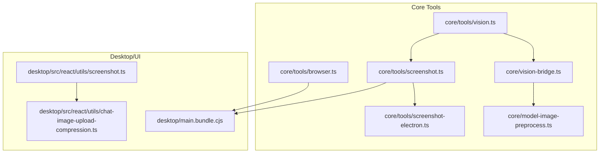
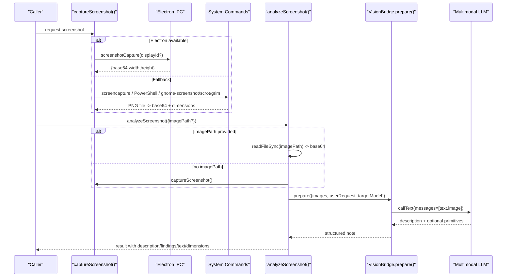
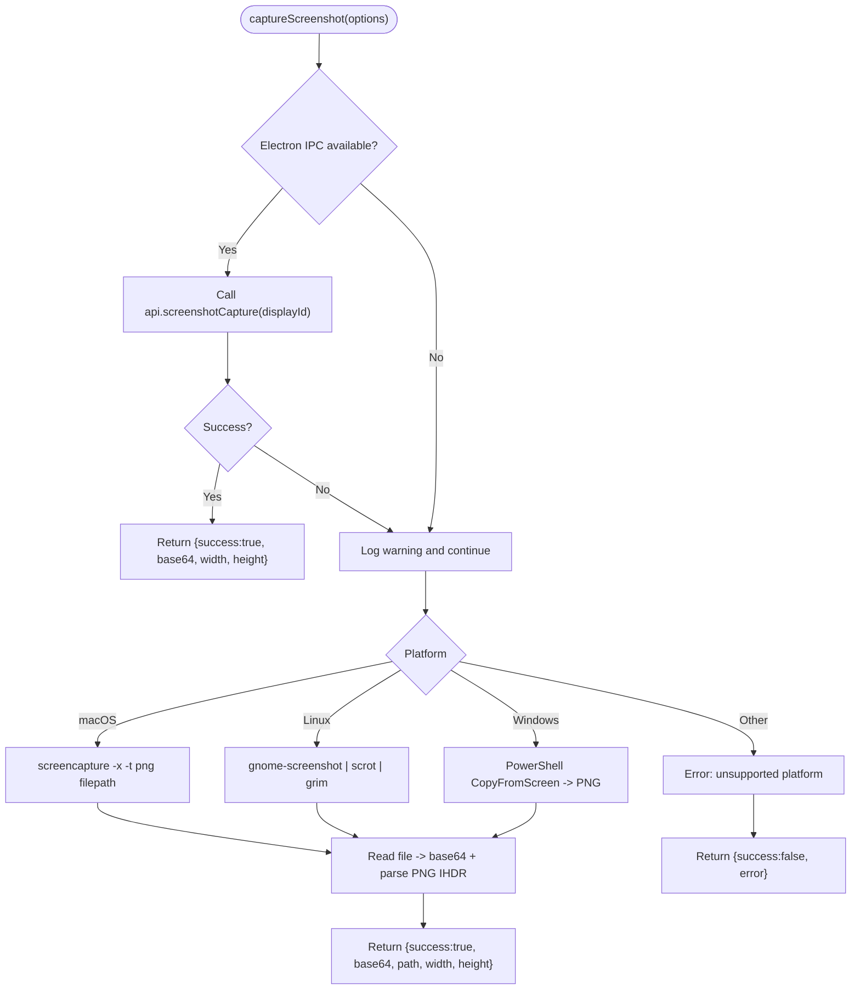
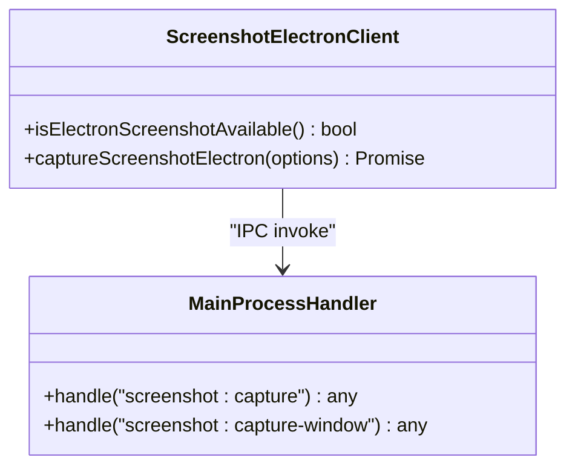
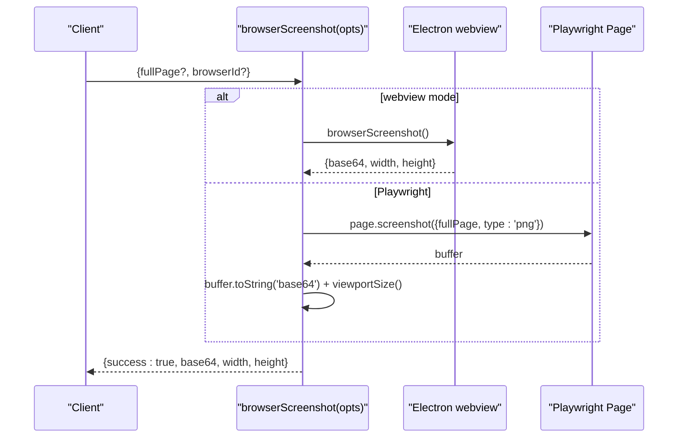
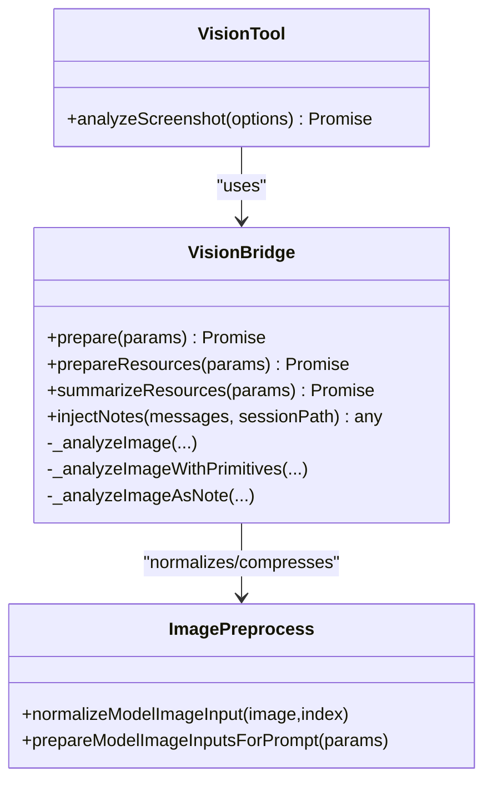
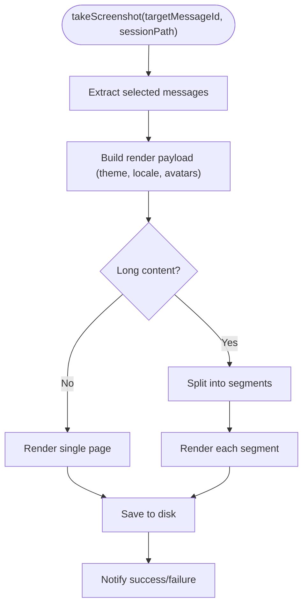
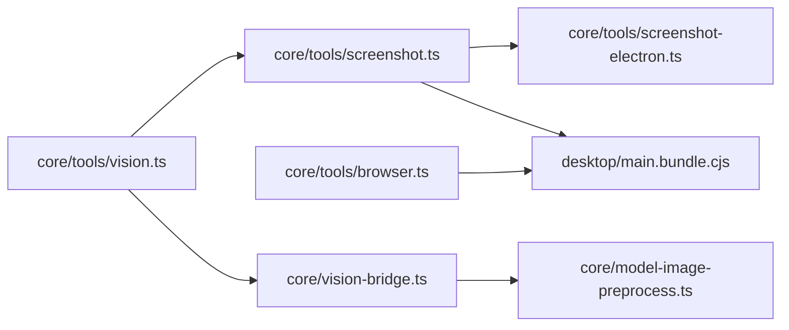

# Screen Capture & Vision Analysis

<cite>
**Referenced Files in This Document**
- [screenshot.ts](file://core/tools/screenshot.ts)
- [screenshot-electron.ts](file://core/tools/screenshot-electron.ts)
- [browser.ts](file://core/tools/browser.ts)
- [vision.ts](file://core/tools/vision.ts)
- [vision-bridge.ts](file://core/vision-bridge.ts)
- [model-image-preprocess.ts](file://core/model-image-preprocess.ts)
- [chat-image-upload-compression.ts](file://desktop/src/react/utils/chat-image-upload-compression.ts)
- [screenshot.ts (UI)](file://desktop/src/react/utils/screenshot.ts)
- [main.bundle.cjs](file://desktop/main.bundle.cjs)
</cite>

## Table of Contents
1. Introduction
2. Project Structure
3. Core Components
4. Architecture Overview
5. Detailed Component Analysis
6. Dependency Analysis
7. Performance Considerations
8. Troubleshooting Guide
9. Conclusion
10. Appendices

## Introduction
This document explains the screen capture and vision analysis capabilities, including:
- Screenshot modes: full-page captures, viewport screenshots, and region-specific captures
- Vision processing: image analysis, OCR-like text extraction, and visual element detection
- Practical workflows for automated testing, UI validation, and visual regression
- Image format support, compression options, and memory management for large images
- Performance optimization techniques and batch processing strategies

## Project Structure
The screenshot and vision features span core tools, Electron integration, browser automation, and desktop utilities:
- Core screenshot tool with cross-platform fallbacks
- Electron IPC bridge for native captures
- Browser automation with Playwright and webview modes
- Vision pipeline that prepares images and calls multimodal models
- Image preprocessing and compression utilities

**Diagram sources**
- [screenshot.ts:1-180](file://core/tools/screenshot.ts#L1-L180)
- [screenshot-electron.ts:1-38](file://core/tools/screenshot-electron.ts#L1-L38)
- [browser.ts:1-414](file://core/tools/browser.ts#L1-L414)
- [vision.ts:1-112](file://core/tools/vision.ts#L1-L112)
- [vision-bridge.ts:1-760](file://core/vision-bridge.ts#L1-L760)
- [model-image-preprocess.ts:1-293](file://core/model-image-preprocess.ts#L1-L293)
- [screenshot.ts (UI):1-337](file://desktop/src/react/utils/screenshot.ts#L1-L337)
- [chat-image-upload-compression.ts:1-197](file://desktop/src/react/utils/chat-image-upload-compression.ts#L1-L197)
- [main.bundle.cjs:20404-20443](file://desktop/main.bundle.cjs#L20404-L20443)

**Section sources**
- [screenshot.ts:1-180](file://core/tools/screenshot.ts#L1-L180)
- [screenshot-electron.ts:1-38](file://core/tools/screenshot-electron.ts#L1-L38)
- [browser.ts:1-414](file://core/tools/browser.ts#L1-L414)
- [vision.ts:1-112](file://core/tools/vision.ts#L1-L112)
- [vision-bridge.ts:1-760](file://core/vision-bridge.ts#L1-L760)
- [model-image-preprocess.ts:1-293](file://core/model-image-preprocess.ts#L1-L293)
- [screenshot.ts (UI):1-337](file://desktop/src/react/utils/screenshot.ts#L1-L337)
- [chat-image-upload-compression.ts:1-197](file://desktop/src/react/utils/chat-image-upload-compression.ts#L1-L197)
- [main.bundle.cjs:20404-20443](file://desktop/main.bundle.cjs#L20404-L20443)

## Core Components
- Cross-platform screenshot tool with Electron-native path and CLI/server fallback
- Electron IPC client for renderer-side capture requests
- Browser automation tool supporting both Electron webview and Playwright headless modes
- Vision tool to analyze screenshots via multimodal LLMs
- Vision bridge to prepare images, generate structured notes, and inject context into prompts
- Image preprocessing and compression utilities for model input budgets and upload constraints

Key responsibilities:
- Capture: system-level or browser-level screenshots
- Vision: transform images into concise textual descriptions and optional structured primitives
- Preprocessing: enforce size/quality policies and ensure compatibility with target models

**Section sources**
- [screenshot.ts:1-180](file://core/tools/screenshot.ts#L1-L180)
- [screenshot-electron.ts:1-38](file://core/tools/screenshot-electron.ts#L1-L38)
- [browser.ts:1-414](file://core/tools/browser.ts#L1-L414)
- [vision.ts:1-112](file://core/tools/vision.ts#L1-L112)
- [vision-bridge.ts:1-760](file://core/vision-bridge.ts#L1-L760)
- [model-image-preprocess.ts:1-293](file://core/model-image-preprocess.ts#L1-L293)
- [chat-image-upload-compression.ts:1-197](file://desktop/src/react/utils/chat-image-upload-compression.ts#L1-L197)

## Architecture Overview
End-to-end flow from capture to vision analysis:

**Diagram sources**
- [screenshot.ts:152-180](file://core/tools/screenshot.ts#L152-L180)
- [screenshot-electron.ts:24-37](file://core/tools/screenshot-electron.ts#L24-L37)
- [main.bundle.cjs:20404-20443](file://desktop/main.bundle.cjs#L20404-L20443)
- [vision.ts:34-112](file://core/tools/vision.ts#L34-L112)
- [vision-bridge.ts:403-442](file://core/vision-bridge.ts#L403-L442)

## Detailed Component Analysis

### Screenshot Tool (Cross-Platform)
- Modes:
  - Electron mode: uses desktopCapturer via IPC; returns base64 and real width/height without temp files
  - CLI/server fallback: writes a temporary PNG using platform commands, reads back to base64, parses PNG IHDR for dimensions
- Platform support:
  - macOS: screencapture
  - Linux: gnome-screenshot, scrot, grim
  - Windows: PowerShell with System.Drawing
- Output:
  - Success: base64, path, width, height, platform
  - Error: descriptive error string

**Diagram sources**
- [screenshot.ts:57-150](file://core/tools/screenshot.ts#L57-L150)
- [screenshot.ts:161-180](file://core/tools/screenshot.ts#L161-L180)

**Section sources**
- [screenshot.ts:1-180](file://core/tools/screenshot.ts#L1-L180)

### Electron Screenshot Bridge
- Renderer-side client exposes window.__REM_API__.screenshotCapture
- Main process handler uses desktopCapturer or webContents.capturePage
- Returns consistent shape across Electron and CLI paths

**Diagram sources**
- [screenshot-electron.ts:1-38](file://core/tools/screenshot-electron.ts#L1-L38)
- [main.bundle.cjs:20404-20443](file://desktop/main.bundle.cjs#L20404-L20443)

**Section sources**
- [screenshot-electron.ts:1-38](file://core/tools/screenshot-electron.ts#L1-L38)
- [main.bundle.cjs:20404-20443](file://desktop/main.bundle.cjs#L20404-L20443)

### Browser Automation Screenshot
- Dual-mode browser tool:
  - Electron webview mode via IPC
  - Playwright headless Chromium fallback
- Supports fullPage screenshots and viewport-based captures
- Returns base64 and dimensions

**Diagram sources**
- [browser.ts:186-228](file://core/tools/browser.ts#L186-L228)

**Section sources**
- [browser.ts:1-414](file://core/tools/browser.ts#L1-L414)

### Vision Tool and Vision Bridge
- Vision tool:
  - Captures screenshot if no image path provided
  - Calls multimodal LLM with image_url and prompt
  - Returns description, findings, and compact text
- Vision bridge:
  - Prepares images for text-only models by generating structured notes
  - Normalizes visual primitives (boxes/points), formats sections like visible_text and objects_and_layout
  - Persists notes per session and caches results

**Diagram sources**
- [vision.ts:1-112](file://core/tools/vision.ts#L1-L112)
- [vision-bridge.ts:376-760](file://core/vision-bridge.ts#L376-L760)
- [model-image-preprocess.ts:1-293](file://core/model-image-preprocess.ts#L1-L293)

**Section sources**
- [vision.ts:1-112](file://core/tools/vision.ts#L1-L112)
- [vision-bridge.ts:1-760](file://core/vision-bridge.ts#L1-L760)
- [model-image-preprocess.ts:1-293](file://core/model-image-preprocess.ts#L1-L293)

### Desktop Article Screenshot Utility
- Renders chat messages or markdown articles offscreen and saves images
- Supports segmentation for long content and progress reporting
- Uses theme and font presets for consistent output

**Diagram sources**
- [screenshot.ts (UI):164-232](file://desktop/src/react/utils/screenshot.ts#L164-L232)

**Section sources**
- [screenshot.ts (UI):1-337](file://desktop/src/react/utils/screenshot.ts#L1-L337)

## Dependency Analysis
- Screenshot tool depends on:
  - Electron IPC when available
  - OS command-line tools otherwise
- Vision tool depends on:
  - Screenshot tool for live captures
  - Vision bridge for structured preparation
  - Image preprocessing for size/quality compliance
- Browser tool depends on:
  - Electron IPC for webview operations
  - Playwright for headless automation

**Diagram sources**
- [screenshot.ts:1-180](file://core/tools/screenshot.ts#L1-L180)
- [screenshot-electron.ts:1-38](file://core/tools/screenshot-electron.ts#L1-L38)
- [main.bundle.cjs:20404-20443](file://desktop/main.bundle.cjs#L20404-L20443)
- [vision.ts:1-112](file://core/tools/vision.ts#L1-L112)
- [vision-bridge.ts:1-760](file://core/vision-bridge.ts#L1-L760)
- [model-image-preprocess.ts:1-293](file://core/model-image-preprocess.ts#L1-L293)
- [browser.ts:1-414](file://core/tools/browser.ts#L1-L414)

**Section sources**
- [screenshot.ts:1-180](file://core/tools/screenshot.ts#L1-L180)
- [screenshot-electron.ts:1-38](file://core/tools/screenshot-electron.ts#L1-L38)
- [main.bundle.cjs:20404-20443](file://desktop/main.bundle.cjs#L20404-L20443)
- [vision.ts:1-112](file://core/tools/vision.ts#L1-L112)
- [vision-bridge.ts:1-760](file://core/vision-bridge.ts#L1-L760)
- [model-image-preprocess.ts:1-293](file://core/model-image-preprocess.ts#L1-L293)
- [browser.ts:1-414](file://core/tools/browser.ts#L1-L414)

## Performance Considerations
- Prefer Electron native capture to avoid temp files and external processes
- Use browser fullPage only when necessary; viewport screenshots are faster
- For large images:
  - Enforce per-image and total base64 budgets before sending to models
  - Apply JPEG quality and dimension scaling to meet limits
  - Reuse cached vision notes keyed by image content and model signature
- Batch processing:
  - Chunk long article renders and report progress
  - Cache avatar and remote image data URLs during rendering
  - Limit number of visual primitives to reduce downstream cost

[No sources needed since this section provides general guidance]

## Troubleshooting Guide
Common issues and resolutions:
- Electron IPC not available:
  - Ensure running inside Electron and preload exposes __REM_API__
  - Verify main process handlers for screenshot:capture and screenshot:capture-window exist
- System command failures:
  - On Linux, install gnome-screenshot, scrot, or grim
  - On Windows, confirm PowerShell execution policy and System.Drawing availability
  - On macOS, verify screencapture is present
- Vision model errors:
  - Configure a vision-capable model and API key
  - If auxiliary vision is required but missing, configure the auxiliary model
- Large image upload failures:
  - Use the chat image upload compression utility to fit within target base64 size
  - Adjust policy parameters (maxWidth/maxHeight, quality steps) if needed

**Section sources**
- [screenshot.ts:57-150](file://core/tools/screenshot.ts#L57-L150)
- [screenshot-electron.ts:14-37](file://core/tools/screenshot-electron.ts#L14-L37)
- [main.bundle.cjs:20404-20443](file://desktop/main.bundle.cjs#L20404-L20443)
- [vision.ts:34-112](file://core/tools/vision.ts#L34-L112)
- [vision-bridge.ts:403-442](file://core/vision-bridge.ts#L403-L442)
- [chat-image-upload-compression.ts:1-197](file://desktop/src/react/utils/chat-image-upload-compression.ts#L1-L197)

## Conclusion
The system provides robust screen capture across environments and powerful vision analysis through multimodal models. By combining native Electron captures, browser automation, structured vision notes, and strict image preprocessing, it supports reliable automated testing, UI validation, and visual regression workflows while maintaining performance and memory efficiency.

[No sources needed since this section summarizes without analyzing specific files]

## Appendices

### Screenshot Modes Reference
- Full-page captures:
  - Browser: use fullPage option in browser_screenshot
  - Desktop article: segmented rendering for long content
- Viewport screenshots:
  - Default behavior for browser screenshots
  - Electron desktopCapturer thumbnails provide viewport-sized images
- Region-specific captures:
  - Electron window capture via capture-window handler
  - Platform-specific tools can be extended to support region selection

**Section sources**
- [browser.ts:186-228](file://core/tools/browser.ts#L186-L228)
- [main.bundle.cjs:20404-20443](file://desktop/main.bundle.cjs#L20404-L20443)
- [screenshot.ts (UI):164-232](file://desktop/src/react/utils/screenshot.ts#L164-L232)

### Image Format Support and Compression
- Supported formats detected/sniffed:
  - PNG, JPEG, WebP, GIF
- Compression strategies:
  - Per-image and total base64 budget enforcement
  - JPEG quality stepping and dimension scaling
  - Target base64 character limit for uploads

**Section sources**
- [model-image-preprocess.ts:89-139](file://core/model-image-preprocess.ts#L89-L139)
- [model-image-preprocess.ts:202-293](file://core/model-image-preprocess.ts#L202-L293)
- [chat-image-upload-compression.ts:1-197](file://desktop/src/react/utils/chat-image-upload-compression.ts#L1-L197)

### Practical Workflows
- Automated testing:
  - Navigate to URL, interact via browser tools, capture screenshots, compare outputs
- UI validation:
  - Use vision tool to describe current state and assert presence of elements or text
- Visual regression:
  - Generate baseline screenshots (fullPage or viewport), store references, compare new captures against baselines

[No sources needed since this section provides general guidance]