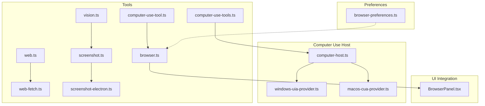
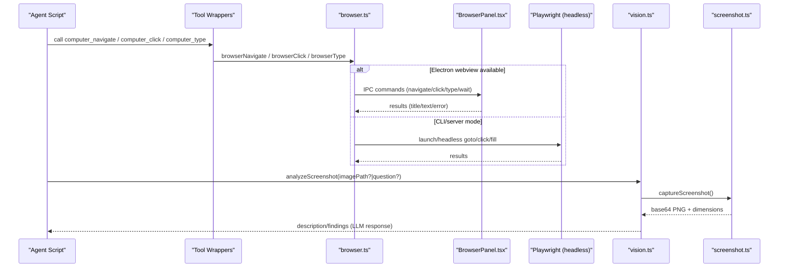
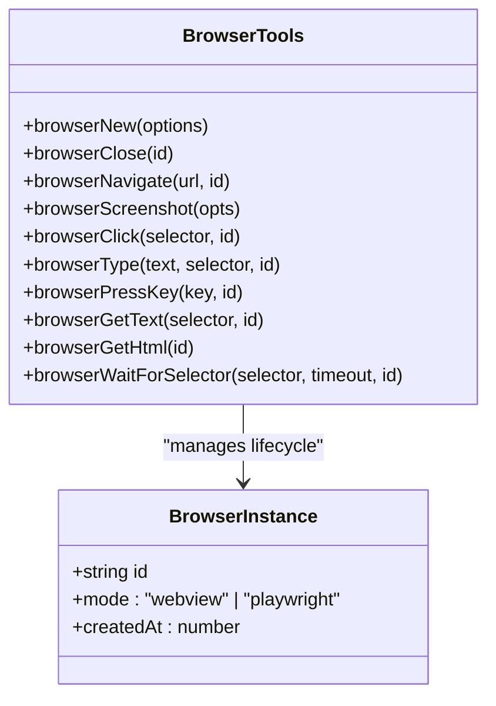
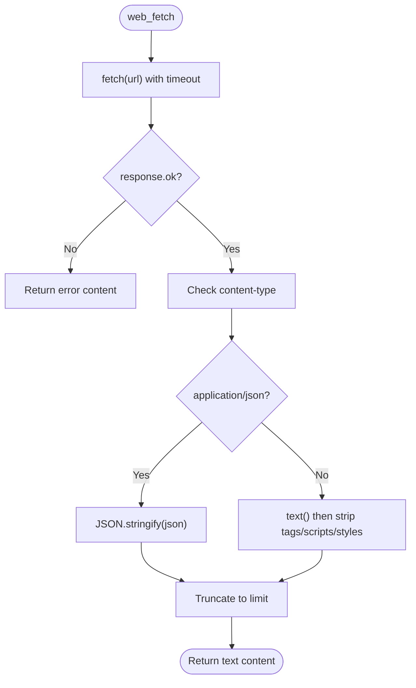
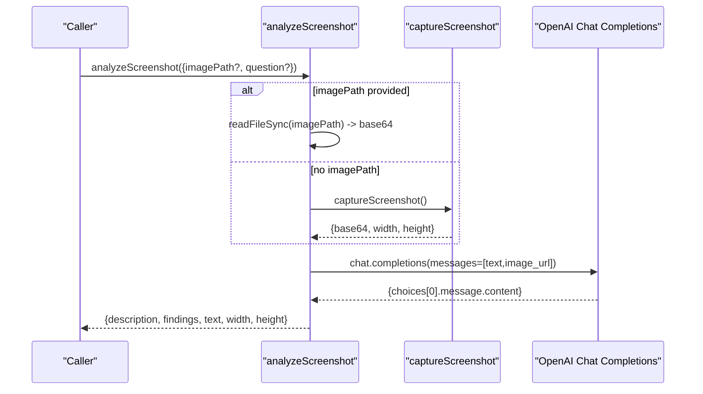
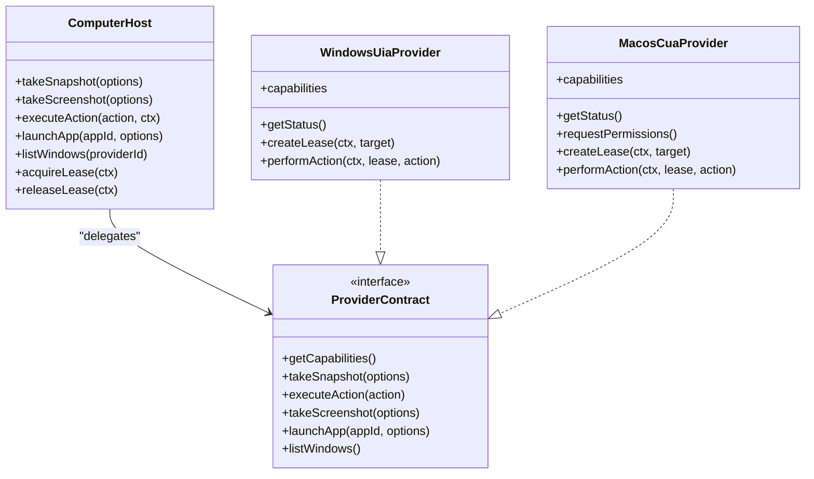
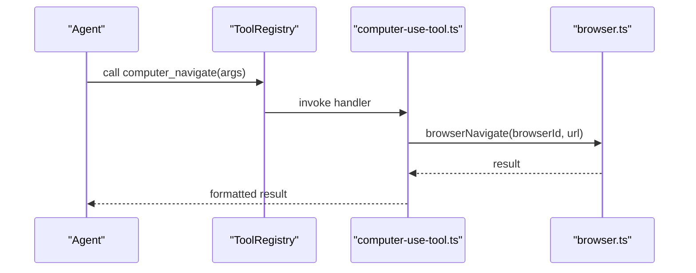
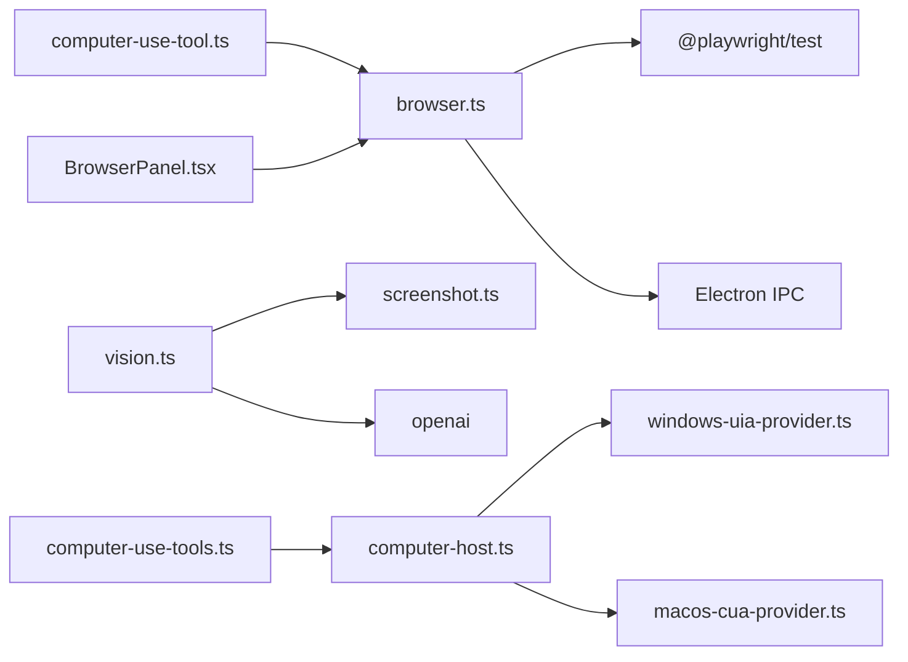

# Web & Browser Automation

<cite>
**Referenced Files in This Document**
- [browser.ts](file://core/tools/browser.ts)
- [browser-types.ts](file://core/tools/browser-types.ts)
- [web.ts](file://core/tools/web.ts)
- [web-fetch.ts](file://core/tools/web-fetch.ts)
- [screenshot.ts](file://core/tools/screenshot.ts)
- [screenshot-electron.ts](file://core/tools/screenshot-electron.ts)
- [vision.ts](file://core/tools/vision.ts)
- [computer-use-tool.ts](file://core/tools/computer-use-tool.ts)
- [computer-use-tools.ts](file://core/tools/computer-use-tools.ts)
- [computer-host.ts](file://core/computer-use/computer-host.ts)
- [windows-uia-provider.ts](file://core/computer-use/providers/windows-uia-provider.ts)
- [macos-cua-provider.ts](file://core/computer-use/providers/macos-cua-provider.ts)
- [browser-preferences.ts](file://shared/browser-preferences.ts)
- [BrowserPanel.tsx](file://desktop/src/components/BrowserPanel.tsx)
</cite>

## Table of Contents
1. Introduction
2. Project Structure
3. Core Components
4. Architecture Overview
5. Detailed Component Analysis
6. Dependency Analysis
7. Performance Considerations
8. Troubleshooting Guide
9. Conclusion

## Introduction
This document explains the web and browser automation capabilities in the project, focusing on:
- Browser control interfaces for navigation, interaction, and data extraction
- Web scraping utilities for fetching and searching content
- Screenshot capture and vision-based analysis (OCR-like descriptions via multimodal models)
- Computer use automation across platforms with provider abstractions
- Practical examples for navigation, extraction, and screenshot generation
- Headless configuration, proxy support considerations, and anti-detection guidance
- Automation scripting patterns, error handling, and performance optimization

## Project Structure
The automation features are implemented as tools and providers under core/tools and core/computer-use, with UI integration in desktop components.

**Diagram sources**
- [browser.ts:1-414](file://core/tools/browser.ts#L1-L414)
- [web.ts:1-59](file://core/tools/web.ts#L1-L59)
- [web-fetch.ts:1-77](file://core/tools/web-fetch.ts#L1-L77)
- [screenshot.ts:1-180](file://core/tools/screenshot.ts#L1-L180)
- [screenshot-electron.ts:1-38](file://core/tools/screenshot-electron.ts#L1-L38)
- [vision.ts:1-112](file://core/tools/vision.ts#L1-L112)
- [computer-use-tool.ts:1-112](file://core/tools/computer-use-tool.ts#L1-L112)
- [computer-use-tools.ts:1-71](file://core/tools/computer-use-tools.ts#L1-L71)
- [computer-host.ts:1-222](file://core/computer-use/computer-host.ts#L1-L222)
- [windows-uia-provider.ts:1-525](file://core/computer-use/providers/windows-uia-provider.ts#L1-L525)
- [macos-cua-provider.ts:1-800](file://core/computer-use/providers/macos-cua-provider.ts#L1-L800)
- [browser-preferences.ts:1-41](file://shared/browser-preferences.ts#L1-L41)
- [BrowserPanel.tsx:171-208](file://desktop/src/components/BrowserPanel.tsx#L171-L208)

**Section sources**
- [browser.ts:1-414](file://core/tools/browser.ts#L1-L414)
- [web.ts:1-59](file://core/tools/web.ts#L1-L59)
- [web-fetch.ts:1-77](file://core/tools/web-fetch.ts#L1-L77)
- [screenshot.ts:1-180](file://core/tools/screenshot.ts#L1-L180)
- [screenshot-electron.ts:1-38](file://core/tools/screenshot-electron.ts#L1-L38)
- [vision.ts:1-112](file://core/tools/vision.ts#L1-L112)
- [computer-use-tool.ts:1-112](file://core/tools/computer-use-tool.ts#L1-L112)
- [computer-use-tools.ts:1-71](file://core/tools/computer-use-tools.ts#L1-L71)
- [computer-host.ts:1-222](file://core/computer-use/computer-host.ts#L1-L222)
- [windows-uia-provider.ts:1-525](file://core/computer-use/providers/windows-uia-provider.ts#L1-L525)
- [macos-cua-provider.ts:1-800](file://core/computer-use/providers/macos-cua-provider.ts#L1-L800)
- [browser-preferences.ts:1-41](file://shared/browser-preferences.ts#L1-L41)
- [BrowserPanel.tsx:171-208](file://desktop/src/components/BrowserPanel.tsx#L171-L208)

## Core Components
- Browser automation toolset: dual-mode browser control (Electron webview or Playwright headless), with operations like navigate, click, type, press key, get text/HTML, wait for selectors, and screenshots.
- Web utilities: lightweight search and fetch helpers using global fetch.
- Screenshot capture: cross-platform screen capture with Electron IPC fallback to system commands.
- Vision analysis: screenshot capture plus multimodal LLM analysis for visual understanding and OCR-like outputs.
- Computer use host and providers: platform-specific backends (Windows UIA, macOS Cua Driver) exposing snapshots and actions through a unified interface.
- Tool wrappers: agent-facing tools that expose computer and browser automation functions.

**Section sources**
- [browser.ts:1-414](file://core/tools/browser.ts#L1-L414)
- [web.ts:1-59](file://core/tools/web.ts#L1-L59)
- [web-fetch.ts:1-77](file://core/tools/web-fetch.ts#L1-L77)
- [screenshot.ts:1-180](file://core/tools/screenshot.ts#L1-L180)
- [vision.ts:1-112](file://core/tools/vision.ts#L1-L112)
- [computer-use-tools.ts:1-71](file://core/tools/computer-use-tools.ts#L1-L71)
- [computer-use-tool.ts:1-112](file://core/tools/computer-use-tool.ts#L1-L112)
- [computer-host.ts:1-222](file://core/computer-use/computer-host.ts#L1-L222)
- [windows-uia-provider.ts:1-525](file://core/computer-use/providers/windows-uia-provider.ts#L1-L525)
- [macos-cua-provider.ts:1-800](file://core/computer-use/providers/macos-cua-provider.ts#L1-L800)

## Architecture Overview
The system provides two complementary automation layers:
- Web layer: browser control and web fetch/search tools for navigating and extracting page content.
- Computer use layer: OS-level automation via platform providers, enabling screenshots, element inspection, and input actions.

**Diagram sources**
- [computer-use-tool.ts:1-112](file://core/tools/computer-use-tool.ts#L1-L112)
- [browser.ts:1-414](file://core/tools/browser.ts#L1-L414)
- [BrowserPanel.tsx:171-208](file://desktop/src/components/BrowserPanel.tsx#L171-L208)
- [vision.ts:1-112](file://core/tools/vision.ts#L1-L112)
- [screenshot.ts:1-180](file://core/tools/screenshot.ts#L1-L180)

## Detailed Component Analysis

### Browser Control Interface (Dual Mode)
- Modes:
  - Electron webview mode: uses IPC to control an embedded webview for interactive, visible browsing.
  - Playwright headless mode: launches Chromium for server/CLI environments.
- Key operations:
  - Create/close instances, navigate, click, type, press key, get text/HTML, wait for selector, screenshot.
- Data model:
  - BrowserInstance tracks id, mode, and underlying resources; default instance management simplifies usage.

**Diagram sources**
- [browser.ts:1-414](file://core/tools/browser.ts#L1-L414)

**Section sources**
- [browser.ts:1-414](file://core/tools/browser.ts#L1-L414)
- [browser-types.ts:1-49](file://core/tools/browser-types.ts#L1-L49)

### Web Scraping and Fetch Utilities
- webSearch: queries DuckDuckGo JSON endpoint and extracts titles/snippets.
- webFetch: fetches URL content, strips scripts/styles/tags, and returns cleaned text.
- web_fetch tool registration: wraps fetch with timeouts, content-type handling, and truncation.

**Diagram sources**
- [web-fetch.ts:1-77](file://core/tools/web-fetch.ts#L1-L77)
- [web.ts:1-59](file://core/tools/web.ts#L1-L59)

**Section sources**
- [web.ts:1-59](file://core/tools/web.ts#L1-L59)
- [web-fetch.ts:1-77](file://core/tools/web-fetch.ts#L1-L77)

### Screenshot Capture and Vision Analysis
- Screenshot:
  - Electron mode: uses desktopCapturer via IPC for fast captures without temp files.
  - Fallback: system commands per platform (macOS screencapture, Windows PowerShell, Linux gnome-screenshot/scrot/grim).
- Vision:
  - Captures screenshot if no image path provided.
  - Sends image to multimodal LLM with a prompt/question and returns description and findings.

**Diagram sources**
- [vision.ts:1-112](file://core/tools/vision.ts#L1-L112)
- [screenshot.ts:1-180](file://core/tools/screenshot.ts#L1-L180)
- [screenshot-electron.ts:1-38](file://core/tools/screenshot-electron.ts#L1-L38)

**Section sources**
- [screenshot.ts:1-180](file://core/tools/screenshot.ts#L1-L180)
- [screenshot-electron.ts:1-38](file://core/tools/screenshot-electron.ts#L1-L38)
- [vision.ts:1-112](file://core/tools/vision.ts#L1-L112)

### Computer Use Automation (Host and Providers)
- Host:
  - Manages leases, validates actions against provider capabilities, and executes actions.
- Providers:
  - Windows UIA: background-aware, semantic element actions, snapshot-driven workflows.
  - macOS Cua Driver: daemon-managed, supports app/window targeting, accessibility tree parsing, and optional native cursor styling.

**Diagram sources**
- [computer-host.ts:1-222](file://core/computer-use/computer-host.ts#L1-L222)
- [windows-uia-provider.ts:1-525](file://core/computer-use/providers/windows-uia-provider.ts#L1-L525)
- [macos-cua-provider.ts:1-800](file://core/computer-use/providers/macos-cua-provider.ts#L1-L800)

**Section sources**
- [computer-host.ts:1-222](file://core/computer-use/computer-host.ts#L1-L222)
- [windows-uia-provider.ts:1-525](file://core/computer-use/providers/windows-uia-provider.ts#L1-L525)
- [macos-cua-provider.ts:1-800](file://core/computer-use/providers/macos-cua-provider.ts#L1-L800)

### Agent-Facing Tools
- Computer use tools:
  - computer_take_snapshot, computer_execute_action, computer_screenshot, computer_release_lease.
- Browser wrapper tools:
  - computer_navigate, computer_click, computer_type, computer_screenshot, computer_extract.

**Diagram sources**
- [computer-use-tool.ts:1-112](file://core/tools/computer-use-tool.ts#L1-L112)
- [browser.ts:1-414](file://core/tools/browser.ts#L1-L414)

**Section sources**
- [computer-use-tools.ts:1-71](file://core/tools/computer-use-tools.ts#L1-L71)
- [computer-use-tool.ts:1-112](file://core/tools/computer-use-tool.ts#L1-L112)

## Dependency Analysis
- Browser tools depend on:
  - Playwright for headless mode.
  - Electron IPC when running inside the desktop app.
- Vision depends on:
  - Screenshot capture module.
  - OpenAI client for multimodal responses.
- Computer use host depends on:
  - Platform providers implementing the provider contract.
- UI integration:
  - BrowserPanel handles webview commands and responds to main process requests.

**Diagram sources**
- [browser.ts:1-414](file://core/tools/browser.ts#L1-L414)
- [vision.ts:1-112](file://core/tools/vision.ts#L1-L112)
- [screenshot.ts:1-180](file://core/tools/screenshot.ts#L1-L180)
- [computer-host.ts:1-222](file://core/computer-use/computer-host.ts#L1-L222)
- [windows-uia-provider.ts:1-525](file://core/computer-use/providers/windows-uia-provider.ts#L1-L525)
- [macos-cua-provider.ts:1-800](file://core/computer-use/providers/macos-cua-provider.ts#L1-L800)
- [computer-use-tool.ts:1-112](file://core/tools/computer-use-tool.ts#L1-L112)
- [computer-use-tools.ts:1-71](file://core/tools/computer-use-tools.ts#L1-L71)
- [BrowserPanel.tsx:171-208](file://desktop/src/components/BrowserPanel.tsx#L171-L208)

**Section sources**
- [browser.ts:1-414](file://core/tools/browser.ts#L1-L414)
- [vision.ts:1-112](file://core/tools/vision.ts#L1-L112)
- [screenshot.ts:1-180](file://core/tools/screenshot.ts#L1-L180)
- [computer-host.ts:1-222](file://core/computer-use/computer-host.ts#L1-L222)
- [windows-uia-provider.ts:1-525](file://core/computer-use/providers/windows-uia-provider.ts#L1-L525)
- [macos-cua-provider.ts:1-800](file://core/computer-use/providers/macos-cua-provider.ts#L1-L800)
- [computer-use-tool.ts:1-112](file://core/tools/computer-use-tool.ts#L1-L112)
- [computer-use-tools.ts:1-71](file://core/tools/computer-use-tools.ts#L1-L71)
- [BrowserPanel.tsx:171-208](file://desktop/src/components/BrowserPanel.tsx#L171-L208)

## Performance Considerations
- Prefer Electron webview mode for interactive tasks to avoid headless overhead and provide real-time feedback.
- Reuse browser instances where possible; close them explicitly after long-running tasks to free resources.
- For screenshots:
  - In Electron mode, avoid temp file I/O by using desktopCapturer.
  - In CLI mode, ensure system tools are installed to prevent retries and delays.
- Vision calls can be expensive; cache images and reuse prompts when appropriate.
- For web fetch:
  - Set reasonable timeouts and truncate large responses to reduce memory usage.
- Computer use providers:
  - Use semantic element actions rather than pixel-based interactions when supported to improve reliability.
  - Leverage snapshots to minimize stale state errors.

## Troubleshooting Guide
- Browser not open:
  - Ensure browser_new is called before other browser operations.
- Click/type failures:
  - Verify selectors exist; use browser_wait_for_selector to synchronize with dynamic content.
- Screenshot failures:
  - On Linux, install one of gnome-screenshot, scrot, or grim.
  - On Windows, ensure PowerShell execution policy allows script execution.
- Vision errors:
  - Confirm API key and model support vision capabilities.
- Computer use permissions:
  - On macOS, grant Accessibility and Screen Recording permissions; check provider status and request permissions if needed.
  - On Windows, ensure UIA helper runs successfully and returns valid JSON results.

**Section sources**
- [browser.ts:1-414](file://core/tools/browser.ts#L1-L414)
- [screenshot.ts:1-180](file://core/tools/screenshot.ts#L1-L180)
- [vision.ts:1-112](file://core/tools/vision.ts#L1-L112)
- [windows-uia-provider.ts:1-525](file://core/computer-use/providers/windows-uia-provider.ts#L1-L525)
- [macos-cua-provider.ts:1-800](file://core/computer-use/providers/macos-cua-provider.ts#L1-L800)

## Conclusion
The project provides a robust, multi-layered automation stack:
- A flexible browser control interface supporting both interactive and headless modes.
- Lightweight web scraping utilities for quick content retrieval.
- Cross-platform screenshot capture integrated with multimodal vision analysis.
- A unified computer use abstraction with platform-specific providers for deep OS automation.
Adopting the recommended practices for instance management, synchronization, and permission handling will yield reliable and efficient automation workflows.